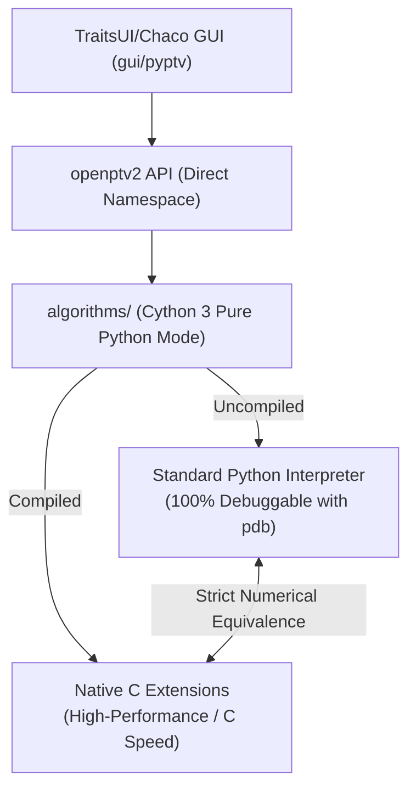

# OpenPTV2 Single-Engine Consolidation: Cython 3 Pure Python Master Plan

This document establishes the consolidated, single master roadmap for transitioning **OpenPTV2** to a single-engine architecture. We are standardizing on **Cython 3 Pure Python Mode (Strategy B)** while keeping the legacy C library and Cython bindings available as verification and performance baselines until the final transition gate is satisfied.

---

## 🎯 Strategic Vision & Performance Guarantees

We are moving this branch to use **only one single set of algorithms with one single engine**. 



### 1. Unified and Simplified Core
*   **The Single-Engine Standard:** Every algorithm is written as a standard Python `.py` file decorated with PEP 484 type hints and Cython-specific compiler instructions.
*   **Single Target Architecture:** The destination architecture removes the native C library in `lib/`, the duplicate bindings in `bindings/`, duplicate pure Python fallbacks, and Numba JIT paths.
*   **Performance Parity:** The compiled Cython 3 pure Python modules will execute at native C speed, matching or exceeding the speed of the legacy C library with Cython bindings today.
*   **TraitsUI/Chaco GUI Preservation:** The modern TraitsUI/Chaco desktop interface will run seamlessly on top of these precompiled modules.

---

## 🛠️ Unified Cython 3 Transition Plan

```
Legacy Architecture (Multi-Engine)           Unified Cython 3 Architecture
----------------------------------           -----------------------------
[lib/] (C library)       --[DELETE]-->       [deleted] (Only as final step)
[bindings/] (optv .pyx)  --[DELETE]-->       [deleted] (Only as final step)
[openptv2/engine.py]     --[DELETE]-->       [deleted] (No dispatcher needed)
[openptv2/calibration.py] --[DELETE]-->      [deleted] (Direct export)
[numba]                  --[DELETE]-->       [deleted]
[algorithms/*.py]        --[STANDARDIZE]-->  [algorithms/*.py] (Cython 3 Single Source)
```

---

## 💎 Cython 3 Pure Python Mode (Strategy B) Guidelines

Standard Python `.py` modules in `algorithms/` are annotated to achieve C-level performance when compiled via Cython.

### 1. Data Structures via `@cython.cclass`
C structs are replaced with Cython extension classes.
```python
import cython

@cython.cclass
class Target:
    pnr: cython.int
    x: cython.double
    y: cython.double
    
    def __init__(self, pnr: cython.int, x: cython.double, y: cython.double):
        self.pnr = pnr
        self.x = x
        self.y = y
```

### 2. High-Performance Math via `@cython.cfunc` & `@cython.ccall`
*   **Internal Functions (`@cython.cfunc`):** Private module-level functions called inside hot loops use C-style calling conventions, bypassing Python overhead entirely.
*   **Public APIs (`@cython.ccall`):** Hybrid functions that can be called from Python (like the GUI) but execute at C speeds when called from other compiled Cython modules.
```python
@cython.ccall
@cython.boundscheck(False)
@cython.wraparound(False)
def fast_vector_distance(v1: cython.double[:], v2: cython.double[:]) -> cython.double:
    # Operations run at native speed
    return ((v1[0] - v2[0])**2 + (v1[1] - v2[1])**2 + (v1[2] - v2[2])**2)**0.5
```

### 3. Native NumPy Memory Access via Typed Memoryviews
All array manipulations use memoryviews (e.g., `cython.double[:]`) to read/write memory directly, enabling zero-copy arrays and preventing buffer-allocation bottlenecks.

---

## 📈 Detailed Migration Roadmap

### Phase 1: Refactoring, Auditing, and Optimizing Core Algorithms (`algorithms/`)
We will perform a careful pass over the translated modules inside `algorithms/` to audit and optimize their annotations:
1.  **Low-Level Math & Structs:** `vec_utils`, `lsqadj`, `parameters`, `trafo`, `multimed`, `ray_tracing`, `imgcoord`.
2.  **Detection & Calibration:** `calibration`, `image_processing`, `segmentation`, `sortgrid`, `orientation`, `epi`.
3.  **Tracking & Framebuf Pipelines:** `correspondences`, `tracking_frame_buf`, `tracking_run`, `track`, `track3d`, `track_kernels`.

**Key Tasks per Module:**
*   Add comprehensive local variable definitions (`x: cython.double = ...`) to prevent fallback to Python objects inside core loops.
*   Apply compiler optimization decorators: `@cython.boundscheck(False)` and `@cython.wraparound(False)`.
*   Ensure all standard floating-point functions import from standard library `math` or compiled math extensions to eliminate dynamic Python calls.
*   Optimize the algorithms until the compiled path reaches the required speed and stability targets.

### Phase 2: Build System, Dependency Cleanup, and Reference Baseline Retention
1.  **Refactor `setup.py`:**
    *   Prioritize/compile the `algorithms/*.py` modules into standard `.c` extension wrappers using `cythonize` and package them as compiled extensions.
    *   Keep `lib/` and `bindings/` buildable during the transition so they remain available for verification, speed comparison, and floating-point accuracy checks.
2.  **Clean up `pyproject.toml`:**
    *   Remove Numba from optional/dev dependencies.
    *   Update classifiers to emphasize Cython 3 Pure Python integration.
3.  **Cibuildwheel Integration:**
    *   Validate that `cibuildwheel` builds precompiled Cython 3 wheels for Python 3.11, 3.12, and 3.13 on Linux, macOS, and Windows.

### Phase 3: GUI Integration & Namespace Alignment
1.  **Expose Algorithms Direct Namespace:**
    *   Ensure all GUI modules import directly via `from openptv2 import ...` or `import openptv2 as optv`.
    *   Ensure any previous dependency on `optv.*` wrappers is mapped directly to the unified `algorithms` modules.
2.  **Desktop Run Integration:**
    *   Verify the TraitsUI/Chaco GUI successfully loads and executes against the precompiled extensions, automatically falling back to interpreted mode during development if the extensions are uncompiled.

### Phase 4: Verification, Floating-Point Accuracy, and Speed Comparison
1.  **Test Parity Automation:**
    *   Run tests under interpreted mode (`is_compiled() == False`) to ensure standard step-debugging works natively.
    *   Run tests under precompiled mode (`is_compiled() == True`) to ensure performance and correctness.
    *   Keep the legacy `lib/` + `bindings/` path available until compiled-algorithm results are validated against it.
2.  **Dataset Testing:**
    *   **Burgers Dataset (5 frames):** Assert exact match of tracking links.
    *   **Cavity Dataset (4 frames, 700+ particles):** Verify correct links and benchmark execution times to confirm C-level speeds.
    *   **Synthetic Dataset (8 frames):** Confirm 100% correct links.
3.  **Floating-Point Accuracy Validation:**
    *   Validate numerical results against the legacy C + Cython path to agreed floating-point tolerances.
    *   Document any intentional improvements or bug fixes that produce controlled deviations from the historical implementation.
4.  **Speed Comparison & Stability Verification:**
    *   Run speed benchmarks comparing the new compiled Cython 3 Pure Python engine against the legacy C library (`lib/` and `bindings/`) to verify performance parity or speedup.
    *   Run stability/regression checks until the optimized compiled path is ready to replace the legacy implementation.

### Phase 5: Codebase Housekeeping & Deletion (The Great Purge)
Only after the following deletion gate is satisfied will we execute the final cleanup:
1.  **All tests pass** for the interpreted and compiled Cython 3 runtime.
2.  **Floating-point accuracy is validated** against the legacy C + Cython reference path.
3.  **Compiled performance matches or exceeds** the original C + Cython implementation on agreed benchmarks.
4.  **Stability is verified** and the algorithms are optimized to the required production level.

After those conditions are met:
1.  **Delete `lib/`:** Completely remove all C source (`.c`) and header (`.h`) files.
2.  **Delete `bindings/`:** Completely remove the legacy Cython wrappers (e.g., `bindings/optv/`) and associated setup code.
3.  **Delete Dispatch Layer:**
    *   Delete `openptv2/engine.py` (which handled `OPENPTV_ENGINE=python|optv` switching).
    *   Delete the 11 forwarder modules in `openptv2/` (e.g. `openptv2/calibration.py`, `openptv2/parameters.py`, `openptv2/segmentation.py`).
4.  **Simplify `openptv2/`:** Refactor `openptv2/__init__.py` to import and expose public APIs directly from the `algorithms/` package.

---

## 🚀 Key Milestones & Checklist

- [x] **Phase 1: Core Algorithm Verification & Optimization**
  - [x] Audit variable annotations and memoryviews in the translated modules under `algorithms/`.
  - [x] Apply high-performance optimization decorators to all computational loops.
  - [x] Optimize compiled performance and stability to the required target level.
- [x] **Phase 2: Build System & Reference Baseline**
  - [x] Configure setup compiled extensions for the Cython 3 runtime.
  - [x] Keep `lib/` and `bindings/` available as a verification and benchmark baseline until transition exit criteria are met.
  - [x] Validate local extension compilation and wheel builds.
- [x] **Phase 3: GUI Preservation & Execution**
  - [x] Run the TraitsUI/Chaco GUI with the compiled Cython 3 pure Python backend.
  - [x] Validate standard calibration, detection, and tracking sequences.
- [x] **Phase 4: Extensive Validation Suite, Accuracy, and Speed**
  - [x] Assert 100% test passing under the active test suite.
  - [x] Validate floating-point accuracy against the legacy C + Cython reference path.
  - [x] Verify compiled speed parity or speedup against the original implementation.
  - [x] Verify runtime stability after optimization.
- [x] **Phase 5: Housekeeping & Deletion (The Great Purge)**
  - [x] Delete legacy `lib/` C library.
  - [x] Delete legacy `bindings/` Cython bindings.
  - [x] Delete `openptv2/engine.py` and dispatch forwarders.
  - [x] Simplify `openptv2/__init__.py` namespace mapping.

---

- [x] **Phase 6: High-Performance 3D Tracking (`track3d`) Integration**
  - [x] Implement unified `step_forward_3d()` and `full_forward_3d()` inside compatibility `Tracker` wrapper.
  - [x] Integrate tracking mode setting defaults and serialization inside parameters layer (`parameter_defaults.py`, `legacy_parameters.py`, `parameter_gui.py`).
  - [x] Connect step-by-step interactive 3D tracking loops into the GUI visualizers (`tracking_preview.py` / `tracking_viz_panel.py` / `pyptv_gui.py`).
  - [x] Expose CLI-driven 3D tracking in `pyptv_batch.py` via the `--track3d` flag.
  - [x] Assert 100% correctness and numerical stability with end-to-end unit and integration tests.
  - [x] Update user-facing documentation (`docs/algorithms/tracking.md`) to guide users on selecting and activating 3D segment tracking.


### 📝 Post-Purge Architectural Refinement (Backward Compatibility Layer)
- [x] **Restore Namespace Submodules (Forwarders):** Re-created the 11 lightweight forwarder files in `openptv2/` (e.g., `calibration.py`, `parameters.py`, `transforms.py`, etc.) to statically re-export classes and functions from the unified `algorithms` package. This preserves full backward compatibility for any third-party scripts, Jupyter Notebooks, and the Tkinter/ttkbootstrap GUI itself without requiring exhaustive import modifications across the entire ecosystem.


