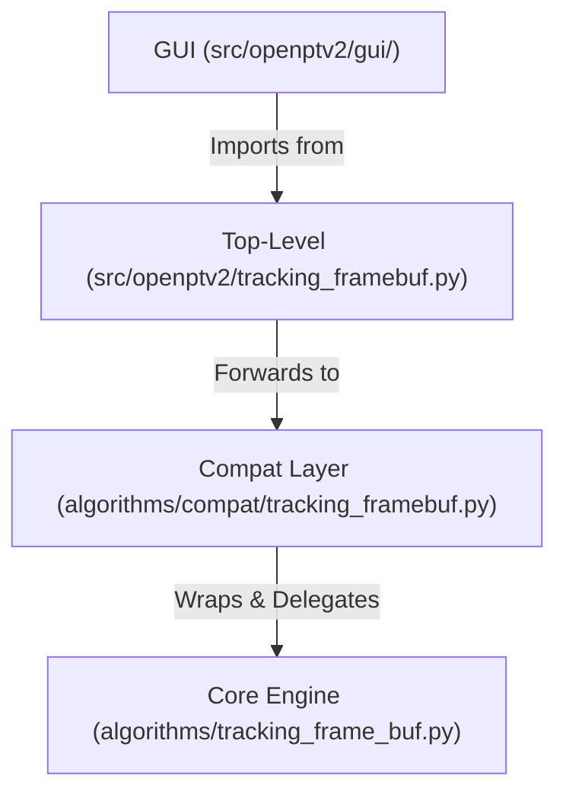
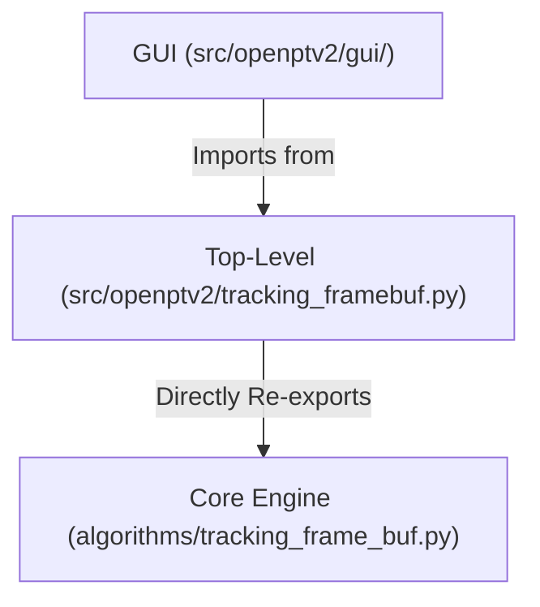

# Refactoring Plan: Complete Elimination of Legacy Compatibility Adaptors

This plan outlines the final steps to dismantle the legacy compatibility layer (`src/openptv2/algorithms/compat/`) and establish direct, zero-overhead compatibility within the compiled algorithms library (`src/openptv2/algorithms/`).

---

## 1. Architectural Overview & Present Status

Historically, the codebase maintained a dual-layer wrapping system to accommodate the GUI's expectation of the legacy object-oriented `optv` API:



Thanks to our successful unification of the `Target`, `Frame`, and `TargetArray` classes directly inside `src/openptv2/algorithms/tracking_frame_buf.py` (including the implementation of public Cython attributes `n`, `nx`, `ny`, `sumg`, and property descriptors for `pnr`, `x`, `y`, and `tnr` returning `CallableInt`/`CallableFloat`), we have achieved **full OOP compatibility natively within the compiled C-extension level**.

This allows us to completely bypass the intermediate wrapper layer, streamlining imports and eliminating all delegating overhead:



---

## 2. Step-by-Step Migration Plan

### Step 2.1: Update top-level forwarding module (`src/openptv2/tracking_framebuf.py`)
Modify `src/openptv2/tracking_framebuf.py` to import directly from `openptv2.algorithms.tracking_frame_buf` instead of the compat folder.

```python
"""Compatibility forwarder for tracking_framebuf."""
from openptv2.algorithms.tracking_frame_buf import (
    CORRES_NONE,
    Frame,
    Target,
    TargetArray,
    read_targets,
)

__all__ = ["Frame", "Target", "TargetArray", "read_targets", "CORRES_NONE"]
```

### Step 2.2: Migrate Test Imports
Update tests that imported from `openptv2.algorithms.compat` to use the top-level public `openptv2` package instead:

1. **`tests/gui/test_correspondence_disparity.py`** (line 134):
   - **Before**: `from openptv2.algorithms.compat.tracking_framebuf import TargetArray`
   - **After**: `from openptv2.tracking_framebuf import TargetArray`
2. **`tests/gui/test_matched_coords_parity.py`** (lines 63-64, 114, 129):
   - **Before**: 
     ```python
     from openptv2.algorithms.compat.parameters import ControlParams as C, TargetParams as T
     from openptv2.algorithms.compat.calibration import Calibration as CalC
     from openptv2.algorithms.compat.segmentation import target_recognition as c_tr
     from openptv2.algorithms.compat.correspondences import MatchedCoords as c_mc
     ```
   - **After**:
     ```python
     from openptv2.parameters import ControlParams as C, TargetParams as T
     from openptv2.calibration import Calibration as CalC
     from openptv2.segmentation import target_recognition as c_tr
     from openptv2.correspondences import MatchedCoords as c_mc
     ```
3. **`notebooks/marimo_tracking_step_viz.py`** (line 86):
   - **Before**: `from openptv2.algorithms.compat.tracker import Tracker, default_naming`
   - **After**: `from openptv2.tracker import Tracker, default_naming`

### Step 2.3: Clean up package discovery (`pyproject.toml`)
Remove `"openptv2.algorithms.compat"` from the package discovery list in `pyproject.toml`.

### Step 2.4: Execute Verification Tests
Run the entire test suite using `uv run pytest` to ensure everything is functional and perfectly correct.

### Step 2.5: Purge Compatibility adaptors folder
Completely delete `src/openptv2/algorithms/compat/` directory.

---

## 3. Risks & Verification Strategy

- **Risk**: A class-level property accessor behaves differently under compilation than in interpreted Python.
  - **Mitigation**: We already successfully ran `uv run pytest tests/unit/test_compat_core.py` with compiled extensions, proving that the property descriptors and public visibility declarations work beautifully under compilation.
- **Verification**: Run `uv run pytest` across the entire project. All 476 tests must pass.
