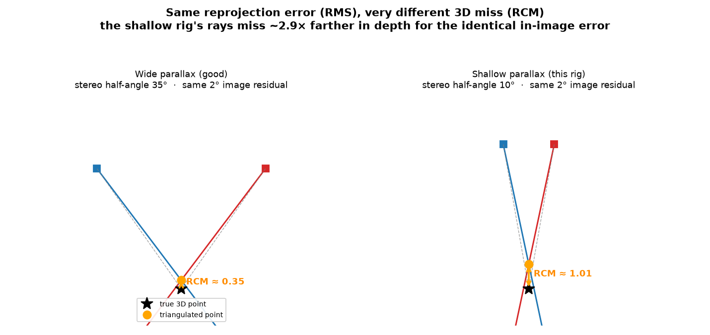

# RMS vs RCM: two very different calibration quality numbers

OpenPTV reports **two** calibration errors that are easy to confuse. They measure
different things, and on many real rigs they disagree by ~10×. Reading only the
first one will make you believe a rig is far better than it is.

- **RMS** — *per-camera reprojection error*, in **pixels**. How well each camera's
  model reproduces **its own** detected dots. An in-image, single-camera number.
- **RCM** — *cross-camera ray-convergence miss distance*, in **millimetres**. How
  close the cameras' back-projected rays actually come to meeting at one 3D point.
  A 3D, multi-camera number.

RMS answers *"does each camera fit its own data?"* RCM answers *"do the cameras
agree with each other in 3D?"* — which is what triangulation, stereo-matching, and
tracking actually depend on.

## Formulas

**RMS** (one camera, `n` matched calibration points): reproject each known 3D
point `Xᵢ` through that camera's model to pixel `x̂ᵢ`, compare to the detected
pixel `xᵢ`:

```
RMS = sqrt( (1/n) · Σᵢ ‖ xᵢ − x̂ᵢ ‖² )            [pixels]
```

Everything here lives in one camera's image plane. Nothing in this expression
involves any other camera.

**RCM** (one 3D point seen by `m ≥ 2` cameras): back-project each camera's
detection to a ray `Rⱼ(t) = Cⱼ + t·dⱼ` (camera centre + direction, through the
multimedia interface), find the 3D point `P*` closest to all rays, and average the
ray-to-point miss:

```
P*   = argmin_P  Σⱼ dist(P, Rⱼ)²
RCM  = (1/m) · Σⱼ dist(P*, Rⱼ)                    [mm]
```

`multi_cam_point_positions` returns `P*` **and** this miss distance directly, so
RCM is read straight out of triangulation — no new geometry.

## Why they diverge: shallow parallax

The cameras' rays cross at a **stereo angle**. A small in-image error `δ` (the RMS)
displaces the ray by a small angle, but the resulting shift of the *intersection*
scales roughly as

```
depth error  ≈  (range · δ) / sin(parallax angle)
```

At a wide stereo angle `sin(parallax)` is near 1 and the 3D error stays small. At a
**shallow** angle (short baseline relative to range — exactly the OpenPTV splitter
geometry, where all sub-apertures look through nearly the same direction) `sin` is
small and the same `δ` blows up along the line of sight. The rays pass close
*sideways* but miss badly *lengthwise* in depth.



*Same 2° image residual in both panels. Wide parallax (left): the triangulated
point barely moves. Shallow parallax (right, this rig's regime): it drifts ~3×
farther along depth. Regenerate with `uv run python
docs/figures/make_rms_vs_rcm_figure.py`.*

This is why **RMS cannot see the problem**: it is computed independently per camera
and never asks whether the cameras agree. You can drive every camera's RMS
sub-pixel and still have a rig that triangulates poorly.

## A real example (`TT13_aorta`, 4-view splitter)

After the `interf` glass-tilt fit:

| camera | RMS (px) | points matched |
|---|---|---|
| cam1 | 0.84 | 81 / 135 |
| cam2 | 1.13 | 80 / 135 |
| cam3 | 0.74 | 71 / 135 |
| cam4 | 0.96 | 76 / 135 |

**Cross-camera RCM** (38 points seen in all 4 cameras): **p50 = 0.076 mm,
p95 = 0.206 mm, max = 0.323 mm.** The p95 is ~2.7× the median — the shallow-parallax
tail. Sub-pixel RMS alone would have told you the rig is essentially perfect; RCM
tells you the true 3D consistency and where the tail is.

## How to read the numbers

- **RMS** — expect sub-pixel (< ~1 px) for a good fit. A camera stuck at 2–3 px
  usually means an unmodeled distortion (see the [bundle-adjustment
  doc](calibration-bundle-adjustment.md); on this rig the glass **`interf`** tilt
  took cam2 from 2.4 → 1.1 px). RMS is necessary but **not sufficient**.
- **RCM** — this is the number that predicts downstream 3D quality. Compare its
  **p95/max** against your triangulation tolerance and particle spacing. If RCM ≫
  your acceptable 3D error, the rig is inconsistent *as a set* even when every RMS
  looks great. RCM does **not** shrink just because RMS does.
- **The ratio** RCM/RMS (in comparable units) exposes parallax sensitivity: a large
  ratio means a geometry that amplifies small image errors — inherent to the rig,
  not a fit you can tighten arbitrarily.

## How to get the numbers

```bash
uv run python skills/openptv-calibrate/scripts/calib.py run <dataset> \
    --output report.json          # RMS + RCM printed, both in report.json
```

```python
from openptv2.autocalibration import (
    calibrate_dataset,
    cross_camera_rcm,
    _load_dataset_params,
    resolve_calblock,
)

results = calibrate_dataset("<dataset>")  # per-camera RMS in results[i].rms
cpar = _load_dataset_params("<dataset>", resolve_calblock("<dataset>")).cpar
print(
    cross_camera_rcm(results, cpar)
)  # {n_points, n_common, median, p90, p95, max} in mm
```

`--rcm-flag-mm` (default 0.1) sets the threshold above which `run` warns that RCM
is high relative to RMS.

## What to do when RCM is high but RMS is low

That combination means the cameras individually fit fine but disagree in 3D. The
fix is a calibration step that has a **cross-camera term** — see
[calibration-bundle-adjustment.md](calibration-bundle-adjustment.md). In short:
per-camera resection (the default) can't lower RCM; a **joint bundle adjustment**
or **tracer self-calibration** can, because they couple the cameras through shared
3D points.
