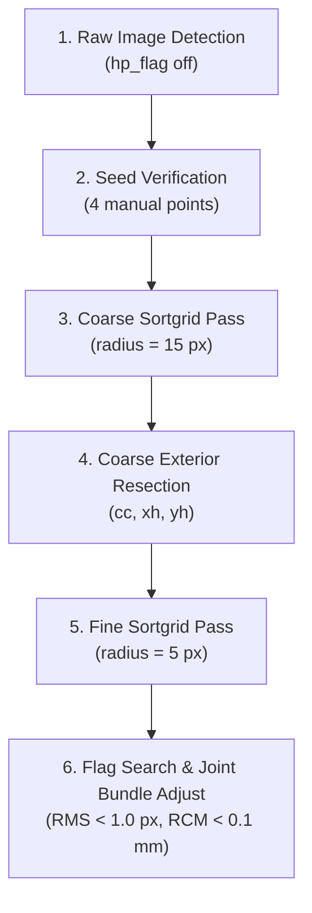

# Calibration Best Practices & Troubleshooting Guide

This guide compiles practical lessons, best practices, and troubleshooting workflows derived from real-world multi-camera and 4-view optical splitter datasets.

---

## 🚀 The Core Playbook: 6-Step Calibration Workflow

When calibrating a complex multi-camera or splitter rig in OpenPTV, follow this systematic workflow:

### Step 1: Detect Targets on Raw Images
- **Do NOT apply high-pass filtering (`hp_flag`) to calibration plate images.**
- High-pass filtering creates ringing artifacts around bright calibration target dots, shifting the grey-weighted centroid and corrupting subpixel precision.
- High-pass filtering is for dim particle tracking images, not bright calibration plates.

### Step 2: Seed Verification
- Select 4 well-spread, unambiguous seed points per camera (`man_ori`).
- Ensure the initial reprojection overlay lands reasonably near the target dots before proceeding to full bundle adjustment.

### Step 3: Coarse-to-Fine Search Radius (`sortgrid`)
- **The Problem**: Starting directly at a tight search radius ($\text{radius} = 3\text{--}5\text{ px}$) on an unrefined orientation guess drops outer target points and gets trapped in a sparse local minimum ($17\text{--}35$ points matched, $\text{RMS} > 2.0\text{ px}$).
- **The Solution**: 
  - First, execute a **coarse pass** at $\text{radius} = 15\text{ px}$. This captures $70\text{--}80$ target points across the entire plate.
  - Fit coarse exterior parameters (`cc`, `xh`, `yh`) to pull the camera pose into global alignment.
  - Second, execute the **fine pass** at the target tight radius ($\text{radius} = 5\text{ px}$) to select the clean inlier set at subpixel precision.

### Step 4: Existing Orientation (`.ori`) Reuse
- When re-calibrating or refining an existing dataset, **reuse the existing `.ori` files** as the initial guess.
- Resection from 4 manual clicks (`external_calibration`) is an analytic fallback for bootstrapping from scratch; reusing a previously converged `.ori` avoids 4-point pose perturbation on complex refractive paths.

### Step 5: Candidate Distortion Model Selection
- Evaluate candidate distortion flag sets greedily by reprojection RMS:
  1. Base: `["cc", "xh", "yh"]`
  2. Radial: `+ ["k1", "k2"]`
  3. Decentering & Higher-order: `+ ["k3", "p1", "p2"]`
  4. Glass Interface / Splitter Tilt: `+ ["interf"]`
- *Note*: Distortion terms must be initialized from the refined camera pose (`copy.deepcopy(cal)`), not reset back to the 4-point seed.

### Step 6: Joint Plate Bundle Adjustment & RCM Check
- After per-camera resection achieves subpixel RMS ($< 1.0\text{ px}$), run `joint_plate_bundle_adjust` (`openptv2.autocalibration`).
- Evaluate **Cross-Camera Ray-Convergence Miss (RCM)** distance:
  - **Reprojection RMS** measures how well each camera reprojects onto its own image plane.
  - **RCM** measures whether rays from multiple cameras actually intersect in 3D object space.
  - Target: **RCM median $< 0.10\text{ mm}$** ($100\ \mu\text{m}$).

---

## ⚡ 4-View Splitter Rig Considerations

On 4-view optical splitter rigs (`cal_splitter: true`):
1. **Shared Frame Multiplexing**:
   - All 4 camera channels share a single physical raw image (e.g. $1024 \times 1024$).
   - Target recognition splits the frame into four sub-quadrants (e.g. $512 \times 512$).
2. **Target File Isolation**:
   - Derived per-camera target filenames (e.g., `cam_1.tif_targets`, `cam_2.tif_targets`) are derived from each camera's `.ori` path rather than the shared image path to prevent target file collisions.
3. **Refractive Wall / Glass Vector**:
   - Splitter optical paths often introduce slight keystone distortion due to mirror tilts and glass interfaces.
   - Enabling the `interf` flag (glass interface vector tilt) allows the solver to absorb refractive wall tilt that Brown's radial/decentering model cannot represent.

---

## 📊 Summary Checklist

| Objective | Recommended Setting / Action |
| :--- | :--- |
| **Image Preprocessing** | Raw image detection (`hp_flag = 0`) |
| **Sortgrid Radius** | Coarse ($15\text{ px}$) $\rightarrow$ Fine ($5\text{ px}$) |
| **Outlier Rejection** | Drop worst reprojecting points until inlier $\text{RMS} \le 1.0\text{ px}$ |
| **Quality Criteria** | Reprojection $\text{RMS} < 1.0\text{ px}$ AND $\text{RCM} < 0.10\text{ mm}$ |
