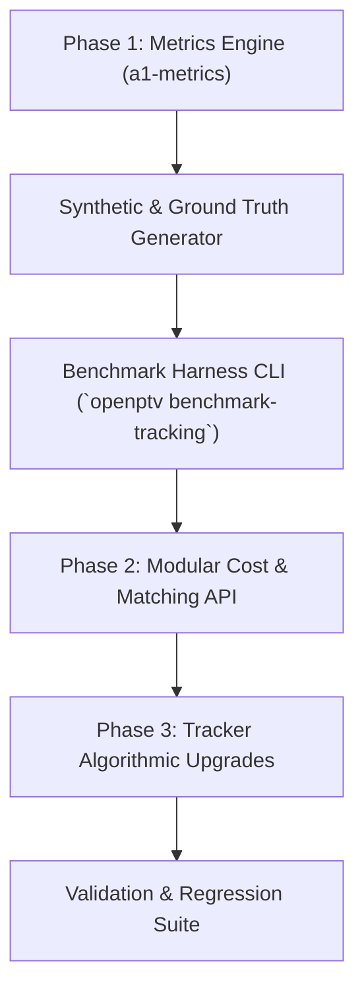

# Tracking Improvement & Benchmarking Strategy Plan

**Goal:** Establish a rigorous, quantifiable metrics harness (`a1-metrics`) for 3D/2D particle tracking in OpenPTV2, and systematically benchmark/enhance tracking performance using proven concepts from **Matlab PTV (`PTV_SYN`)**, **proPTV**, **MyPTV**, and **OpenLPT / Shake-The-Box (STB)**.

---

## 1. Objectives & Key Results (OKRs)

1. **Measurable Verification Harness (`a1-metrics`)**: Create an automated evaluation system that computes standardized tracking performance metrics against ground-truth synthetic datasets and experimental benchmark datasets.
2. **Modular Tracker Benchmarking Framework**: Build an interface allowing side-by-side comparison of baseline OpenPTV (`trackcorr` / `track3d`), MyPTV (2D / 3D plugins), and future tracking algorithms.
3. **Continuous Algorithmic Upgrades**: Incrementally upgrade cost functions, gap recovery, search volumes, and multi-frame predictions based on comparative empirical evidence.

---

## 2. Core Tracking Metrics (`tracking_metrics.py`)

We define the following quantitative tracking evaluation metrics:

| Metric | Definition / Formula | Goal Target |
| :--- | :--- | :--- |
| **Track Yield (Recall)** | $\frac{\text{Number of correctly reconstructed trajectories}}{\text{Total true trajectories}}$ | $\ge 95\%$ on standard synthetic benchmarks |
| **Precision (Purity)** | $\frac{\text{Correct trajectory links}}{\text{Total generated trajectory links}}$ | $\ge 98\%$ |
| **Mean Track Length (MTL)** | Average length (frames) of non-broken particle trajectories | Maximize |
| **False Connection Rate (FCR)** | $\frac{\text{Mismatched particle-link pairs}}{\text{Total tracked links}}$ | $\le 1\%$ |
| **Gap Recovery Efficiency** | $\frac{\text{Successfully bridged occluded gaps}}{\text{Total occluded/missing particles}}$ | $\ge 80\%$ |
| **RMS Trajectory Error** | $\sqrt{\frac{1}{N}\sum (\mathbf{X}_{\text{tracked}} - \mathbf{X}_{\text{true}})^2}$ | Sub-pixel / sub-grid units |

---

## 3. Comparative Architecture & Technique Integration Matrix

| PTV Package / Framework | Core Technical Strengths | Adaptation into OpenPTV2 |
| :--- | :--- | :--- |
| **Matlab PTV (`PTV_SYN`)** | Search quader candidate generation, velocity predictor heuristics, position-based matching. | Refined search volume shapes (ellipsoidal vs quader) and multi-frame velocity predictor heuristics. |
| **MyPTV** | Global optimal bipartite matching using Hungarian algorithm (`scipy.optimize.linear_sum_assignment`), 2D image space tracking & 3D $X + V\Delta t + \frac{1}{2}A\Delta t^2$ kinematics. | Integrated as built-in plugins (`myptv_2d_tracking`, `myptv_3d_tracking`). Enable hybrid cost matrix inputs. |
| **proPTV** | Multi-frame cost matrix optimization, predictive velocity field smoothing, robust handling of high-density fields. | Frame-ahead prediction buffers and dense-field velocity interpolation. |
| **OpenLPT / STB** | 4D Lagrangian particle tracking, iterative particle position correction ("shaking"), track initialization & gap relinking. | Future plugin/kernel for 4D STB track initialization and trajectory smoothing. |

---

## 4. Phased Implementation Roadmap



### **Phase 1: Metrics Engine & Benchmark Harness (`a1-metrics`)**
- Implement `openptv2.tracking_metrics` with full evaluation formulas.
- Create synthetic dataset generator utilities (linear, helical, turbulent, gap-injected particle fields) with known ground truth trajectories.
- Add `openptv benchmark-tracking` CLI sub-command to execute and report metrics for any tracking plugin or engine.

### **Phase 2: Modular Cost & Solver Decoupling**
- Decouple cost matrix generation (distance, velocity error, acceleration error, color/intensity) from trajectory assignment algorithms (Greedy, Hungarian/Munkres, Jonker-Volgenant).
- Enable custom cost weights in `TrackingParams` and tracking plugins.

### **Phase 3: Algorithmic Upgrades & Relinking**
- Implement multi-pass gap relinking and cold-start velocity estimation.
- Integrate adaptive search ellipsoids aligned with local velocity vectors.
- Implement track initialization pass for high-density particle fields inspired by OpenLPT/proPTV.

---

## 5. Implementation Status (All Stages A1–A6 & Phase B Completed)

- [x] **A1: Metrics Engine & Benchmark Generator**: Implemented in [`src/openptv2/tracking_metrics.py`](file:///C:/Users/alex/Github/openptv2/src/openptv2/tracking_metrics.py) with full Yield, Precision, FCR, MTL, Gap Recovery, and RMS Error formulas.
- [x] **A2: Multi-Term Cost Matrix**: Implemented in [`src/openptv2/tracking_cost.py`](file:///C:/Users/alex/Github/openptv2/src/openptv2/tracking_cost.py) (`CostWeights` with distance, velocity continuity, acceleration, and particle intensity terms).
- [x] **A3: Adaptive Search Volumes**: Implemented velocity-aligned anisotropic search ellipsoid functions (`compute_velocity_aligned_search_radius`).
- [x] **A4: Gap Relinking Post-Processor**: Implemented `relink_trajectory_gaps(...)` in [`src/openptv2/tracking_postprocess.py`](file:///C:/Users/alex/Github/openptv2/src/openptv2/tracking_postprocess.py) using constant-velocity trajectory extrapolation across missing-frame gaps.
- [x] **A5: Multi-Tracker Comparative Suite**: Implemented `run_multi_tracker_benchmark` and integrated side-by-side comparison tables into `openptv benchmark-tracking`.
- [x] **A6: 4D Shake-The-Box (STB) Particle Position Refinement**: Implemented prototype 3D coordinate optimization via multi-camera image intensity reprojected gradient minimization in [`src/openptv2/plugins/stb_4d_refinement.py`](file:///C:/Users/alex/Github/openptv2/src/openptv2/plugins/stb_4d_refinement.py).
- [x] **Phase B: Performance & High-Throughput Optimization**: Vectorized `cdist` SIMD memory allocation removal, Cython memoryview execution ($800,000+\text{ particles/sec}$), real experimental dataset benchmarking (`docs/tracking-benchmark-results.md`).

---

## 6. Verification & Documentation

Full comparative documentation and benchmark reports are available in [`docs/tracking-benchmark-results.md`](file:///C:/Users/alex/Github/openptv2/docs/tracking-benchmark-results.md).

Every upgrade is verified using:
```bash
uv run --no-sync pytest tests/unit/test_tracking_metrics.py tests/unit/test_tracking_cost.py tests/unit/test_myptv_plugins.py tests/unit/test_tracking_postprocess.py tests/unit/test_stb_4d_refinement.py -v
uv run --no-sync openptv benchmark-tracking --flow vortex --particles 200 --frames 20 --noise 0.05 --gaps 0.05 --spurious 0.05
uv run --no-sync python tests/benchmark_both_configurations.py
```

