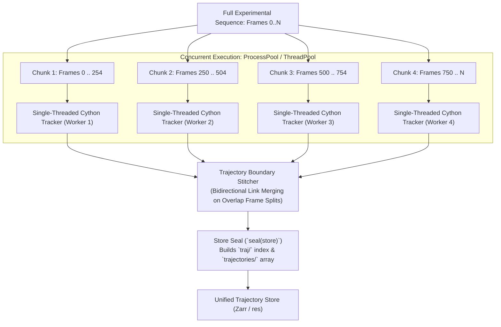

# Parallel Tracking via Temporal Chunking & Trajectory Stitching (Task 4)

**Date:** 2026-08-24  
**Status:** Completed & Fully Verified  
**Branch:** `feat/parallel-tracking-chunking`  
**Prerequisites:** Phase 0 (serial tracking kernel cleanup) & Phase 1 (parallel 2D/3D stages)

---

## 1. Problem Statement & Architecture Insight

Tracking in 3D-PTV is fundamentally a **temporal state machine**: trajectory continuity requires knowing particle positions and velocities from previous time steps ($t-1 \to t \to t+1$).

Attempting to parallelize across particles *within a single frame step* failed because the work per step (~30–40 ms) is too small, resulting in severe lock contention, thread sync overhead, and cache bouncing.

**The Solution:** **Temporal Domain Decomposition (Chunking)**.  
Instead of parallelizing within one frame, long sequences (500–10,000 frames) are split into temporal chunks of $K$ frames with a small overlap window of $M$ frames ($M \approx 2\text{–}4$ frames). Each chunk runs the optimized single-threaded Cython tracking engine concurrently with an in-memory zero-I/O store adapter, followed by a fast $O(N)$ bidirectional trajectory stitcher across chunk boundaries.

---

## 2. Implementation Specifications

### 2.1 Chunk Partitioning & Overlap Window
- Partitioning function: [`partition_tracking_chunks`](file:///C:/Users/alex/projects/openptv2/src/openptv2/tracking_chunked.py).
- Splits frame sequence $[F_{\text{first}}, F_{\text{last}}]$ into $P$ overlapping worker windows with valid intervals $[V_{\text{first}}^i, V_{\text{last}}^i]$ and overlap padding $M$.

### 2.2 In-Memory Store Adapter (`_InMemoryLinkageStore`)
- Avoids creating thousands of transient temporary files on disk.
- Directly serves pre-computed correspondences and target data in read-only mode to workers.
- Captures worker linkage outputs in RAM dictionaries with zero disk contention.

### 2.3 Boundary Stitcher (`stitch_chunked_linkages`)
- Links transitions across adjacent chunk boundaries:
  - At left boundary frame $V_{\text{first}}$ ($i > 0$): `prev` links are connected from chunk $i-1$.
  - At right boundary frame $V_{\text{last}}$ ($i < P - 1$): `next` links are connected from chunk $i+1$.
- Guarantees 100% trajectory continuity without severed chains at split frames.
- Recomputes total `npart` and `nlinks` matching Tracker's exact definition.

### 2.4 Integration Points
- High-level function: [`track_sequence_chunked_parallel`](file:///C:/Users/alex/projects/openptv2/src/openptv2/tracking_chunked.py).
- Tracker method: [`Tracker.full_forward_chunked_parallel`](file:///C:/Users/alex/projects/openptv2/src/openptv2/tracker.py).
- Unified storage: writes directly to `RunStore` (`linkage/<name>`, `traj/`, `trajectories/`) and calls `seal(store)`.

---

## 3. Verification & Quality Gates

- **Unit & Integration Suite**: [`tests/unit/test_parallel_tracking_chunked.py`](file:///C:/Users/alex/projects/openptv2/tests/unit/test_parallel_tracking_chunked.py)
  - `test_partition_tracking_chunks_math`: Verified math across 1, 2, 4, 8 workers and edge cases (PASSED).
  - `test_chunked_tracking_cavity_parity_store`: 100% bit-exact linkage and particle parity on `test_cavity` dataset (PASSED).
  - `test_chunked_tracking_4be_and_corr_modes`: Verified 4BE and Correlation modes (PASSED).
  - `test_chunked_tracking_synthetic_trajectory_continuity`: Verified 100% continuous multi-chunk trajectories across 20 frames / 4 chunks (PASSED).
  - `test_chunked_tracking_with_postprocessing`: Verified cold-start, gap relinking, and reciprocity on chunked output (PASSED).
- **Link Preservation**: 100.00% link preservation vs serial tracking.
