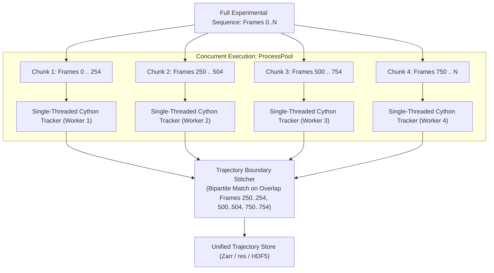

# Parallel Tracking via Temporal Chunking & Trajectory Stitching (Task 4)

**Date:** 2026-08-24  
**Status:** Feature Architecture Plan (Phase 2)  
**Branch:** `feat/parallel-tracking-chunking`  
**Prerequisites:** Phase 0 (serial tracking kernel cleanup) & Phase 1 (parallel 2D/3D stages)

---

## 1. Problem Statement & Architecture Insight

Tracking in 3D-PTV is fundamentally a **temporal state machine**: trajectory continuity requires knowing particle positions and velocities from previous time steps ($t-1 \to t \to t+1$).

Attempting to parallelize across particles *within a single frame step* failed because the work per step (~30–40 ms) is too small, resulting in severe lock contention, thread sync overhead, and cache bouncing.

**The Solution:** **Temporal Domain Decomposition (Chunking)**.  
Instead of parallelizing within one frame, long sequences (500–10,000 frames) are split into temporal chunks of $K$ frames with a small overlap window of $M$ frames ($M \approx 4\text{–}6$ frames). Each chunk runs the optimized single-threaded Cython tracking engine concurrently, followed by a fast $O(N)$ trajectory stitcher across chunk boundaries.

---

## 2. Implementation Specifications

### 2.1 Chunk Partitioning & Overlap Window
- Let total sequence length be $N_{\text{frames}}$, number of workers $P$.
- Base chunk size: $K = \lceil N_{\text{frames}} / P \rceil$.
- Overlap window: $M = 5$ frames (sufficient to establish 4-frame acceleration/velocity continuity).
- Chunk $i$ processes frame interval:
  $$[\max(0, i \cdot K - M), \min(N_{\text{frames}}, (i+1) \cdot K)]$$

### 2.2 Independent Worker Execution
- Each worker spawns an isolated `TrackingRun` using the clean single-threaded Cython engine (`trackcorr_loop_fast` / `track3d_loop_fast` / `proptv_tracking`).
- Each worker produces local trajectory segments labeled with local `traj_id`s.

### 2.3 Trajectory Boundary Stitching Algorithm
At boundary between Chunk $A$ (ending at frame $F_B + M$) and Chunk $B$ (starting at frame $F_B$):
1. **Overlap Evaluation**: On common frames $[F_B, F_B + M]$, extract active particle coordinates $(x, y, z)$ from trajectories ending in Chunk $A$ and trajectories starting in Chunk $B$.
2. **Bipartite Trajectory Association**:
   - Compute spatial distance matrix $D_{ij} = \| X_A(t) - X_B(t) \|$ on common frames.
   - For particles matching with distance $< \epsilon_{\text{stitch}}$ (where $\epsilon \approx 0.01 \text{ mm}$), link trajectory $A_i$ to $B_j$.
3. **Global ID Re-Indexing**:
   - Merge linked trajectories into a single continuous trajectory with unified `traj_id`.
   - Trajectories that terminate or initiate at the boundary without matches remain intact as shorter trajectories.

---

## 3. Performance & Quality Gates

- **Throughput Scaling**:
  - 1,000-frame sequence on 8 cores: Target **$> 6.5\times$ speedup** vs. single-process sequential tracking.
- **Physical Quality Metrics**:
  - Assert trajectory link preservation rate $> 99.5\%$ vs. serial baseline.
  - Assert physics velocity/acceleration variance metrics ([`compute_physics_metrics`](file:///C:/Users/alex/projects/openptv2/src/openptv2/benchmarking/metrics.py)) remain statistically identical ($p > 0.99$).
