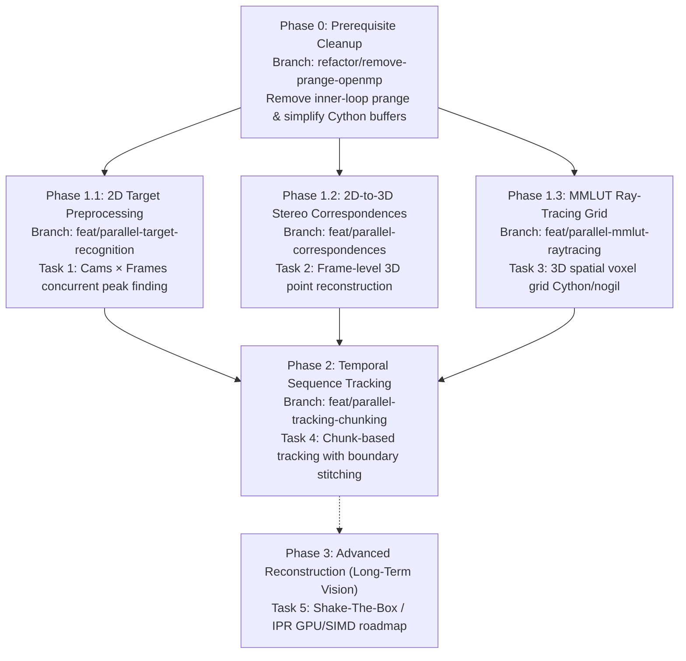

# OpenPTV2 High-Performance Parallelization Master Plan

**Date:** 2026-08-24  
**Status:** Approved Architecture Roadmap  
**Execution Strategy:** Multi-phase, isolated feature branches, subagent-driven implementation.

---

## 1. Executive Summary & Architecture Philosophy

Empirical benchmarking of OpenPTV2's micro-parallelism (inner-loop OpenMP `prange` inside single-frame particle tracking) demonstrated **negative scaling** (speedup $\le 0.84\times$) due to thread synchronization overhead, cache invalidation, and atomic compare-and-swap (CAS) lock contention on small single-frame workloads (~38 ms).

This master plan establishes a **coarse-grained, high-arithmetic-intensity parallelization architecture** designed around two principles:
1. **Zero-Contention Data Partitions**: Parallelize across independent spatial or temporal dimensions (images, frames, 3D voxel grids) where work units share zero mutable state.
2. **Hybrid Concurrency Model**:
   - **Cython Core**: Pure C-speed numerical kernels with typed memoryviews and `nogil` blocks.
   - **Python Orchestration**: `concurrent.futures.ProcessPoolExecutor` (for CPU-bound memory-isolated batch jobs) and `ThreadPoolExecutor` / vectorized loops (for GIL-free contiguous memory buffers and ray tracing).

---

## 2. Phased Roadmap & Branching Strategy

Each phase and task is isolated to an independent git feature branch and executed via a dedicated subagent session to preserve codebase stability and enable thorough verification.

### Execution Order & Handoff Table

| Phase / Task | Scope & Objective | Core Technology | Branch Name | Detailed Plan Link |
|---|---|---|---|---|
| **Phase 0** *(Prereq)* | Remove `prange`/OpenMP from `track_kernels_corr.py`, `track.py`, and `setup.py` | Cython serial refactor | `refactor/remove-prange-openmp` | [`2026-08-24-remove-prange-openmp-plan.md`](file:///C:/Users/alex/projects/openptv2/docs/plans/2026-08-24-remove-prange-openmp-plan.md) |
| **Phase 1: Task 1** | 2D Target Detection & Peak Centroiding across $N$ frames & 4 cameras | Cython + `ProcessPoolExecutor` | `feat/parallel-target-recognition` | [`2026-08-24-parallel-stages-1-to-3-plan.md#1-task-1--parallel-2d-target-detection--peak-fitting`](file:///C:/Users/alex/projects/openptv2/docs/plans/2026-08-24-parallel-stages-1-to-3-plan.md) |
| **Phase 1: Task 2** | Multi-Camera 2D $\to$ 3D Stereo Correspondences & Epipolar Clique Matching | Cython + `ProcessPoolExecutor` / Batching | `feat/parallel-correspondences` | [`2026-08-24-parallel-stages-1-to-3-plan.md#2-task-2--parallel-2d-to-3d-epipolar-stereo-correspondences`](file:///C:/Users/alex/projects/openptv2/docs/plans/2026-08-24-parallel-stages-1-to-3-plan.md) |
| **Phase 1: Task 3** | Multi-Media Optical Calibration & 3D MMLUT Ray-Tracing Grid | Cython `nogil` / SIMD / Multi-core | `feat/parallel-mmlut-raytracing` | [`2026-08-24-parallel-stages-1-to-3-plan.md#3-task-3--parallel-multi-media-optical-calibration--ray-tracing-mmlut`](file:///C:/Users/alex/projects/openptv2/docs/plans/2026-08-24-parallel-stages-1-to-3-plan.md) |
| **Phase 2: Task 4** | Temporal Window Tracking (Frame Chunking + Trajectory Boundary Stitching) | Cython + Python Chunk Runner | `feat/parallel-tracking-chunking` | [`2026-08-24-parallel-tracking-chunking-plan.md`](file:///C:/Users/alex/projects/openptv2/docs/plans/2026-08-24-parallel-tracking-chunking-plan.md) |
| **Phase 3: Task 5** | Iterative Particle Reconstruction (IPR / Shake-The-Box) | GPU / CUDA / OpenMP | *Long-term research* | [`2026-08-24-shake-the-box-ipr-roadmap.md`](file:///C:/Users/alex/projects/openptv2/docs/plans/2026-08-24-shake-the-box-ipr-roadmap.md) |

---

## 3. Technology Stack & Concurrency Guidelines

1. **Python Multi-Processing (`ProcessPoolExecutor`)**:
   - Used when tasks operate on file I/O or distinct frame datasets (Tasks 1, 2, and 4).
   - Avoids Python GIL completely; utilizes multi-process memory isolation.
   - Efficient IPC via shared memory (`multiprocessing.shared_memory` or numpy memory-mapped arrays) where large image buffers are passed.
2. **Cython + `nogil` Memoryview Parallelism**:
   - Used for compute-intensive 3D mathematical grids (Task 3: MMLUT Ray Tracing).
   - Operates on pre-allocated contiguous C arrays with zero Python object allocations inside hot loops.
3. **Determinism Verification**:
   - Every parallel task must guarantee 100% bit-exact parity against reference serial runs across all unit and batch tests.
