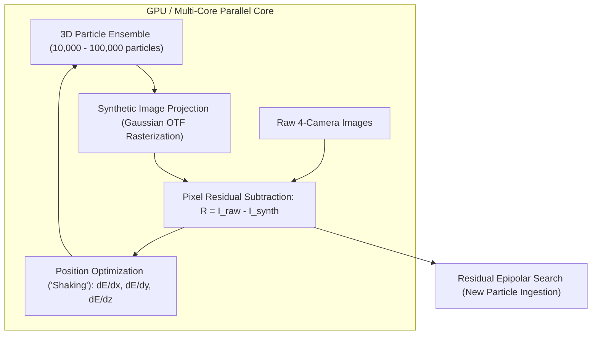

# Long-Term Roadmap: Shake-The-Box & Iterative Particle Reconstruction (Task 5)

**Date:** 2026-08-24  
**Status:** Long-Term Research & Architectural Vision (Phase 3 — Future Milestone)  
**Scope:** Advanced optical reconstruction for ultra-dense particle tracking ($> 0.05\text{–}0.1\text{ ppp}$)

---

## 1. Context & Motivation

Standard 3D-PTV (based on 2D peak finding followed by epipolar stereo triangulation) breaks down when particle image density exceeds $\sim 0.005\text{–}0.01\text{ particles per pixel (ppp)}$ due to overlapping particle images ("ghost" 3D correspondences).

**Shake-The-Box (STB)** and **Iterative Particle Reconstruction (IPR)** solve this by treating particle tracking as an **inverse image optimization problem**:
1. Predict 3D particle positions from established trajectories.
2. Render synthetic 2D camera images using a forward optical transfer function (OTF / 3D Gaussian PSF).
3. Compute image intensity residuals: $R_c(x, y) = I_{\text{raw}, c}(x, y) - I_{\text{synthetic}, c}(x, y)$.
4. "Shake" (optimize) 3D particle coordinates $(x, y, z, I)$ via gradient descent or Levenberg-Marquardt to minimize residual image energy.
5. Triangulate residual images to discover new particles and add them to the box.

---

## 2. Why STB/IPR is Massively Parallel

Unlike classical heuristics, STB/IPR is **pure numerical image-space computation** with extreme arithmetic intensity:

### Computational Characteristics:
- **Forward Image Rasterization**: 100,000 particles $\times$ 4 cameras rendered as small $7\times 7$ pixel Gaussian kernels. Embarrassingly parallel across particles and pixels.
- **Residual Shaking / Optimization**: Independent coordinate update for each particle based on local image gradients.
- **Hardware Mapping**: Perfectly suited for CUDA / OpenCL / Vulkan compute shaders or AVX-512 SIMD loops.

---

## 3. Future Architectural Roadmap

When OpenPTV2 enters Phase 3 development, the implementation roadmap will follow:

1. **Optical Transfer Function (OTF) Engine**:
   - Calibrated 3D anisotropic Gaussian PSF model per camera.
   - Fast sub-pixel splatting kernel in Cython / C++ / CUDA.
2. **Image Residual Pipeline**:
   - 2D tiled shared-memory image buffers.
   - High-throughput parallel residual subtraction.
3. **Continuous Trajectory Predictor & Shaker**:
   - B-spline / polynomial trajectory extrapolation combined with image-gradient position correction.
4. **Integration**:
   - Seamless plug-in replacement for the core tracking pipeline when processing high-density experiments.
