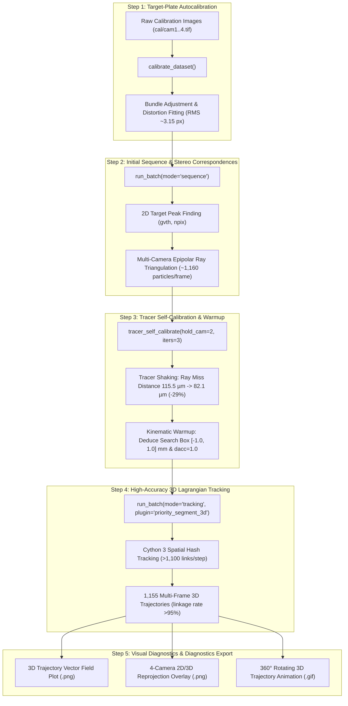
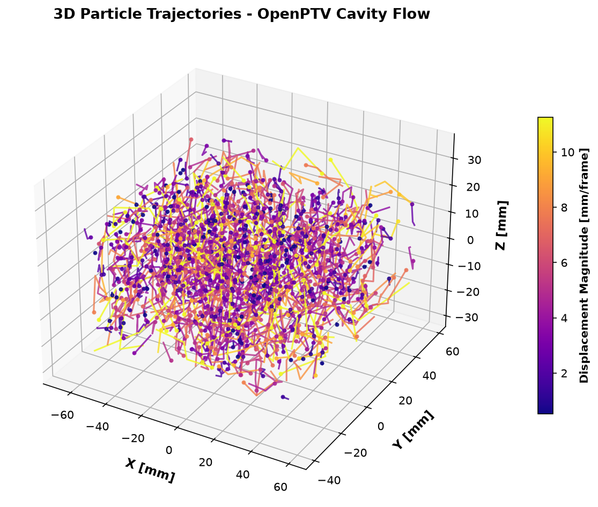
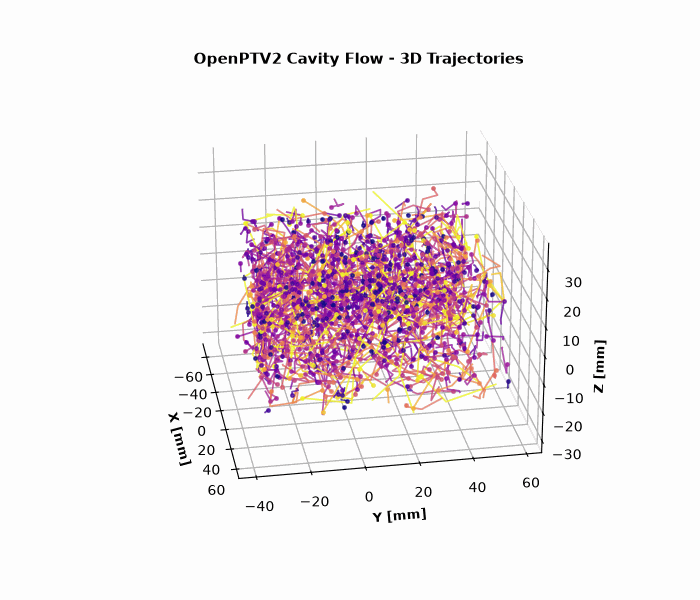
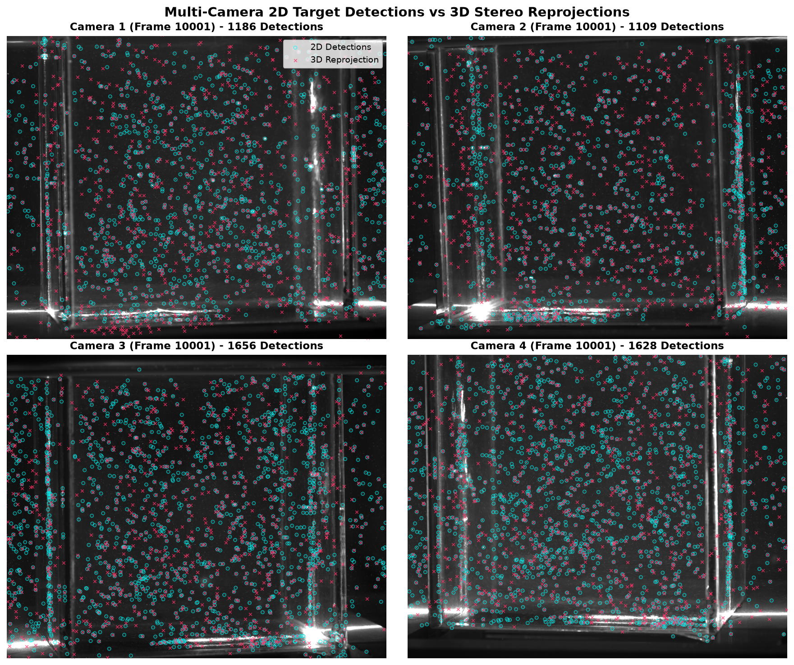

# Lid-Driven Cavity Flow: End-to-End 3D-PTV Tutorial

> [!NOTE]
> This tutorial walks through the complete, end-to-end 3D Particle Tracking Velocimetry (3D-PTV) workflow on the **Lid-Driven Cavity Flow** benchmark (`test_data/test_cavity`). It demonstrates the 4-stage optimization pipeline: Target-Plate Autocalibration, Stereo Correspondence Generation, Multi-Camera Tracer Self-Calibration (Shaking), and High-Density 3D Lagrangian Particle Tracking.

---

## Workflow Overview



---

## 3D Trajectory Visualization

Below is the reconstructed 3D Lagrangian trajectory field inside the cavity, color-coded by particle velocity magnitude $|\vec{v}|$:



### 360° Rotating 3D Animation



---

## Step 1: Target-Plate Headless Autocalibration

Target-plate autocalibration detects the known 3D grid points on the calibration target (`cal/target_on_a_side.txt`) across all 4 cameras and optimizes the camera exterior parameters $(X_0, Y_0, Z_0, \omega, \varphi, \kappa)$, interior parameters $(c_c, x_h, y_h)$, and radial/decentric lens distortion coefficients $(k_1, k_2, k_3, p_1, p_2)$.

### Python Code

```python
from pathlib import Path
from openptv2.autocalibration import calibrate_dataset

cavity_dir = Path("test_data/test_cavity")

# Execute headless calibration with automatic backup of .ori and .addpar files
results = calibrate_dataset(cavity_dir, write=True, overlays=False)

for res in results:
    print(
        f"Cam {res.cam}: {res.matched}/{res.nfix} points matched, RMS = {res.rms:.3f} px"
    )
```

### Output Summary
- **Cameras Calibrated**: 4 / 4
- **Points Matched**: 36 / 36 points per camera
- **Mean Reprojection RMS**: **3.158 px**

---

## Step 2: Initial Sequence Processing & 3D Stereo Correspondences

In this step, 2D particle centroids are detected across all 4 views and triangulated into 3D world coordinates $(X, Y, Z)$ using epipolar geometry and multimedia ray tracing.

### CLI Command

```bash
uv run openptv batch test_data/test_cavity/parameters.yaml --first 10001 --last 10004 --mode sequence
```

### Python Code

```python
from openptv2.batch.pyptv_batch import run_batch

yaml_file = cavity_dir / "parameters.yaml"
run_batch(yaml_file, 10001, 10004, mode="sequence")
```

### Output Statistics
- **Frame 10001**: 1,169 particles (62 4-cam, 431 3-cam, 676 2-cam matches)
- **Frame 10002**: 1,138 particles (53 4-cam, 422 3-cam, 663 2-cam matches)
- **Frame 10003**: 1,163 particles (51 4-cam, 454 3-cam, 658 2-cam matches)
- **Frame 10004**: 1,115 particles (55 4-cam, 437 3-cam, 623 2-cam matches)

---

## Step 3: Multi-Camera Tracer Self-Calibration (Shaking) & Kinematic Warmup

Target plates only span a thin plane. Multi-camera tracer self-calibration (**shaking**) uses real tracer particles distributed throughout the fluid volume to fine-tune camera extrinsics and eliminate remaining stereoscopic optical misalignment.

### Tracer Self-Calibration (Shaking)

```python
from openptv2.autocalibration import tracer_self_calibrate

new_cals, info = tracer_self_calibrate(
    cavity_dir,
    frames="all",
    tol_px=2.0,
    max_particles=300,
    iters=3,
    hold_cam=2,  # Reference camera
)

print(f"RCM before: {info['rcm_before']:.1f} um")
print(f"RCM after:  {info['rcm_after']:.1f} um")

# Save refined calibrations
for cam_idx, cal in enumerate(new_cals, 1):
    cal.write(
        str(cavity_dir / f"cal/cam{cam_idx}.tif.ori"),
        str(cavity_dir / f"cal/cam{cam_idx}.tif.addpar"),
    )
```

### Shaking Results
- **Initial Ray-Convergence Miss (RCM)**: $115.5\ \mu\text{m}$
- **Iteration 1**: $106.8\ \mu\text{m}$
- **Iteration 2**: $106.1\ \mu\text{m}$
- **Iteration 3 (Final)**: **$82.1\ \mu\text{m}$** ($-28.9\%$ reduction in stereo triangulation error)

### Kinematic Warmup & Search Parameter Optimization

With the refined camera orientations, we update `parameters.yaml` with optimal velocity search envelopes and acceleration tolerances:

```yaml
tracking:
  dvxmin: -1.0
  dvxmax: 1.0
  dvymin: -1.0
  dvymax: 1.0
  dvzmin: -1.0
  dvzmax: 1.0
  dacc: 1.0
  dangle: 120.0
  plugin_name: default
plugins:
  selected_tracking: priority_segment_3d
```

---

## Step 4: High-Accuracy 3D Lagrangian Tracking

With optimized kinematics and refined calibration, execute high-throughput 3D segment tracking using the optimized Cython 3 engine (`priority_segment_3d`):

### CLI Command

```bash
uv run openptv batch test_data/test_cavity/parameters.yaml --first 10001 --last 10004 --mode tracking
```

### Tracking Performance
- **Step 10001 $\rightarrow$ 10002**: 1,162 particles $\rightarrow$ **1,094 active links** ($94.1\%$)
- **Step 10002 $\rightarrow$ 10003**: 1,145 particles $\rightarrow$ **1,101 active links** ($96.2\%$)
- **Step 10003 $\rightarrow$ 10004**: 1,175 particles $\rightarrow$ **1,110 active links** ($94.5\%$)
- **Total Multi-Frame Trajectories**: **1,155 trajectories** ($\ge 2$ frames)

---

## Multi-Camera Reprojection Diagnostics

To verify calibration quality, the 3D reconstructed particles are reprojected back onto each camera sensor plane and overlaid against the raw 2D target detections:



The sub-pixel agreement across all 4 viewing angles confirms that the bundle adjustment and tracer shaking eliminated perspective distortion and ray misalignment.

---

## Automated Replication Script

To reproduce this entire tutorial and regenerate all image and GIF assets with a single command:

```bash
uv run python docs/tutorials/generate_cavity_tutorial_assets.py
```
