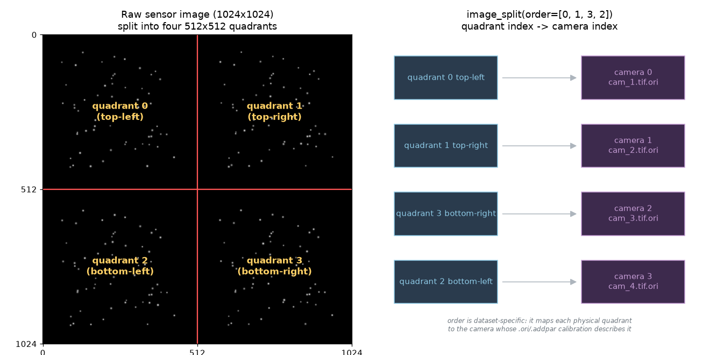

# Tutorial: 4-View Image Splitter in openptv2

This tutorial walks through the complete workflow for a **single-camera,
four-view image-splitter** PTV experiment in `openptv2`: preparing images,
setting parameters, calibrating, running the splitter plugins, and verifying
you get correct 3D correspondences and tracks.

It is grounded in the working reference dataset shipped with the repo,
[`test_data/test_splitter/`](https://github.com/alexlib/openptv2/blob/main/test_data/test_splitter), and uses the
demo assets in [`images/`](images/).

---

## 1. What a "4-view splitter" is

In a splitter setup you have **one physical camera** and **one image per frame**.
An optical splitter (mirrors or a prism assembly) projects **four different views**
of the same measurement volume onto the four quadrants of the sensor.

You then treat each 512×512 quadrant as an **independent virtual camera** with its
own calibration. Everything downstream (detection, stereo correspondence,
triangulation, tracking) runs exactly as a normal 4-camera experiment — the only
extra step is splitting the one image into four.



Key facts:

- Raw frame: `1024×1024` (one file per time step).
- Split into four `512×512` quadrants → 4 virtual cameras.
- The **quadrant→camera order is dataset-specific** (see §6). The reference
  dataset uses `order=[0, 1, 3, 2]`.
- Each virtual camera has its **own** `.ori` + `.addpar` calibration. Because the
  splitter optics are off-center, the calibrated **principal point (xh, yh) can be
  large — even larger than the quadrant half-size**. That is normal and must be
  handled correctly (it was the source of a real bug — see §9).

A synthetic demo frame is provided:
[`images/demo_4view.tif`](images/demo_4view.tif) (1024×1024, four viewpoints of the
same particle cloud). Regenerate it any time with:

```bash
uv run python docs/tutorials/four_view_splitter/make_demo_assets.py
```

---

## 2. Directory layout

A splitter experiment is a normal openptv2 experiment directory. Reference:

```
test_data/test_splitter/
├── parameters_Run1.yaml        # single source of truth (YAML-first)
├── parameters/                 # legacy .par mirror (auto-derived from YAML)
├── cal/                        # calibration: one .ori + .addpar PER quadrant
│   ├── cam_1.tif.ori   cam_1.tif.addpar
│   ├── cam_2.tif.ori   cam_2.tif.addpar
│   ├── cam_3.tif.ori   cam_3.tif.addpar
│   ├── cam_4.tif.ori   cam_4.tif.addpar
│   ├── calblock_new.txt        # 3D coordinates of the calibration target
│   └── C001H001S0001000001.tif # the (full 1024×1024) calibration image
├── img/                        # raw single-sensor frames, one file per time step
│   └── C001H001S000<frame>.tif
└── res/                        # outputs (rt_is.*, ptv_is.*) are written here
```

The splitter sequence/tracker plugins are built into `openptv2.plugins` — no
`plugins/` folder is needed in the experiment directory. (An experiment-local
`plugins/` dir is still supported as an override for one-off scripts; see
§6.)

Even though there are four virtual cameras, there is only **one** raw image series
in `img/` and **one** calibration image in `cal/` — both full 1024×1024. The
splitter code does the cropping.

---

## 3. Preparing your images

1. **One file per frame**, full sensor size (here 1024×1024), 8-bit grayscale TIFF.
   Color images are converted to grayscale by the plugin.
2. Name them with a `%d`-style frame token. The reference uses
   `img/C001H001S000%d.tif`, so frame `1000001` → `img/C001H001S0001000001.tif`.
   This pattern lives in the YAML under `sequence.base_name[0]`.
3. **Quadrant geometry is fixed halves**: top-left, top-right, bottom-left,
   bottom-right, each `imx/2 × imy/2`. There is no gap/border handling — if your
   splitter has dead bands between views, crop/pad the raw image so each view sits
   cleanly in its quadrant before running.
4. The calibration image (`cal/…tif`) must be the **same full size** and produced
   by the **same optical path** as the data frames.

> Only the **first** `sequence.base_name` / `ptv.img_name` entry is used in
> splitter mode (the other three are `'---'` placeholders). The four cameras all
> come from splitting that one image.

---

## 4. Parameters (YAML-first)

`openptv2` is YAML-first: [`parameters_Run1.yaml`](https://github.com/alexlib/openptv2/blob/main/test_data/test_splitter/parameters_Run1.yaml)
is the single source of truth. The two flags that turn on splitter mode:

```yaml
ptv:
  splitter: true          # <-- enable image splitting in the sequence
  imx: 512                # <-- QUADRANT size, not the raw sensor size
  imy: 512
  pix_x: 0.02             # pixel pitch in mm
  pix_y: 0.02
  hp_flag: true           # high-pass before detection
  img_name:
  - img/C001H001S0001000002.tif   # only [0] is used in splitter mode
  - '---'
  - '---'
  - '---'
  mmp_n1: 1.0             # multimedia refractive indices (air/glass/water)
  mmp_n2: 1.49
  mmp_n3: 1.41
  mmp_d: 7.5

cal_ori:
  cal_splitter: true      # <-- split the calibration image the same way

sequence:
  base_name:
  - img/C001H001S000%d.tif   # only [0] is used in splitter mode
  - '--'
  - '--'
  - '--'
  first: 1000001
  last: 1000005
```

Critical point: **`imx`/`imy` are the quadrant dimensions (512×512), NOT the raw
1024×1024 sensor.** The calibration is expressed in quadrant coordinates, so every
metric conversion (`pixel_to_metric`) uses the 512×512 size.

Other sections you will tune (values from the reference dataset):

**Detection** — `targ_rec` (the parameters actually used at runtime):

```yaml
targ_rec:
  gvthres: [10, 10, 10, 10]   # grey threshold per camera
  disco: 50                   # max grey discontinuity for blob growth
  nnmin: 2                    # min/max pixels per particle
  nnmax: 200
  nxmin: 1                    # min/max bounding-box width
  nxmax: 15
  nymin: 2                    # min/max bounding-box height
  nymax: 15
  sumg_min: 20                # min summed grey
  cr_sz: 2                    # high-pass / cross size
```

**Correspondence + volume** — `criteria`:

```yaml
criteria:
  X_lay:   [-30, 50]     # illuminated volume x-extent (mm)
  Zmin_lay: [-80, -80]   # z at the two x-planes
  Zmax_lay: [-15, -15]
  cnx: 0.3               # correspondence tolerances (band widths / weights)
  cny: 0.3
  cn:  0.02
  csumg: 0.02
  corrmin: 33.0          # minimum correlation to accept a match
  eps0: 0.06             # epipolar band half-width (mm)  <-- most important knob
```

`eps0` is the epipolar search-band half-width in millimeters. If it is too small
you get **zero** correspondences; too large and you get false matches. `0.06 mm`
works for the reference dataset.

**Tracking** — `track` (velocity/acceleration gates in mm/frame):

```yaml
track:
  dvxmin: -1.9   dvxmax: 1.9
  dvymin: -1.9   dvymax: 1.9
  dvzmin: -1.9   dvzmax: 1.9
  dacc: 1.9              # max acceleration
  angle: 270.0          # max direction change
  flagNewParticles: true
```

---

## 5. Calibration (per quadrant)

Each virtual camera needs its own `cam_N.tif.ori` (exterior + interior
orientation) and `cam_N.tif.addpar` (Brown distortion: k1,k2,k3,p1,p2,scx,she).

**`.ori` file format** (as in `cal/cam_1.tif.ori`):

```
x0  y0  z0            # camera position (mm)
omega  phi  kappa     # rotation angles (rad)
<blank>
r11 r12 r13           # 3×3 rotation matrix
r21 r22 r23
r31 r32 r33
<blank>
xh   yh               # principal point (mm)  <-- often large for splitters
cc                    # camera constant / focal length (mm)
<blank>
gx gy gz              # glass/interface vector
```

Workflow to produce them:

1. **Enable splitting for calibration** with `cal_ori.cal_splitter: true`. The
   calibration image is split into the same four quadrants, so you calibrate each
   virtual camera against its quadrant of the calibration target image.
2. **Provide the 3D target coordinates** in `cal/calblock_new.txt`
   (`fixp_name` in `cal_ori`), one `id x y z` per control point.
3. **Seed manual orientation.** The YAML carries clicked image points per camera in
   `man_ori_coordinates` (4 known points per virtual camera) plus the matching
   control-point ids in `man_ori.nr`. These bootstrap the exterior orientation.
4. **Run the calibration** (external orientation → `sortgrid` → bundle adjustment).
   The turnkey path is the **`openptv-calibrate` skill**, which inspects the
   dataset, helps you click the manual-orientation seed if missing, runs the full
   external→sortgrid→bundle pipeline, and verifies with reprojection overlays and
   RMS. In the GUI, the calibration window honors `cal_splitter` and shows
   "Using splitter in Calibration".

**Sanity checks after calibrating** (do these before trusting results):

- Reprojection RMS should be sub-pixel (verify with overlay images).
- A large `xh`/`yh` (e.g. `8.77 mm` on a 512-px/10.24-mm-wide quadrant) is
  **expected** for off-center splitter optics — it is *not* a sign of bad
  calibration. Do not "fix" it by zeroing.

---

## 6. The splitter plugins

Splitter behavior lives in two built-in plugins, shipped in
`src/openptv2/plugins/`:

- `splitter_sequence.py` — detection + correspondence (the `Sequence` class,
  `do_sequence()`). Selected as `sequence_plugin="ext_sequence_splitter"`
  below — the legacy name is an alias, resolved by
  `openptv2.plugins.loader.LEGACY_ALIASES`.
- `splitter_tracking.py` — temporal tracking (the `Tracking` class,
  `do_tracking()`). Selected as `tracking_plugin="ext_tracker_splitter"`.

You do not need to copy these into your experiment folder. If you need a
one-off variant for a specific dataset, drop a `.py` file in an
experiment-local `plugins/` directory next to the YAML — it is resolved after
the built-ins, so it can shadow them by using the same name, or add a new
one.

The core of the sequence plugin (simplified):

```python
full_image = imread(imname)  # one 1024×1024 frame
list_of_images = self.ptv.image_split(full_image, order=[0, 1, 3, 2])  # -> 4 views

for i_cam in range(num_cams):
    hp = self.ptv.simple_highpass(list_of_images[i_cam], cpar)
    targs = self.ptv.target_recognition(hp, tpar, i_cam, cpar)  # detect
    targs.sort_y()
    detections.append(targs)
    corrected.append(MatchedCoords(targs, cpar, cals[i_cam]))  # pixel->metric->flat

sorted_pos, sorted_corresp, _ = correspondences(detections, corrected, cals, vpar, cpar)
```

### 6a. Quadrant order (`order=[0, 1, 3, 2]`)

`image_split` cuts the sensor into `[top-left, top-right, bottom-left, bottom-right]`
= indices `[0,1,2,3]`, then reorders by `order`. The list index becomes the
**camera index**, so `order` must map each physical quadrant to the camera whose
`.ori`/`.addpar` describes it.

`[0, 1, 3, 2]` means: camera 0 = top-left, camera 1 = top-right,
camera 2 = **bottom-right**, camera 3 = **bottom-left** (the bottom two are
swapped — an optics-specific choice). **If your correspondences come out near
zero, a wrong `order` is a prime suspect** — the calibration for camera *k* then
describes the wrong quadrant. Try the permutation that matches how your splitter
routes views to quadrants.

### 6b. Use openptv2 imports, not `optv`

If you write your own plugin (built-in or experiment-local), import from
`openptv2`, not the legacy `optv` C package — mixing them silently feeds
openptv2-detected targets to optv's C structures and you get **zero
correspondences**. The built-in `splitter_sequence.py` / `splitter_tracking.py`
already do this; keep new plugin headers consistent:

```python
from openptv2.correspondences import correspondences, MatchedCoords
from openptv2.tracker import default_naming, Tracker
from openptv2.orientation import point_positions
```

---

## 7. Running the pipeline

Programmatically, via `run_batch`:

```python
from pathlib import Path
from openptv2.batch.pyptv_batch_plugins import run_batch

run_batch(
    yaml_file=Path("test_data/test_splitter/parameters_Run1.yaml"),
    seq_first=1000001,
    seq_last=1000002,
    sequence_plugin="ext_sequence_splitter",
    tracking_plugin="ext_tracker_splitter",
    mode="sequence",  # "sequence" | "tracking" | "both"
)
```

- `mode="sequence"` runs detection + correspondence and writes `res/rt_is.<frame>`.
- `mode="tracking"` links particles across frames → `res/ptv_is.<frame>`.
- `mode="both"` does sequence then tracking.
- `run_batch` `chdir`s into the YAML's directory, so all relative paths in the YAML
  resolve against the experiment folder.

> **Tip for testing:** run against a *copy* of the experiment. The plugins write
> `cam*_targets` and `rt_is.*` files in place, so pointing at your pristine dataset
> will modify it. Copy the folder to a scratch dir (or `tmp_path` in tests) first.

From the GUI (`pyptv_gui`), open the experiment; splitter mode is picked up from
`ptv.splitter` / `cal_ori.cal_splitter`, and the selected plugins come from the
`plugins` section of the YAML.

---

## 8. Getting — and verifying — the right results

A correct run prints per-frame correspondence counts as
`[quadruplets, triplets, pairs]`:

```
Frame 1000001 had [1247, 914, 24] correspondences.
Frame 1000002 had [1210, 929, 16] correspondences.
```

and writes `res/rt_is.<frame>` with one line per triangulated 3D point:

```
<n_points>
   1   x   y   z   p0 p1 p2 p3
   ...
```

where `x y z` are metric 3D coordinates and `p0..p3` are the target indices in each
camera (−1 = not seen in that camera).

**How to verify you got it right:**

1. **Non-zero, sensible correspondence counts.** Thousands of quads/trips for a
   dense seeded flow; a flat `[0, 0, 0]` means something is wrong (see §9).
2. **Detection counts per camera** are in the same ballpark across the four views
   (a few thousand for the demo/reference); a camera with ~0 targets points to a
   bad quadrant crop, threshold, or high-pass.
3. **3D points fall inside the illuminated volume** defined by `criteria`
   (`X_lay`, `Zmin/Zmax_lay`). Points far outside indicate a calibration or
   `order` error.
4. **Ground-truth parity (optional but decisive):** if you have the legacy `optv`
   package installed, run the same detections through `optv`'s `MatchedCoords` +
   `correspondences` and compare — corrected coordinates should match to
   floating-point, and counts should match within detection noise.

---

## 9. Troubleshooting

**Symptom: `Frame N had [0, 0, 0] correspondences.` (everything else looks fine)**

Root causes, in order of likelihood:

1. **Wrong quadrant `order`** — camera *k*'s calibration describes a different
   quadrant than the one handed to it. Try the permutation matching your optics.
2. **`eps0` too small** — widen the epipolar band in `criteria.eps0`.
3. **Plugin importing from `optv` instead of `openptv2`** (§6b) — cross-package
   type mismatch silently yields zero matches.
4. **Principal point not applied in the flat-coordinate transform.** This was a
   real openptv2 bug: `MatchedCoords`' distortion-correction step must subtract the
   principal point `(xh, yh)` (via `trafo.dist_to_flat`). With centered
   calibrations it was invisible, but splitter cameras have large `xh/yh`, so every
   coordinate landed ~`xh` mm off and epipolar bands missed every target. It is
   fixed in current openptv2; if you maintain a fork, confirm
   `openptv2.transforms.distorted_to_flat` delegates to
   `openptv2.algorithms.trafo.dist_to_flat` (which subtracts `xh, yh` and applies
   the full Brown-affine model), not a radial-only reimplementation.

**Symptom: one camera detects far fewer/no targets**
- Check that quadrant's `gvthres`, that the high-pass isn't erasing signal, and
  that the quadrant actually contains that view (visualize `image_split` output).

**Symptom: `imx/imy` confusion**
- They must be the **quadrant** size (512×512), not the raw sensor (1024×1024).
  Wrong values corrupt every pixel→metric conversion.

**Symptom: results differ by a few targets vs legacy `optv`**
- A ~0.5% detection difference is a known, benign fidelity gap in the peak-detection
  raster order; it does not materially affect correspondence quality.

---

## 10. Quick start (copy-paste)

```bash
# 1. Work on a scratch copy so the fixture stays clean
cp -r test_data/test_splitter /tmp/my_splitter

# 2. (Optional) regenerate the demo assets used by this tutorial
uv run python docs/tutorials/four_view_splitter/make_demo_assets.py

# 3. Run sequence (detection + correspondence)
uv run python - <<'PY'
from pathlib import Path
from openptv2.batch.pyptv_batch_plugins import run_batch
run_batch(
    yaml_file=Path("/tmp/my_splitter/parameters_Run1.yaml"),
    seq_first=1000001, seq_last=1000002,
    sequence_plugin="ext_sequence_splitter",
    tracking_plugin="ext_tracker_splitter",
    mode="sequence",
)
PY

# 4. Inspect results
head /tmp/my_splitter/res/rt_is.1000001
```

Expected: non-zero `[quads, trips, pairs]` printed per frame, and `res/rt_is.*`
populated with 3D points. That is a correct 4-view splitter run.
