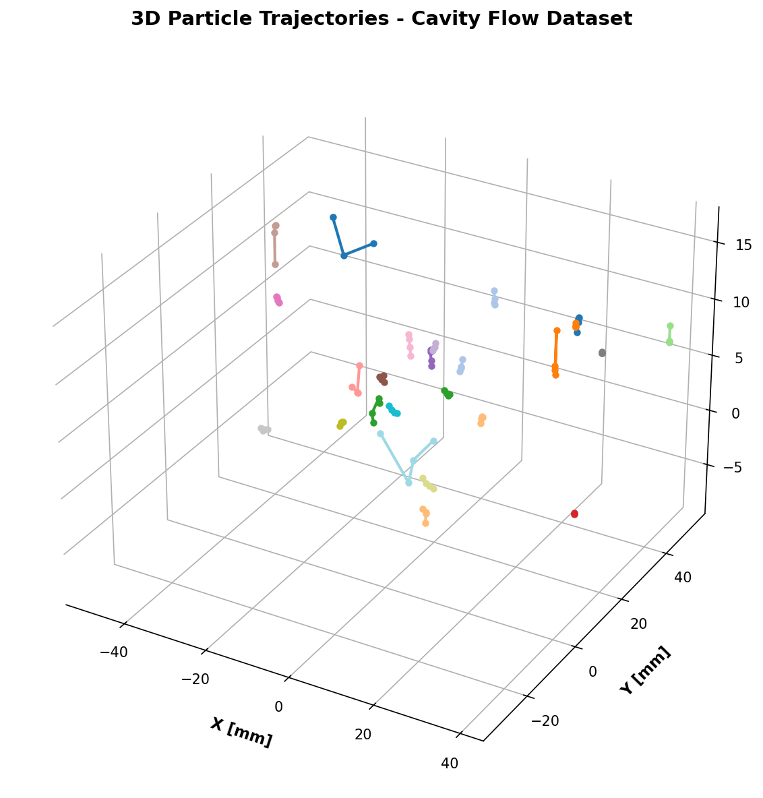
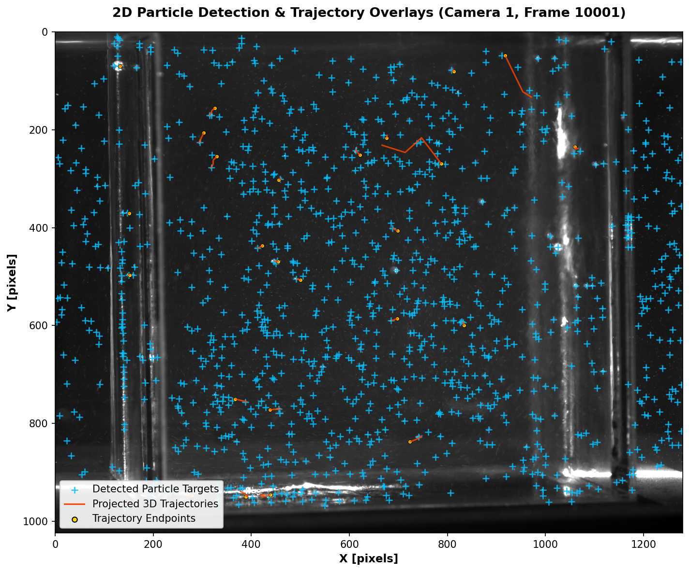

# Tutorial: End-to-End Particle Tracking

This tutorial guides you through an end-to-end Particle Tracking Velocimetry (PTV) workflow using the **cavity flow** sample dataset. You will learn how to initialize calibrations, detect particles, match correspondences, run 3D tracking, and plot results.

---

## Prerequisites

Before starting, ensure OpenPTV2 is installed with scientific dependencies:
```bash
uv pip install "openptv2[gui]"
```

For a complete, real-world sample dataset to use with this tutorial, first download the `test_cavity` case from Git:
```bash
git clone https://github.com/openptv/test_cavity
```

You can run the interactive OpenPTV2 GUI on this dataset at any time using:
```bash
uv run openptv2-gui ./test_cavity
```

*(Note: If you are running code directly from the repository, a small mock version of this dataset is also included under `test_data/test_cavity`.)*

---

## Step-by-Step Workflow Script

Create a Python script named `run_cavity_tracking.py` inside your project directory and add the following steps:

### Step 1: Initialize Project Configuration
To track particles across 4 cameras, we need to load camera calibrations and experiment parameter constraints.

```python
from openptv2.calibration import Calibration
from openptv2.parameters import TrackingParameters
import os

# Define workspace directory
workdir = "test_data/test_cavity"

# Load calibration for camera 1-4
cals = []
for cam in range(1, 5):
    cal = Calibration()
    cal.from_file(
        ori_file=os.path.join(workdir, f"cal/cam{cam}.ori"),
        addpar_file=os.path.join(workdir, f"cal/cam{cam}.addpar")
    )
    cals.append(cal)

print(f"Loaded {len(cals)} camera calibrations successfully!")
```

### Step 2: Set up Tracking Parameters
Load tracking physical bounds (e.g. search volume and velocity limits) from the YAML file:

```python
from openptv2.parameters import load_params_from_yaml

# Load parameters
params = load_params_from_yaml(os.path.join(workdir, "parameters_Run1.yaml"))
print("Velocity constraints: dvxmin =", params.track.dvxmin, "dvxmax =", params.track.dvxmax)
```

### Step 3: Run Target Segmentation (Particle Detection)
Segment particles from the TIFF images using a brightness threshold.

```python
import skimage.io
from openptv2.segmentation import detect_targets

frame_number = 10000
img_path = os.path.join(workdir, f"img/cam1_{frame_number}.tif")
image = skimage.io.imread(img_path)

# Detect targets with a intensity threshold of 12
targets = detect_targets(image, threshold=12)
print(f"Detected {len(targets)} particle targets in Camera 1, Frame {frame_number}")
```

### Step 4: Run Unified Trajectory Tracking
Instantiate the high-performance unified `Tracker` to find continuous 3D coordinate links over multiple frames.

```python
from openptv2 import Tracker

# Initialize Tracker with configuration file
tracker = Tracker(parameter_file=os.path.join(workdir, "parameters_Run1.yaml"))

# Run 3D tracking sequence on frames 10000 to 10004
tracks = tracker.track(first_frame=10000, last_frame=10004)
print(f"\nTracking complete! Formed {len(tracks)} active particle trajectories.")
```

### Step 5: Exporting and Analyzing Results
Print and review the calculated 3D coordinates from the tracking trajectories.

```python
# Print coordinates for the first 3 continuous trajectories
for path_id, trajectory in list(tracks.items())[:3]:
    print(f"\nTrajectory Path ID: {path_id}")
    for frame, pt in list(trajectory.items()):
        print(f"  Frame {frame}: [X={pt['pos'][0]:.2f}, Y={pt['pos'][1]:.2f}, Z={pt['pos'][2]:.2f}]")
```

---

## Interactive Plotting Tutorial (Matplotlib)

To plot the 3D particle trajectories we just calculated:

```python
import matplotlib.pyplot as plt
from mpl_toolkits.mplot3d import Axes3D

fig = plt.figure(figsize=(10, 8))
ax = fig.add_subplot(111, projection='3d')

# Draw each path with a unique color
for path_id, trajectory in list(tracks.items())[:15]:  # Plot first 15 trajectories
    x = [pt['pos'][0] for pt in trajectory.values()]
    y = [pt['pos'][1] for pt in trajectory.values()]
    z = [pt['pos'][2] for pt in trajectory.values()]
    
    ax.plot(x, y, z, marker='o', linestyle='-', linewidth=2, label=f"Path {path_id}")

ax.set_xlabel('X Physical Coordinate')
ax.set_ylabel('Y Physical Coordinate')
ax.set_zlabel('Z Physical Coordinate')
ax.set_title('3D Trajectories - Cavity Flow Dataset')
plt.show()
```

This completes your end-to-end particle tracking workflow with OpenPTV2!

---

## Programmatic Snapshot Generation for Visual Tutorials

For generating premium, publication-quality figures directly from the Python/C API, we include a reference tutorial snapshot generator script inside the repository at `docs/tutorials/generate_tutorial_snapshots.py`.

This script:
1. Loads the camera calibrations and control parameters.
2. Reads the raw TIFF camera images and loads detected 2D particle targets.
3. Loads the 3D particle tracking trajectories from disk.
4. Mapped 3D trajectories back onto the 2D camera image planes using pinhole camera projection equations.
5. Saves clean, high-resolution figures.

You can execute this generation script using:
```bash
uv run python docs/tutorials/generate_tutorial_snapshots.py
```

It generates the following two high-resolution visualizations under the `docs/tutorials/images/` directory:

### 1. 3D Particle Trajectories Snapshot
A modern, transparent grid 3D plot displaying the tracked 3D continuous physical particle trajectories from the cavity flow dataset.



### 2. 2D Camera Projections and Target Overlays Snapshot
The raw camera image frame overlaid with the loaded 2D detected particle targets (cyan `+`) and the projected 3D trajectory paths (orange lines with gold `o` endpoints) mapped back onto the camera sensor.


