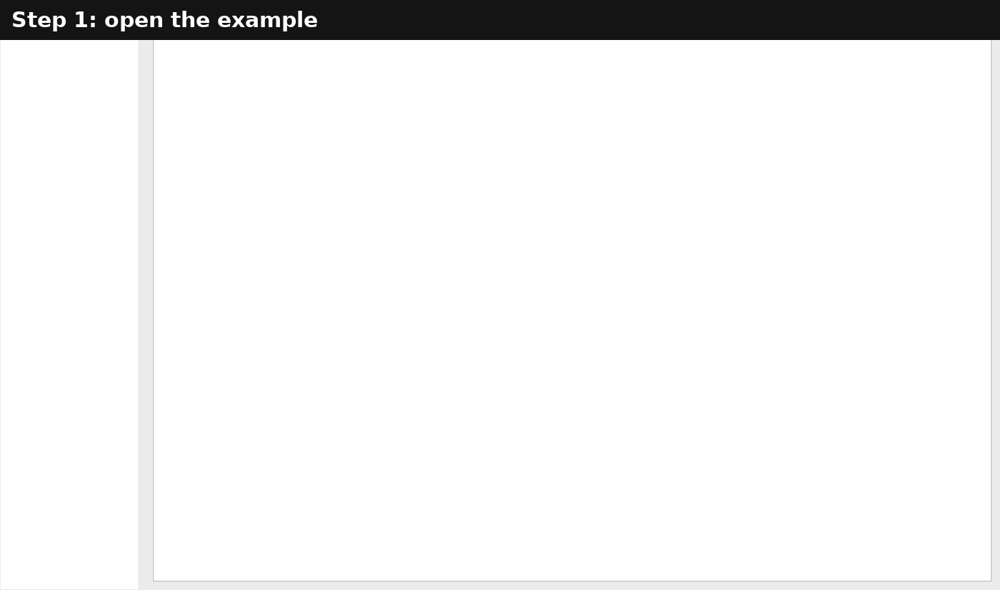
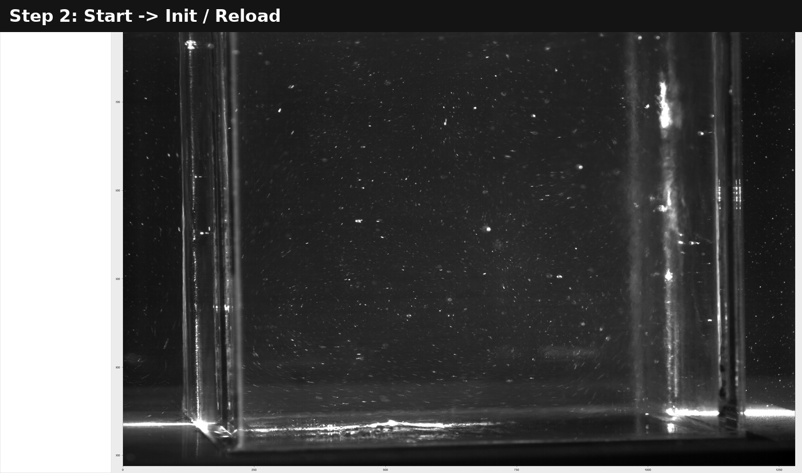
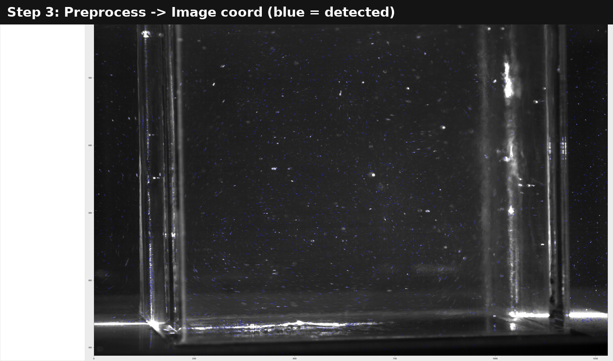
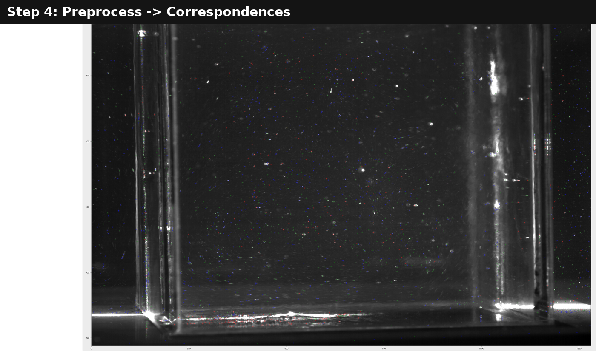
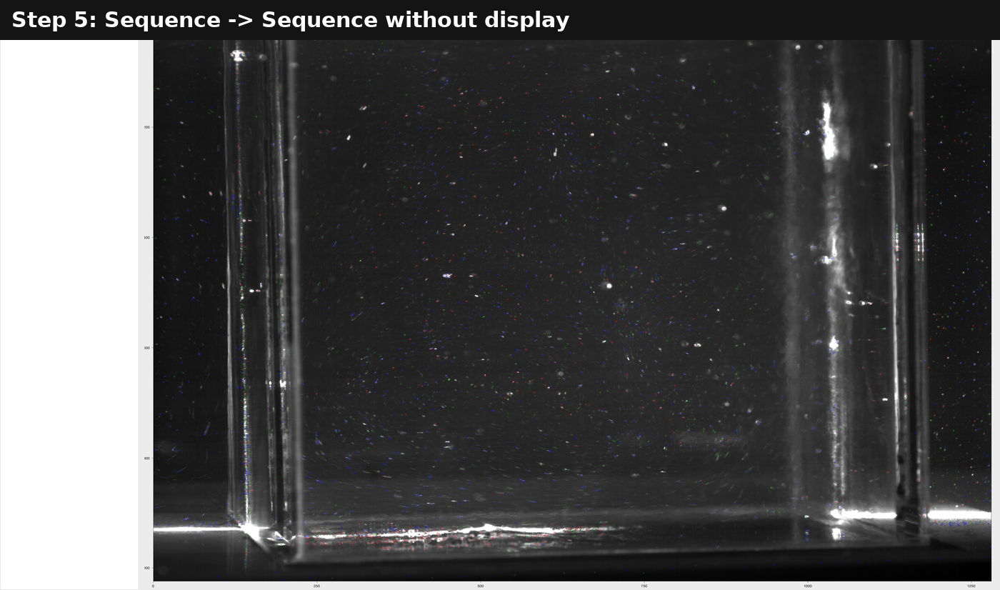
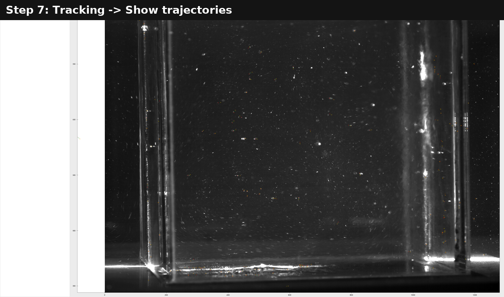

# Tutorial: Your First Tracking (GUI, 10 minutes)

Track real particles in 3D using the example bundled with openptv2.
No data to download, no parameters to change.

**You will:** open the `test_cavity` example, detect particles, match them
across 4 cameras, track them over time, and see the trajectories.

Watch the whole walkthrough first (30 seconds, recorded from the real GUI):


## Before you start

- openptv2 installed with the GUI:
  ```bash
  pip install "openptv2[gui]"
  ```
- A checkout of the openptv2 repository (the example lives in
  `test_data/test_cavity`). If you installed from PyPI without the source,
  clone it:
  ```bash
  git clone https://github.com/alexlib/openptv2.git
  cd openptv2
  ```

## Step 1: Open the example

```bash
openptv2-gui -w test_data/test_cavity/parameters_Run1.yaml
```

The GUI opens showing 4 camera views of a lid-driven cavity experiment
(frames 10000–10004).

**What it does:** `-w` points the GUI at one experiment. Passing a YAML
file makes that run active; passing a directory opens the first run found
there. Everything the GUI needs — image paths, calibrations, detection and
tracking settings — lives in that single YAML file.

**Parameters in YAML:** the whole `parameters_Run1.yaml`. Each `Run` in the
left-hand tree is one `parameters_*.yaml` file in the folder
(`Run1` → `parameters_Run1.yaml`). Right-click a run for
**Main / Calibration / Tracking parameters** dialogs; edits are saved back
to its YAML.



## Step 2: Load parameters — Start → Init / Reload

Click **Start → Init / Reload** in the menu bar.

Success looks like this in the console:

```text
Read all the parameters and calibrations successfully
```

The 4 camera views now show the first frame. If you see this message,
everything else in this tutorial will work.

**What it does:** reads the active YAML, loads the 4 camera calibrations
(`cal/camN.tif.ori` + `.addpar`) and the current frame's images
(`ptv.img_name`). No options — it either loads cleanly or reports what is
missing.

**Parameters in YAML:** `ptv` section (`img_name`, `imx`/`imy`,
multimedia `mmp_n1/n2/n3`, `mmp_d`) and `cal_ori` section (calibration
file locations).



## Step 3: Detect particles — Preprocess → Image coord

Click **Preprocess → Image coord**.

The console prints:

```text
Start detection
Detection finished
```

Each camera view fills with **blue crosses** — one per detected particle
(several hundred per camera). This is 2D detection: finding bright spots
in each image.

**What it does:** thresholds each image and keeps blobs that look like
particles (bright enough, right size). Too few crosses → lower the
threshold; merges and streaks → raise it or tighten the size bounds.

**Parameters in YAML (`targ_rec` section):** `gvthres` (brightness
threshold, one per camera), `sumg_min` (minimum total brightness),
`nnmin`/`nnmax` (pixel count), `nxmin`/`nxmax` and `nymin`/`nymax`
(width/height bounds). Edit via right-click `Run1` → **Main parameters**.



## Step 4: Match across cameras — Preprocess → Correspondences

Click **Preprocess → Correspondences**.

The console prints:

```text
correspondence proc started
```

New crosses appear in **yellow** (seen in 2 cameras), **green** (3 cameras),
and **red** (all 4 cameras). This is stereo matching: the same physical
particle found in multiple views is triangulated into a 3D position.

**What it does:** for each detection, searches the other cameras along
its epipolar line; consistent sightings become one 3D point. Detections
and 3D points are written to the run's zarr store (`run.zarr`). Mostly
blue with little color → calibration or tolerances need work, not the
detection threshold.

**Parameters in YAML (`criteria` section):** `eps0` (epipolar tolerance),
`corrmin` (minimum match quality), `cn`/`cnx`/`cny`/`csumg` (center
tolerances), `X_lay`/`Zmin_lay`/`Zmax_lay` (allowed 3D volume). The
`ptv` section's `mmp_*` values describe the air–glass–water optics and
must match your tank.



## Step 5: Process all frames — Sequence → Sequence without display

Click **Sequence → Sequence without display**.

This repeats Steps 3–4 for every frame (10000–10004). It takes under a
minute. Per-frame detections and 3D points accumulate in the run's zarr
store (`run.zarr`).

**What it does:** runs the active sequence plugin over the whole frame
range — same detection + correspondence code as Steps 3–4, no new
science, just all frames.

**Parameters in YAML (`sequence` section):** `base_name` (image filename
pattern per camera), `first`/`last` (frame range). To process more frames,
extend `last` here — or pass `--first`/`--last` to `pyptv_batch`.



## Step 6: Track over time — Tracking → Tracking without display

Click **Tracking → Tracking without display**.

The console prints:

```text
tracking without display finished
```

Particles are now linked frame-to-frame into trajectories, stored as
linkage in the run's zarr store (`run.zarr`, sealed into trajectories
automatically). Expect a few hundred trajectories over these frames.

**What it does:** predicts where each 3D particle should appear next frame
and links nearest matches into paths. Short/broken tracks → widen the
velocity box or raise `dacc`; wrong connections → narrow them.

**Parameters in YAML (`track` section):** `dvxmin`/`dvxmax`,
`dvymin`/`dvymax`, `dvzmin`/`dvzmax` (velocity search box per axis),
`dacc` (acceleration tolerance), `angle` (max direction change),
`flagNewParticles` (start tracks on unmatched particles). The tracker
itself is chosen in `plugins.selected_tracking` (this example: `default`).
Edit via right-click `Run1` → **Tracking parameters**. The
[warmup tutorial](warmup_tutorial.md) derives these from your data
automatically.


## Step 7: See the trajectories — Tracking → Show trajectories

Click **Tracking → Show trajectories** to plot the 3D paths.

**What it does:** reads the sealed trajectories from the zarr store and
draws them on the camera views — **red** heads, **green** tails,
**orange** ends. Pure visualization: no parameters, nothing is recomputed.



You just ran a full 3D-PTV pipeline: detect → match → track → visualize.

## If something goes wrong

| Symptom | Fix |
| ------- | --- |
| GUI fails with `No module named 'traitsui'` | You installed without the GUI extra. Run `pip install "openptv2[gui]"`. |
| `Init / Reload` reports a missing image | Check you launched from the repository root so relative paths in the YAML resolve. |
| No crosses after Image coord | The example threshold is pre-tuned; make sure Step 2 succeeded first. |

## Same run without the GUI

Every click above has a command-line equivalent (useful on servers).
From the repository root:

```bash
# Steps 3–5 (detection + correspondences, all frames)
pyptv_batch --workdir=test_data/test_cavity --first=10000 --last=10001 --mode=sequence

# Step 6 (tracking)
pyptv_batch --workdir=test_data/test_cavity --first=10000 --last=10001 --mode=tracking
```

## Regenerating these screenshots

All images and the animation on this page are recorded from the real GUI
by `docs/tutorials/record_gui_tutorial.py`, which drives the same menu
handlers and captures the window after each step. Re-run it from the
repository root after GUI changes:

```bash
uv run python docs/tutorials/record_gui_tutorial.py
```

## Where to go next

- [Tracking Pipeline & Results](../tracking_guide.md) — what each step does
  and where result files land.
- [Command-Line Batch Processing](batch_processing.md) — headless runs on
  your own data.
- [Plate Calibration How-To](../plate-calibration-howto.md) — calibrating
  your own cameras (only needed for new experiments, not this example).
- [Lid-Driven Cavity Flow](cavity_flow_tutorial.md) — the advanced,
  scripted version of this example (autocalibration, self-calibration,
  warmup).
