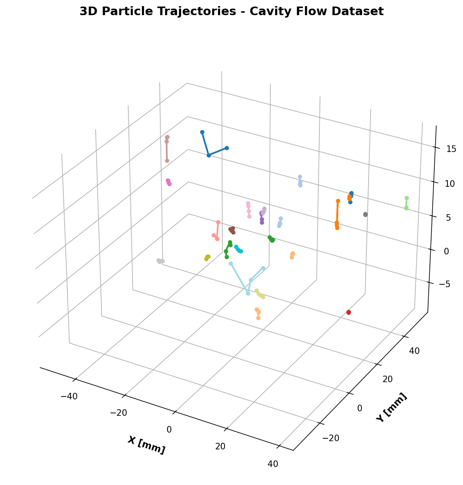

# Tutorial: Your First Tracking (GUI, 10 minutes)

Track real particles in 3D using the example bundled with openptv2.
No data to download, no parameters to change.

**You will:** open the `test_cavity` example, detect particles, match them
across 4 cameras, track them over time, and see the trajectories.

## Before you start

- openptv2 installed with the GUI:
  ```bash
  pip install "openptv2[gui]"
  ```
- A checkout of the openptv2 repository (the example lives in
  `test_data/test_cavity`). If you installed from PyPI without the source,
  clone it:
  ```bash
  git clone https://github.com/alexlib/openptv2.git
  cd openptv2
  ```

## Step 1: Open the example

```bash
openptv2-gui -w test_data/test_cavity/parameters_Run1.yaml
```

The GUI opens showing 4 camera views of a lid-driven cavity experiment
(frames 10000–10004).

## Step 2: Load parameters — Start → Init / Reload

Click **Start → Init / Reload** in the menu bar.

Success looks like this in the console:

```text
Read all the parameters and calibrations successfully
```

The 4 camera views now show the first frame. If you see this message,
everything else in this tutorial will work.

## Step 3: Detect particles — Preprocess → Image coord

Click **Preprocess → Image coord**.

The console prints:

```text
Start detection
Detection finished
```

Each camera view fills with **blue crosses** — one per detected particle
(several hundred per camera). This is 2D detection: finding bright spots
in each image.

## Step 4: Match across cameras — Preprocess → Correspondences

Click **Preprocess → Correspondences**.

The console prints:

```text
correspondence proc started
```

New crosses appear in **yellow** (seen in 2 cameras), **green** (3 cameras),
and **red** (all 4 cameras). This is stereo matching: the same physical
particle found in multiple views is triangulated into a 3D position.

## Step 5: Process all frames — Sequence → Sequence without display

Click **Sequence → Sequence without display**.

This repeats Steps 3–4 for every frame (10000–10004). It takes under a
minute. Results are saved to `test_data/test_cavity/res/` as `rt_is.*`
files (one per frame, 3D positions).

## Step 6: Track over time — Tracking → Tracking without display

Click **Tracking → Tracking without display**.

The console prints:

```text
tracking without display finished
```

Particles are now linked frame-to-frame into trajectories, saved as
`res/ptv_is.*` files. Expect a few hundred trajectories over these frames.

## Step 7: See the trajectories — Tracking → Show trajectories

Click **Tracking → Show trajectories** to plot the 3D paths.



You just ran a full 3D-PTV pipeline: detect → match → track → visualize.

## If something goes wrong

| Symptom | Fix |
| ------- | --- |
| GUI fails with `No module named 'traitsui'` | You installed without the GUI extra. Run `pip install "openptv2[gui]"`. |
| `Init / Reload` reports a missing image | Check you launched from the repository root so relative paths in the YAML resolve. |
| No crosses after Image coord | The example threshold is pre-tuned; make sure Step 2 succeeded first. |

## Same run without the GUI

Every click above has a command-line equivalent (useful on servers).
From the repository root:

```bash
# Steps 3–5 (detection + correspondences, all frames)
pyptv_batch --workdir=test_data/test_cavity --first=10000 --last=10001 --mode=sequence

# Step 6 (tracking)
pyptv_batch --workdir=test_data/test_cavity --first=10000 --last=10001 --mode=tracking
```

## Where to go next

- [Tracking Pipeline & Results](../tracking_guide.md) — what each step does
  and where result files land.
- [Command-Line Batch Processing](batch_processing.md) — headless runs on
  your own data.
- [Plate Calibration How-To](../plate-calibration-howto.md) — calibrating
  your own cameras (only needed for new experiments, not this example).
- [Lid-Driven Cavity Flow](cavity_flow_tutorial.md) — the advanced,
  scripted version of this example (autocalibration, self-calibration,
  warmup).
