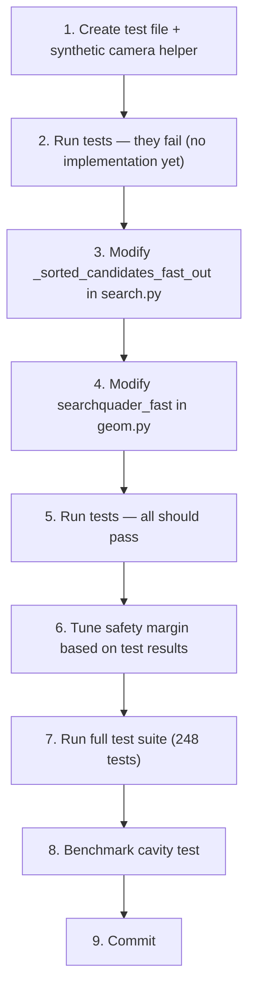

# Plan: Reduced Quader Search — 2-Corner Approximation

## Overview

Replace the current 8-corner quader projection with a **2-diagonal-corner + safety margin** approach for pinhole cameras (no multimedia). This reduces `_point_to_pixel_out` calls from 32 per candidate to 8 per candidate — a **4× reduction** in the searchquader section, estimated **30-40% total kernel speedup**.

## Branch

```
feature/reduced-quader-search  (forked from main)
```

## Design

### Current algorithm (inlined in `_sorted_candidates_fast_out`)

```python
for i in range(num_cams):                    # 4 cameras
    for pt in range(8):                      # 8 corners
        _point_to_pixel_out(qx, qy, qz, ...) # 32 projections total
```

### New algorithm

```python
for i in range(num_cams):
    if has_mmlut:
        # SAFE PATH: full 8-corner projection (unchanged)
        for pt in range(8):
            _point_to_pixel_out(...)
    else:
        # FAST PATH: 2 diagonal corners + safety margin
        # Corner A: (px+dvxmin, py+dvymin, pz+dvzmin)
        _point_to_pixel_out(px+dvxmin, py+dvymin, pz+dvzmin, ...)
        xl_i = x_min = corner_x; xr_i = x_max = corner_x
        yu_i = y_min = corner_y; yd_i = y_max = corner_y
        # Corner B: (px+dvxmax, py+dvymax, pz+dvzmax)
        _point_to_pixel_out(px+dvxmax, py+dvymax, pz+dvzmax, ...)
        xl_i = min(x_min, corner_x); xr_i = max(x_max, corner_x)
        yu_i = min(y_min, corner_y); yd_i = max(y_max, corner_y)
        # Expand by safety margin to compensate for perspective non-linearity
        margin = 0.05  # 5%, tunable based on test results
        dx = (xr_i - xl_i) * margin; dy = (yd_i - yu_i) * margin
        xl_i -= dx; xr_i += dx; yu_i -= dy; yd_i += dy
```

### Rationale for 2 diagonal corners

For a pinhole projection (no multimedia, no distortion):
```
x = f * (dm·X) / (dm·Z)  (simplified)
y = f * (dm·Y) / (dm·Z)
```

The 8 quader corners (±dvx, ±dvy, ±dvz) form a box. The 2 diagonal corners — (dvxmin, dvymin, dvzmin) and (dvxmax, dvymax, dvzmax) — are the extreme points of the box in 3D. For small search boxes (dvz ≪ camera distance Z, typical: dvz=±15mm, Z≈500mm), the 1/Z variation across the box is only ~6%, making the perspective projection approximately linear over the box. The diagonal bounds then closely approximate the true 8-corner bounds.

The 5% safety margin absorbs the non-linear error, ensuring no candidates are missed while still being much tighter than using the full image as the search area.

### Files to modify

| File | Function | Change |
|------|----------|--------|
| `track_kernels_search.py` | `_sorted_candidates_fast_out` lines 519-578 | Replace inlined 8-corner loop with conditional 2-corner |
| `track_kernels_geom.py` | `searchquader_fast` lines 765-773 | Same change for the standalone function |

### New test file

`tests/unit/test_searchquader_approx.py` — comprehensive test suite (see below).

---

## Tests

### Test 1: `test_2corner_vs_8corner_pinhole` — Correctness

**Purpose:** Verify 2-corner + margin bounds always encompass 8-corner bounds for pinhole cameras.

**Setup:**
- 4 synthetic pinhole cameras (no multimedia, no distortion)
- Parameters: cc=70mm, imx=1024, imy=1024, pix=0.01mm, FOV ≈ 70°
- Camera positions: 4 corners of a 500mm cube, looking at center
- 200 random particle positions uniformly distributed in the measurement volume

**Assertions:**
- For every particle × camera combination: the 2-corner × (1+MARGIN) bounding box must contain all 8 individually projected corners
- MARGIN starts at 0.05 (5%) — adjust up if any test fails, down if all pass

### Test 2: `test_2corner_not_excessive` — Efficiency

**Purpose:** Verify 2-corner bounds are not pathologically larger than 8-corner bounds.

**Setup:** Same as Test 1.

**Assertions:**
- Area of 2-corner bounding box ≤ Area of 8-corner bounding box × (1 + MARGIN)² × 2
  (allowing for the margin expansion plus a small additional factor for the approximation error)
- If this fails, the safety margin is too large and the search becomes inefficient

### Test 3: `test_2corner_vs_8corner_multimedia` — Fallback safety

**Purpose:** Verify that multimedia cameras always take the 8-corner path.

**Setup:** Same as Test 1 but with synthetic multimedia data (mmlut) added to one camera.

**Assertions:**
- The bounding boxes from the function are IDENTICAL to the 8-corner baseline
- This proves the `has_mmlut` check correctly falls back

### Test 4: `test_2corner_vs_8corner_extreme` — Edge cases

**Purpose:** Verify the approximation holds at extreme parameter values.

**Test cases:**

| Case | dv | Distortion | Position | Expected |
|------|----|-----------|----------|----------|
| Large box | ±50mm | None | Center | Bounds may be ~15px off; needs larger margin |
| Small box | ±1mm | None | Edge | Very accurate (<1px) |
| Strong radial | ±15mm | k1=0.1 | Off-center | Distortion may shift extremes; test margin |
| Volume corner | ±15mm | None | (x,y near edge) | Perspective warp strongest at edges |
| Elongated Z | dvz=±50mm, dvx/vy=±5mm | None | Center | Large Z variation tests perspective approx |

**Assertions:** Document the margin needed for each case. The default 5% margin should cover normal cases (dvz ≤ ±20mm, moderate distortion). Extreme cases may need larger margins.

### Test 5: `test_2corner_tracking_parity` (slow) — Full pipeline

**Purpose:** Verify the actual cavity tracking results don't change.

**Setup:** Run the cavity test (`test_track.py::test_cavity`) with a compile-time flag or code injection that forces the 2-corner path for all cameras.

**Assertions:**
- `npart` matches within 2% of the 8-corner baseline
- `nlinks` matches within 2% of the 8-corner baseline
- If this test fails, the margin is too small or the approximation is invalid for this dataset

---

## Synthetic Camera Generation

A helper function to create test calibration data:

```python
def make_synthetic_cal(
    num_cams: int = 4,
    has_mmlut: bool = False,
    has_distortion: bool = False,
    seed: int = 42,
) -> tuple[list[Calibration], SequencePar, ControlPar, VolumePar]:
    """Generate synthetic calibration for testing.

    Camera layout:
    4 cameras at corners of a 500mm cube, all pointed at origin.
    Each camera: cc=70mm, pixel=0.01mm, sensor=1024x1024.
    """
```

This creates a full calibration that can be plugged into the tracking pipeline, allowing Test 5 to run with controlled parameters.

---

## Implementation Steps



---

## Success Criteria

| Criterion | Target | How to measure |
|-----------|--------|----------------|
| Correctness | 2-corner + margin ⊇ 8-corner for all pinhole cases | Test 1 |
| Efficiency | Search area not more than 10% larger | Test 2 |
| Fallback | 8-corner used for multimedia cameras | Test 3 |
| Full pipeline | npart/nlinks within 2% of baseline | Test 5 |
| Speedup | Cavity test 30-40% faster | Benchmark |

---

## Effort Estimate

| Task | Time |
|------|------|
| Test file + synthetic camera helper | 1-2h |
| Modify search.py (inlined quader) | 1h |
| Modify geom.py (searchquader_fast) | 0.5h |
| Test iteration + margin tuning | 1-2h |
| Full test suite + benchmark | 1h |
| **Total** | **~5-7h** |
