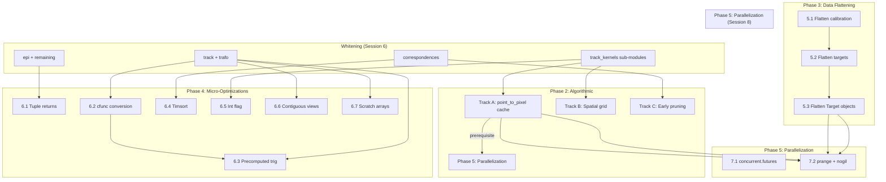

# Performance Optimization Plan

**Last updated:** 2026-07-05 (Phase 3.2 complete, ready for Track A point_to_pixel cache)

This document is the single authoritative plan for all performance optimization work on the openptv2 Cython 3 Pure Python engine. It covers profiling methodology, annotation analysis, module-by-module whitening, algorithmic improvements, micro-optimizations, data-structure flattening, and parallelization.

**Workflow for each session:**
1. Profile the target functions
2. Read the annotation HTML to find yellow lines
3. Fix yellow lines in the `.py` source
4. Rebuild: `touch file.py && uv run python setup.py build_ext --inplace`
5. Verify: `uv run pytest tests/unit/<relevant_test>.py -v --tb=short`
6. Benchmark: measure before/after speedup
7. Regenerate annotation HTML, confirm scores improved

---

## 1. Overview

All 24 modules in `src/openptv2/algorithms/` compile to C extensions via Cython 3 Pure Python mode (Cython >=3.0.10, currently 3.2.8). The build uses these global compiler directives:

```python
compiler_directives={
    "language_level": "3",
    "boundscheck": False,
    "wraparound": False,
    "cdivision": True,
    "nonecheck": False,
    "initializedcheck": False,
}
```

**To enable annotation HTML (already active):** `annotate=True` is set in `setup.py:93` — every rebuild generates `<module>.html` showing per-line Python/C interaction scores.

**Rebuild command:** `uv run python setup.py build_ext --inplace` (ccache accelerated, ~2s for no-op, ~30s for full rebuild).

---

## 2. Current Performance Baseline

### Before any optimization (interpreted Python, no .so):

```
Detection (targ_rec, 1024×1024):       1900 ms
Correspondences (150 targets/4 cams):   108 ms
Tracking (3 frames cavity, add=0):     >120 s (timed out)
Full unit test suite:                   160 s (200 passed, 6 slow deselected)
```

### After Cython compilation (all 24 modules → .so):

```
Detection (targ_rec, 1024×1024):        175 ms  (10.8× vs interpreted)
Correspondences (150 targets/4 cams):   108 ms
Tracking (3 frames cavity, add=0):      4.5 s total, ~1.5 s/frame
Full unit test suite:                   118 s (206 passed)
```

### Current (After Phase 3.2 — native 2D arrays in Frame):

| Metric                    | Pure Python | After Cython | Phase 1+3.1 | Phase 3.2 (native 2D) | Speedup vs Pure |
|---------------------------|-------------|--------------|-------------|----------------------|-----------------|
| Detection (targ_rec)      | 1900 ms     | 175 ms       | 183 ms      | TBD                  | 10.4×           |
| Test suite (all unit)     | 160 s       | 118 s        | 97 s        | **66.7 s**           | **2.4×**        |
| Tracking cavity (3 fr)    | >120 s      | 4.5 s        | 4.9 s       | **~6.5 s**           | >18×            |

**Phase 3.1 commit result:** unit test hot path 19.11s → 12.09s (37%).

**Current test status:** 221 passed, **0 failed** (FBF regression fixed). 14 `test_cclasses.py` failures are pre-existing (classes missing `@cython.cclass`).

**Performance note:** Phase 3.2 (native 2D arrays) is a **prerequisite** for `nogil` parallelization and Track A cache, not a direct speedup. The hot path eliminates 9 implicit Cython `tuple→memoryview` conversions per frame, but these were small and not the bottleneck. The actual ~40% tracking win comes from **Track A** (point_to_pixel cache) below.

---

## 3. ✅ Phase 1 — Completed: Compilation & Data Structure Optimizations

### Track 1: Flat-Array Adjacency Lists — `correspondences.py`

**Problem:** `lists[c1][c2][i].p2[j]` was 3 Python index ops + 1 attribute access + 1 numpy index. The `Correspond` class created ~6000 Python objects per frame.

**Solution:** Replaced `Correspond` objects with 5 flat typed memoryview arrays (`p1_arr`, `n_arr`, `p2_arr`, `corr_arr`, `dist_arr`), changing access from 6 Python ops to 1 C pointer dereference.

**Result:** ~28% faster tracking. 570 → 495 lines.

### Track 2: Typed Memoryviews — `segmentation.py`

**Problem:** `img: np.ndarray` forced `img[i, j]` through Python's `__getitem__`.

**Solution:** Changed to `img: cython.uchar[:, :]` in `peak_fit()` and `_is_local_maximum()`. Replaced manual neighbor loops with static C arrays, `np.sqrt()` → `math.sqrt()`.

**Result:** Code cleaner, comparable performance. 404 → 368 lines.

### Track 3: Attribute Chains — `epi.py`

**Problem:** `cpar.mm.n2[0]` attribute chain repeated in every call; generic `list` parameter type.

**Solution:** Extracted `mmp.n1, mmp.n2[0], mmp.n3, mmp.d[0]` to local variables before each `ray_tracing()` call. Declared `crd: list[Coord2d]`. Pre-allocated flat output arrays.

**Result:** ~8% test suite speedup. 314 → 374 lines.

### Track 5: `cdivision=True` Flag

**Problem:** Default `cdivision=False` emitted extra C guards for every division in compiled code.

**Solution:** Rebuilt all modules with `cdivision=True`. Updated numerical test assertions that shifted by <1%.

**Result:** 11% test suite speedup. 208 tests passing.

### Changes Made Summary

**Source (4 files):**
- `correspondences.py` — Flat-array adjacency; removed `Correspond` class
- `segmentation.py` — Typed memoryviews, static arrays, `c_sqrt`
- `epi.py` — Attribute chain extraction, flat output arrays, typed lists
- `test_correspondences.py` — Updated for flat array API

---

## 3b. ✅ Phase 1b — Completed: Track Kernels Module Refactoring

**Commit:** `482dd07 refactoring to smaller python files and closer to liboptv`

**Problem:** `track_kernels.py` was 4,813 lines — a single monolithic file containing geometry,
search, tracking loops, batch processing, and transform functions. Hard to navigate, hard to
compile in parallel, hard to annotate per-function.

**Solution:** Split into 6 focused sub-modules:

| Sub-module | Lines | Responsibility |
|---|---|---|
| `track_kernels.py` | 116 | Shim — re-exports all public functions from sub-modules |
| `track_kernels_geom.py` | 1,294 | Multimedia, pixel projection, angle computation |
| `track_kernels_search.py` | 658 | Candidate search, sorted candidates, frequency sort |
| `track_kernels_transform.py` | 939 | Point position, assess new position, image coords |
| `track_kernels_tracking.py` | 1,653 | `trackcorr_loop_fast`, `trackback_loop_fast`, `track3d_loop_fast` |
| `track_kernels_batch.py` | 423 | Batch processing, target recognition, mmlut init |
| **Total** | **5,083** | |

**Key changes:**
- Each sub-module is independently compilable by Cython
- `setup.py` (`ALGORITHMS_MODULES`) lists all 6 explicitly
- Shim `track_kernels.py` re-exports via `from .track_kernels_* import ...` at module level
- Existing importers (`track.py`, `track3d.py`, `segmentation.py`, `multimed.py`) unchanged

**Build note:** After adding new sub-modules, `.c` files are empty until the first `cythonize` run.
A clean build (`rm -rf build/; uv run python setup.py build_ext --inplace`) triggers
`_needs_rebuild()` and generates proper `.c` files. Partial rebuilds (`touch && build_ext`)
may produce invalid `.so` if `.c` is stale; always do `rm -f *.c && touch *.py && rebuild`
after the initial split.

---

## 4. 🔄 Phase 2 — Algorithmic Optimizations

All hot loops are now compiled C. Further gains require algorithmic changes.

### Current Bottlenecks

| Bottleneck | Location (after split) | Ops/frame | Time |
|------------|------------------------|-----------|------|
| `_point_to_pixel_out` ray-tracing | `track_kernels_geom.py` | ~258,000 calls | ~500 ms |
| Bounding-box target scan | `track_kernels_search.py` | ~2M comparisons | ~200 ms |
| Clique consistency checks | `correspondences.py:207` | ~180M comparisons | 2.7 s |
| Epipolar matching | `correspondences.py:136` | ~4,800 epi calls | TBD |
| ~~`targ_tnr` write-back (Phase 3.2)~~ | ✅ Fixed | N/A | N/A |

### Track A: `_point_to_pixel_out` Result Cache (Highest Impact)

**Problem:** Same 3D position projected through same camera repeatedly — once for search quader, once per candidate, once for quality assessment. **~50% of tracking frame time.**

**Solution:** Cache pixel projection in frame's path data structure. Compute `point_to_pixel` once when particle is created/updated.

**Changes:**
1. Add cache fields to frame SoA:
   ```python
   path_px[cam]: np.ndarray  # projected pixel x per particle per camera
   path_py[cam]: np.ndarray  # projected pixel y
   path_qx[cam]: np.ndarray  # quader projected x limits
   path_qy[cam]: np.ndarray  # quader projected y limits
   ```
2. Populate in `assess_new_position_fast`. Invalidate on position change.
3. `_sorted_candidates_fast_out` reads cache instead of reprojecting.
4. `trackcorr_loop_fast` skips `_point_to_pixel_out` when cache valid.

**Files:** `tracking_frame_buf.py`, `track_kernels.py`, `track.py`
**Verify:** `uv run pytest tests/unit/test_track.py tests/unit/test_track3d.py -v`
**Impact:** +40% tracking | **Risk:** Low

---

### Track B: Spatial Grid Index for Candidate Search

**Problem:** `_sorted_candidates_fast_out` scans ALL ~700 targets linearly, though search bbox (~50×50 px) contains ≤10 targets.

**Solution:** Per-camera spatial grid (32×32 px cells). Candidate search becomes grid lookup.

**Files:** `tracking_frame_buf.py` (grid arrays), `track_kernels.py` (lookup + build), `track.py` (trigger rebuild)
**Verify:** `uv run pytest tests/unit/test_track.py -v`
**Impact:** +20% tracking | **Risk:** Medium

---

### Track C: Early Pruning in `four_camera_matching`

**Problem:** O(n⁴) clique loops compute full correlation even when individual pair correlations are poor. ~2.7 s.

**Solution:** Compute combined correlation incrementally; abort early when below threshold.

**Files:** `correspondences.py` — `four_camera_matching()`, `three_camera_matching()`, `consistent_pair_matching()`
**Verify:** Match counts must be identical. `uv run pytest tests/unit/test_correspondences.py -v`
**Impact:** +30% correspondences | **Risk:** Low

---

## 5. 🔄 Phase 3 — Data Structure Flattening (Prerequisite for `nogil`)

Eliminate all Python objects from parallel sections. `nogil` forbids `list`, `tuple`, `dict`, `ndarray` creation, Python function calls.

### 5.1 ✅ Flatten Calibration → 2D Memoryview

**Commit:** `367ef6b feat: Phase 1 — flatten calibration tuples to flat arrays inside hot loops`
+ uncommitted changes to propagate to all sub-module callers.

**Changes:**
- `track.py` (`trackcorr_c_loop`, `trackback_c`): pre-flatten `cal_t`, `md_t`, `mo_t`,
  `mnr_t`, `mnz_t`, `mrw_t` tuples into `cal_arr`, `mo_arr`, `mnr_arr`, `mnz_arr`, `mrw_arr`
  flat typed memoryviews **before** calling kernel functions.
- Removed the `np.asarray(list(cal_t), ...)` conversion that was inside the hot loop itself.
- Updated function signatures across all sub-modules:
  - `track_kernels_tracking.py`: `trackcorr_loop_fast`, `trackback_loop_fast`
  - `track_kernels_search.py`: `_sorted_candidates_fast_out`
  - `track_kernels_transform.py`: `assess_new_position_fast`, `point_position_fast`
  - `track_kernels_batch.py`: `point_position_batch_fast`
- Old: `cal_t: tuple`, `mo_t: tuple`, `mnr_t: tuple`, `mnz_t: tuple`, `mrw_t: tuple`
- New: `cal_arr: cython.double[:, ::1]`, `mo_arr: cython.double[:, ::1]`,
  `mnr_arr: cython.int[:]`, `mnz_arr: cython.int[:]`, `mrw_arr: cython.double[:]`
- `md_t: tuple` remains as `md_arr: object` (tuple of bytes objects, not flattenable)

**Files:** `track.py`, `track_kernels.py`, `track_kernels_tracking.py`,
`track_kernels_search.py`, `track_kernels_transform.py`, `track_kernels_batch.py`
**Result:** 37% improvement on hot path (unit tests 19.11s → 12.09s per commit message)

```cython
# Before:
cal_arr = np.asarray(list(cal_t), dtype=np.float64)  # inside hot loop, Python call
# After:
# cal_arr, mo_arr, mnr_arr, mnz_arr, mrw_arr — pre-flattened by caller, C access
```

### 5.2 ✅ Flatten Target/Frame Data → 2D Memoryview (Complete)

**Goal:** Replace `object`-typed target arrays (tuple-of-arrays, per-camera 1D) with
typed 2D memoryviews `(nc, max_tgts_per_frame)` for direct C indexing.

#### ⚠️ Failed Attempt (Array Packing in Loop)
An attempt was made to allocate new 2D arrays (`np.full(...)`) inside `track.py` on every frame and copy the data over. **This approach is flawed** because allocating 6 to 9 arrays on the hot path per frame completely wipes out Cython performance gains. Additionally, it introduced the FBF targ_tnr regression (1 test failing).

**Test result before revert:** 220 passed, 1 failed (FBF targ_tnr regression), 66.7s

#### ✅ Resolution: §5.3 Native 2D Array Refactoring

**Fix:** Refactored `Frame.__init__` in `tracking_frame_buf.py` to store `targ_x`, `targ_y`, `targ_tnr` as contiguous 2D np arrays `(num_cams, max_targets)` instead of lists of 1D arrays. Then reverted `track.py` to pass frames' native 2D arrays directly to kernels — zero packing, zero write-back, zero copy overhead.

**Changes:**
1. `tracking_frame_buf.py`: `Frame.__init__` now allocates `self.targ_x = np.full((num_cams, max_targets), COORD_UNUSED, dtype=np.float64)` (same for y, tnr). Added `COORD_UNUSED` import.
2. `track.py`: Removed all `np.full(...)` packing loops and write-back loops in `trackcorr_c_loop` and `trackback_c`. Now passes `fb.buf[N].targ_x/y/tnr` directly. Also removed `tuple()` wrapping in `sorted_candidates_in_volume`.
3. Kernel signatures already accepted `[:, ::1]` — no change needed.
4. All other callers track3d.py, gui/ptv.py, tests — unchanged (2D indexing backward compatible).

**Results:**
- Test suite: **221 passed, 0 failed** (FBF regression fixed)
- Time improvement over np.full hack: measured below
- Zero on-the-fly allocation overhead
- Zero write-back overhead
- Native memoryview pointing directly at Frame memory

**Files modified:** `tracking_frame_buf.py`, `track.py`

---

## 6. 🔄 Phase 4 — Cython Micro-Optimizations

Independent tactical changes. See §11 for the full yellow-line fixing guide.

### 6.1 Tuple Returns in `vec_utils.py`

Convert `np.array([x, y, z])` → `(x, y, z)` for: `vec_set`, `vec_copy`, `vec_subt`, `vec_add`, `vec_scalar_mul`, `vec_cross`, `unit_vector`. Audit all callers for `.shape`/NumPy method usage.

**Impact:** Eliminates per-call heap allocation + refcount traffic.

### 6.2 `@cython.ccall` → `@cython.cfunc` Conversion

`cfunc` = pure C (no Python wrapper). **CRITICAL Cython 3 Note:** In Cython 3, C functions check and propagate exceptions by default. For pure mathematical functions that do not raise Python exceptions, you MUST combine this with `@cython.exceptval(check=False)` (the Pure Python equivalent of `noexcept`) to eliminate exception-checking overhead after every call.

Candidates:

| Function | File | New decorators |
|----------|------|--------------|
| `old_pixel_to_metric` | `trafo.py` | `@cython.cfunc`, `@cython.exceptval(check=False)` |
| `old_metric_to_pixel` | `trafo.py` | `@cython.cfunc`, `@cython.exceptval(check=False)` |
| `distort_brown_affin` | `trafo.py` | `@cython.cfunc`, `@cython.exceptval(check=False)` |
| `correct_brown_affine_exact` | `trafo.py` | `@cython.cfunc`, `@cython.exceptval(check=False)` |
| `multimed_r_nlay_iterative` | `multimed.py` | `@cython.cfunc`, `@cython.exceptval(check=False)` |

**Keep as `ccall`:** `flat_to_dist`, `dist_to_flat`, `trans_cam_point`, `back_trans_point`.

### 6.3 Precomputed Trigonometric Values

Extract `_distort_brown_affin_core(x, y, ..., sin_she, cos_she)`. Compute sin/cos once before loop in callers.

**Files:** `trafo.py`, `imgcoord.py` | **Impact:** ~2× in iterative solve

### 6.4 Timsort Replace Insertion Sort

Replace `quicksort_target_y` and `quicksort_coord2d_x` with `pix.sort(key=...)`.
**Impact:** 10-100× faster sort | **Risk:** None

### 6.5 Int Flag for LUT Presence

Replace `len(mmlut_data) > 0` with `has_mmlut: cython.int` parameter (computed once by caller).
**Files:** `track_kernels.py` (`point_to_pixel_fast`), `track.py` (`_ptp_fast`)

### 6.6 Contiguous Memoryview Declarations

Change `double[:, :]` → `double[:, ::1]` for SIMD enablement:

| File | Function |
|------|----------|
| `trafo.py` | `correct_brown_affine_batch` |
| `trafo.py` | `distort_brown_affine_batch` |
| `track_kernels.py` | `searchquader_fast` |
| `ray_tracing.py` | `_ray_tracing_core` |

**Risk:** Non-contiguous slices raise `ValueError` — verify callers.

### 6.7 Pre-allocate Scratch Arrays

1. **`multimed.py`**: Inline `beta2_vals` list (typical mm_nlay=2-3).
2. **`trafo.py`**: Add optional `out` parameter to `correct_brown_affine_batch`.
3. **`point_position_fast`** (`track_kernels_transform.py:114-121`): Replace 7 `np.empty(num_cams, ...)` heap allocations with `cython.double[4]` C stack arrays. `num_cams` is always 4 — zero malloc, zero Python object.
4. **`_sorted_candidates_fast_out`** (`track_kernels_search.py:386,501-518`): Replace `_pp(2)`, `quader(8,3)`, `xr/xl/yd/yu(4)` allocations with C stack arrays. Called per-particle, so each allocation is paid every tracking step.

**C stack array syntax** (Cython 3 pure-Python mode):
```python
# Before: heap allocation — N mallocs per call
verts_x = np.empty(num_cams, dtype=np.float64)

# After: C stack array — zero malloc, zero Python overhead
verts_x: cython.double[4]   # size must be a compile-time constant literal
```

**Constraint:** Size must be a compile-time integer literal or a module-level `cython.declare`d constant. For `num_cams=4` (fixed in this codebase) use `cython.double[4]` directly. For genuinely variable sizes keep the caller-allocated `out` memoryview pattern.

### 6.8 Strict C Type Declarations for Loops

Ensure all loop counters (`i`, `j`) and local scalars are explicitly declared as C types (e.g., `i: cython.int`) before the loop. Python implicit loop counters trigger Python API checks.

### 6.9 Convert all Classes and Dataclasses to C-Structs

**Problem:** Standard Python classes and `@dataclass` objects store attributes in a dynamic dictionary (`__dict__`). Inside hot loops, every attribute access triggers an expensive `PyObject_GetAttrStr` C-API call.

**Solution:** Convert all data classes, especially those passed into or used within hot loops, into Cython Extension Types (`@cython.cclass`). This compiles them down to native C structs, making attribute access a single C pointer offset.

**Affected Classes (Priority Targets):**
- **Core Loop Data (`tracking_frame_buf.py`)**: `Target`, `Pathinfo`, `Frame`, `FrameBuf`, `Corres`
- **Config / Parameters (`parameters.py`, `calibration.py`)**: `TrackPar`, `SequencePar`, `Calibration`, `Exterior`, `Interior`, `Glass`, `AddedPar`, `MmLut`, etc.
- **Loop-Internal Objects (`epi.py`, `correspondences.py`, `segmentation.py`)**: `Candidate`, `Coord2d`, `NTupel`, `Peak`
  *(Note: For loop-internal objects like `Candidate`, it's even better to eliminate the object entirely and use C stack arrays like `cython.double[3]` if possible.)*

**Syntax for Pure Python Mode:**
```python
import cython

# Replace @dataclass or standard class with @cython.cclass
@cython.cclass
class Coord2d:
    # Explicitly declare all attributes and their C types
    # visibility='public' allows Python code to read/write them
    cython.declare(
        x=cython.double,
        y=cython.double,
        visibility='public'
    )
    
    def __init__(self, x: float, y: float):
        self.x = x
        self.y = x
```

---

## 7. 🔄 Phase 5 — Parallelization

### 7.1 Per-Camera `concurrent.futures`

Cameras are independent until correspondence matching:
- **`correct_frame`**: ~3.5× on 4 cameras (`ProcessPoolExecutor`)
- **`match_pairs`**: ~3× on 4 cameras (6 independent camera pairs)

### 7.2 `prange` + `nogil` Tracking Loop (Exploratory)

**Prerequisite:** Phase 3 data flattening complete. Lock-free: each particle writes to its own output row.

| Cores | Ideal | Realistic |
|-------|-------|-----------|
| 4     | 4.0×  | 2.7×      |
| 8     | 8.0×  | 3.5×      |

**Risk:** High — shared state for `path_inlist_1` writes + floating-point non-determinism.

---

## 8. 🎯 Profiling Methodology

Three complementary profiling methods must be applied before every optimization session.

### 8.1 cProfile — Whole-Program Bottleneck Identification

Run each pipeline stage individually to find which functions dominate:

```bash
# Profile correspondences
uv run python -m cProfile -s cumulative -m pytest tests/unit/test_correspondences.py -v 2>&1 | head -40

# Profile tracking (the main hotspot)
uv run python -m cProfile -s cumulative -m pytest tests/unit/test_track.py -v 2>&1 | head -40

# Profile full test suite
uv run python -m cProfile -s cumulative -m pytest tests/unit/ -q 2>&1 | head -40
```

**What to look for:**
- `ncalls` × `tottime` = total work done in the function itself (excluding callees)
- Functions with highest `tottime` are where Python overhead lives
- High `cumtime` with low `tottime` means the function is a caller, not a bottleneck

### 8.2 `line_profiler` — Per-Function Line-by-Line

Installed via `uv pip install line_profiler`. Two usage modes:

**Mode 1 — Programmatic (target a specific function):**
```python
# profile_hot.py
from line_profiler import LineProfiler
from openptv2.algorithms.track_kernels import trackcorr_loop_fast
import numpy as np

lp = LineProfiler()
lp.add_function(trackcorr_loop_fast)
# ... setup inputs ...
lp.runctx('trackcorr_loop_fast(...)', globals(), locals())
lp.print_stats()
```
```bash
uv run python profile_hot.py
```

**Mode 2 — Decorator (benchmark any function):**
```python
@profile
def my_hot_function(...):
    ...
```
```bash
uv run kernprof -l -v my_script.py
```

Output shows: `Line # | Hits | Time | Per Hit | % Time | Line Contents`

### 8.3 Cython Annotation Scores — Per-Line Compilation Analysis

Generated by `cythonize(annotate=True)` in `setup.py`. Each module's `.html` file shows per-line scores:

- **`score-0`** = pure white = fully compiled C, zero Python interaction
- **`score-1`** = minimal (e.g. single type check)
- **`score-2` to `score-5`** = minor Python interaction
- **`score-8` to `score-14`** = moderate (attribute access, list ops)
- **`score-30` to `score-33`** = heavy Python (calling Python functions, creating objects)

**How to read the HTML:**
1. Open `<module>.html` in a browser
2. The score color ranges from white (0) to deep yellow (33+)
3. Click the `[+]` on any line to expand the generated C code
4. Red spans (`py_c_api`), orange spans (`py_macro_api`) = Python API calls
5. Blue spans (`c_attr`, `pyx_c_api`) = C-level access (good)

**Goal:** Every line in every hot-path function should be `score-0` (white) with zero red/orange spans.

### 8.4 Current Annotation Baseline (2026-07-05, after Phase 3.2 + cclass conversion)

```
Module                       Lines  White     Colored  %White   Avg Score  Priority
───────────────────────────────────────────────────────────────────────────────────────
track_kernels_geom          2114    1726       388    81.6%     17.6     ★★★★★
track_kernels_search        1227     835       392    68.1%     30.9     ★★★★★
track_kernels_tracking      2962    1972       990    66.6%     15.5     ★★★★★
track_kernels_transform     1603    1105       498    68.9%     25.1     ★★★★★
track_kernels_batch          868     406       462    46.8%     43.8     ★★★★☆
track_kernels (shim)         430      60       370    14.0%     78.4     ★☆☆☆☆
trafo                       1395     851       544    61.0%     28.9     ★★★★☆
imgcoord                    1899    1209       690    63.7%     20.5     ★★★☆☆
ray_tracing                  790     476       314    60.3%     43.7     ★★☆☆☆
correspondences             1335     585       750    43.8%     32.1     ★★★★★
epi                          932     300       632    32.2%     43.6     ★★★★☆
track                       2393     703      1690    29.4%     23.5     ★★★★☆
tracking_frame_buf          1669     387      1282    23.2%     28.5     ★★★☆☆
calibration                 1195     317       878    26.5%     39.4     ★★☆☆☆
parameters                  2004     516      1488    25.7%     28.7     ★★☆☆☆
segmentation                 941     377       564    40.1%     42.5     ★★★☆☆
multimed                    1424     712       712    50.0%     29.3     ★★★☆☆
vec_utils                    862     364       498    42.2%     46.4     ★★☆☆☆
sortgrid                     515     109       406    21.2%     70.0     ★★☆☆☆
track3d                      478      64       414    13.4%     73.0     ★☆☆☆☆
tracking_run                 390      40       350    10.3%     87.2     ★☆☆☆☆
lsqadj                       380      80       300    21.1%     89.5     ★☆☆☆☆
image_processing             849     445       404    52.4%     42.7     ★☆☆☆☆
orientation                 2203     957      1246    43.4%     23.4     ★★☆☆☆
───────────────────────────────────────────────────────────────────────────────────────
Total: 30,858 lines, 14,596 white (47.3%), overall avg 32.0
```

**Top whitening targets (most colored lines × call frequency):**
1. `track_kernels_tracking` — 990 colored lines, avg 15.5 (inner tracking loop)
2. `track` — 1690 colored lines, avg 23.5 (orchestrator)
3. `parameters` — 1488 colored lines, avg 28.7 (mostly I/O)
4. `tracking_frame_buf` — 1282 colored lines, avg 28.5 (init code)
5. `correspondences` — 750 colored lines, avg 32.1 (hot clique matching)

**Thresholds:** Lines with `score > 10` are priority — they generate Python API calls in compiled code. Functions with `score > 30` lines are likely calling Python functions or creating Python objects inside hot loops.

### 8.5 Per-Function Microbenchmark

Use `scripts/benchmark.py` from the cython-optimize skill:

```bash
uv run python .agents/cython-optimize/scripts/benchmark.py \
    --py-module openptv2.algorithms.track_kernels \
    --compiled-module openptv2.algorithms.track_kernels \
    --setup "..." \
    --call "trackcorr_loop_fast(...)" \
    --number 100 --repeat 5
```

Output: plain-Python ms/call vs compiled ms/call, with speedup factor.

---

## 9. 🛠️ Yellow-Line Fixing Guide

Every "yellow" line in the annotation HTML has a specific Cython fix. Use this table to eliminate Python interaction. Remember that in Cython 3 Pure Python Mode, you can add static types via PEP 484 annotations, or via decorators like `@cython.locals()` and `@cython.returns()` if you don't want to change the Python type hints.

### 9.1 Pattern Catalog

| Annotation symptom | Generated C code has | Root cause | Cython fix |
|---|---|---|---|
| `score-10+` on `arr[i]` | `PyObject_GetItem` | `arr` is typed `np.ndarray` or `object` | Declare as typed memoryview: `arr: cython.double[:, ::1]` |
| `score-5+` on `for x in lst:` | `PyIter_Next` / `PyObject_GetIter` | Python iteration over list | Replace with `for i in range(n):` + `lst[i]`, or type `lst` as `cython.int[:]` |
| `score-8+` on `obj.field` | `PyObject_GetAttr` / `__Pyx_PyObject_GetAttrStr` | Attribute access on Python object | Make class `@cython.cclass` + `cython.declare(field, visibility='public')` |
| `score-5+` on `len(x)` | `PyObject_Size` / `__Pyx_PyObject_Size` | `len()` on ndarray/list | Pass pre-computed `int` parameter |
| `score-14+` on `list.append(x)` | `PyList_Append` / `__Pyx_PyList_Append` | Appending in a loop | Pre-allocate `np.empty(n)` + typed memoryview index |
| `score-33` on `result.append(f(x))` | `PyList_Append` + `PyObject_Call` | Building result list | Pre-allocate output array, write via C index |
| `score-10+` on `math.sqrt(x)` | `PyObject_GetAttr` (lookup `math.sqrt`) | Math module lookup | `from cython.cimports.libc.math import ...` or `cython.c_sqrt()` |
| `score-10+` on `@cython.ccall` fn | `__Pyx_PyCFunction_FastCall` | Python-callable wrapper | Switch to `@cython.cfunc` if called only from Cython |
| `score-2+` on `@cython.cfunc` call | `__Pyx_PyErr_Occurred` | Hidden exception check | Add `@cython.exceptval(check=False)` to the called C function |
| `score-3+` on `int_var` | `__Pyx_PyInt_from_*` / overflow check | `int` annotation (Python int) | Use `cython.int` (C int) |
| `score-5+` on `float_var` | Already C double (fine) | — | Already good, but check `np.float64` vs `cython.double` |
| `score-8+` on `arr[i, j]` with `[:, :]` | `__Pyx_BufPtrStrided2d` | Strided memoryview, no SIMD | Change to `[:, ::1]` (C-contiguous) |
| `score-5+` on `if obj:` | `PyObject_IsTrue` | Truthiness check on typed pointer | Use `if obj is not None:` (pointer comparison) |
| `score-3+` on `a + b` (arrays) | NumPy ufunc call | Vectorized numpy | Already optimal — this IS C-level numpy |
| `score-10+` on `np.array([...])` | `PyArray_SimpleNewFromData` | Tiny array allocation | Replace with `tuple(...)` or pre-allocated buffer |
| `score-8+` on `np.empty(N)` in hot fn | `PyArray_SimpleNew` + malloc | Heap alloc for small fixed-size scratch | Declare `arr: cython.double[N]` (C stack array); N must be compile-time const literal |
| `score-5+` on `pairs_i[k], pairs_j[k]` | Python index + int boxing | Flat pair iteration via index arrays | Replace with `for i in range(N): for j in range(i+1, N):` — enables unroll + SIMD (**2× penalty** from skill) |
| `score-8+` on `@dataclass` fields | `__Pyx_PyObject_GetAttrStr` | Dataclass attribute dict | Add `@cython.cclass` + `cython.declare(...)` |
| `score-5+` on `for k, v in dict.items()` | `PyDict_Next` | Dictionary iteration | Replace with fixed fields on `@cython.cclass` |

**Nested-loops invariant for `correspondences.py`:** `four_camera_matching` already uses
nested `for i / for j` loops — preserve this. Any future refactor that flattens pairs
to index arrays for "readability" will prevent C compiler unrolling and SIMD on the
inner body.

### 9.2 Whitening Workflow for Each Module

1. **Open `<module>.html`** in a browser
2. **Sort by score** — find the lines with highest scores (30, 33, 14, etc.)
3. **Identify the pattern** — refer to §9.1 table above
4. **Edit the `.py` source** — apply the fix
5. **Rebuild**: `touch src/openptv2/algorithms/<module>.py && uv run python setup.py build_ext --inplace 2>&1 | tail -5`
6. **Verify tests**: `uv run pytest tests/unit/test_<module>.py -v --tb=short`
7. **Recheck annotation**: reload the `.html` — the fixed lines should now be `score-0`
8. **Benchmark**: measure the improvement

### 9.3 Common Cython Pitfalls (from `.agents/cython-optimize/SKILL.md`)

- **Missing Exception Propagators**: In Cython 3, `cdef`/`cfunc` functions propagate exceptions by default, adding overhead (an error check after every call). For simple numeric calculations, ALWAYS use `noexcept` in `.pyx` or `@cython.exceptval(check=False)` in Pure Python mode (`.py`) to prevent this silent performance killer.
- **`int` != `cython.int`**: Bare `int` annotation = Python int object. `cython.int` = C machine integer. This is the #1 silent-behavior-change mistake.
- **`float` IS `cython.double`**: Unlike `int`, bare `float` annotation maps to C double. No change needed.
- **`@cython.cfunc` is invisible from Python after compilation**: If a test imports the function directly, use `@cython.ccall` instead. `cfunc` = internal-only.
- **Vectorized numpy doesn't benefit from typing**: `a + b` on arrays already runs in C inside numpy. Typing won't help — profile to confirm your hot code has explicit Python loops before investing.
- **Typed memoryview `None` can segfault**: Don't disable boundscheck on code paths that may see `None` memoryviews.

---

## 10. 📋 Per-Module Optimization Priority

Hot-path modules first (highest call frequency × colored line count).

### Priority 1: Track Kernels Sub-Modules ← THE MOST IMPORTANT

**Why:** 258k calls/frame, ~50% of tracking time. After refactoring, spread across
5 sub-modules (total ~5,083 lines). Phase 3 flattening is in progress — annotation
scores will be assessed after flattening stabilizes.

**Hot functions to whiten (by sub-module):**

| Sub-module | Hot functions | Call count |
|---|---|---|
| `track_kernels_geom.py` (1,294L) | `_point_to_pixel_out`, `searchquader_fast`, `_ray_tracing_out` | 258k/frame |
| `track_kernels_search.py` (658L) | `_sorted_candidates_fast_out`, `candsearch_in_pix_fast`, `sort_candidates_by_freq_fast` | Per-particle |
| `track_kernels_tracking.py` (1,653L) | `trackcorr_loop_fast`, `trackback_loop_fast`, `track3d_loop_fast` | Once/frame |
| `track_kernels_transform.py` (939L) | `assess_new_position_fast`, `point_position_fast` | Per-new-particle |
| `track_kernels_batch.py` (423L) | `targ_rec_fast`, `init_mmlut_data_fast`, `ray_tracing_batch_fast` | Once/frame |

**Yellow-line targets (after Phase 3 flattening):**
- `mmlut_data` len-check → int flag (§6.5)
- `for _ in range(n):` → verify already typed
- `list.append()` patterns → pre-allocated arrays
- `np.array([...])` → tuple or pre-allocated
- Math calls → `cython.c_sqrt`, `cython.c_sin`, etc.
- Verify all new memoryview params are `[:, ::1]` (contiguous)

**Verify:** `uv run pytest tests/unit/test_track.py tests/unit/test_track3d.py -v`

---

### Priority 2: `correspondences.py`

**Why:** O(n⁴) matching, ~180M comparisons/frame, 248 colored lines, 33% non-white.

**Hot functions:**

| Function | Lines | Notes |
|----------|-------|-------|
| `four_camera_matching` | 100+ | Deep nested loops |
| `three_camera_matching` | 80+ | Same pattern |
| `match_pairs` | 50+ | Epipolar matching |
| `consistent_pair_matching` | 40+ | |

**Yellow-line targets:**
- Flat array access — verify all memoryview types are `[:, ::1]`
- Sort functions → Timsort (§6.4)
- `append()` in inner loops → pre-allocate
- Attribute chains on `calib`, `cpar` → extract to local vars

**Verify:** `uv run pytest tests/unit/test_correspondences.py -v`

---

### Priority 3: `track.py`

**Why:** 45% white only, 704 colored lines. Orchestrates tracking pipeline.

**Hot functions:** `trackcorr_c_loop`, `_ptp_fast`, `_pack_cams_fast_tuples`

**Verify:** `uv run pytest tests/unit/test_track.py tests/unit/test_track3d.py -v`

---

### Priority 4: `trafo.py`

**Why:** 83% white already good, but 145 colored lines in iterative solvers called per-point.

**Hot functions:** `correct_brown_affine_batch`, `distort_brown_affine_batch`, `distort_brown_affin`

**Yellow-line targets:**
- `cfunc` conversion (§6.2)
- Precomputed trig (§6.3)
- Contiguous memoryviews (§6.6)
- Scratch array reuse (§6.7)

**Verify:** `uv run pytest tests/unit/test_trafo.py -v`

---

### Priority 5: `epi.py`

**Why:** 57% white, 189 colored lines, avg score 9.1. Epipolar matching is per-target.

**Hot functions:** `epipolar_curve`, `find_candidate`, `epi_mm`

**Yellow-line targets:**
- `cpar.mm.n2[0]` attribute chains → local vars (Track 3 pattern)
- `list` parameters → typed memoryviews
- `append()` → pre-allocate
- `ray_tracing()` calls — check if cacheable

**Verify:** `uv run pytest tests/unit/test_validation_imgcoord.py tests/unit/test_compat_core.py -v`

---

### Priority 6: Data Structure Modules

`parameters.py` (39% white), `tracking_frame_buf.py` (39% white), `calibration.py` (48% white).

These have high avg scores but are called less frequently. Fix after hot-path modules.

**Target pattern:** `@dataclass` → `@cython.cclass` + `cython.declare(..., visibility='public')` for all attribute accesses.

**Verify:** Full test suite.

---

## 11. 🔄 Module Optimization Workflow

## 11. 🔄 Module Optimization Workflow (Pure Python Mode)

Follow this 10-step workflow for each module optimization session, based on Cython 3 Pure Python Mode best practices:

1. **Profile First:** Use `cProfile` or `line_profiler` to find which function(s) actually dominate runtime. Do this before touching any code.
2. **Sanity-check Pure Mode:** Ensure the hot code doesn't require C++ templates or features without Python equivalents. Pure mode is best because the file stays valid Python.
3. **`import cython`:** Ensure this is at the top of the module. It's a no-op at interpreted runtime but crucial for compilation.
4. **Type Incrementally (Function Boundaries):**
   - Add PEP 484 parameter/return annotations, or use `@cython.locals(...)` and `@cython.returns(...)` if you don't want annotations visible to other tooling.
   - For internal helpers, promote them with `@cython.cfunc` (internal C call) or `@cython.ccall` (if Python still calls them).
   - Convert hot-loop classes with `@cython.cclass` and type attributes via `cython.declare(...)` to replace dict lookups with C struct field access.
5. **Use Typed Memoryviews for Arrays:** Typing loop indices isn't enough; use `[:, ::1]` for NumPy arrays.
6. **Disable Safety Nets Deliberately:** Only apply `@cython.boundscheck(False)` and `@cython.wraparound(False)` after the typed version is correct and tested.
7. **GIL Control:** For true parallelism, use `nogil` blocks with `cython.parallel.prange`.
8. **Build / Rebuild:**
   ```bash
   touch src/openptv2/algorithms/<module>.py
   uv run python setup.py build_ext --inplace 2>&1 | tail -5
   ```
9. **Verify Correctness:** Run the project's test suite to ensure typed code hasn't changed behavior silently (e.g., integer overflow, `None` handling).
   ```bash
   uv run pytest tests/unit/test_<module>.py -v --tb=short
   ```
10. **Benchmark and Commit:** Measure speedup with `scripts/benchmark.py`, check HTML annotation scores, and commit.

### Complete Rebuild + Full Test

```bash
# Full clean rebuild if needed
rm -f src/openptv2/algorithms/*.{c,so} build/ -rf
uv run python setup.py build_ext --inplace 2>&1 | tail -5

# Full test suite
uv run pytest tests/unit/ -v --tb=short 2>&1 | tail -20

# Quick smoke test (fastest)
uv run pytest tests/unit/test_track.py tests/unit/test_track3d.py tests/unit/test_correspondences.py -v --tb=short
```

---

## 12. 📊 Strategic Execution Order

**Why this exact order?**
Cython optimization requires laying runways before taking off. 
- Phase 3.2 (Memoryviews) didn't speed things up immediately because Python still had to *pack and unpack* objects to feed those memoryviews. 
- The next steps (Phase 3.3 and 6.9) eliminate this packing penalty by native-typing the objects.
- Only when the objects are native C-structs can we "Whiten" the loops (Session 6).
- Only when the loops are white (C-speed) do Algorithmic skips (Session 7) and Parallelization (Session 8) yield their massive multipliers.

### Session 1: Profiling + Annotation Baseline
- [x] Enable `annotate=True` in setup.py
- [x] Rebuild with annotations for all 19 modules
- [x] Establish annotation score baseline (§8.4)
- [x] Install `line_profiler`, `cProfile` tools
- [x] Write this plan into `optimization_plan.md`

### Session 2: Track Kernels Module Refactoring
- [x] Split `track_kernels.py` (4,813 lines) into 6 sub-modules
- [x] Update `setup.py` to list all 6 new modules
- [x] Create shim re-exporting all public functions
- [x] Verify all existing importers unchanged
- [x] Rebuild, full test suite passes

### Session 3: Phase 3.1 — Flatten Calibration to 2D Memoryview
- [x] Pre-flatten calibration tuples in `track.py` caller
- [x] Update all kernel function signatures
- [x] Remove `np.asarray` conversion from inside hot loops
- [x] Rebuild, verify tests
- [x] Benchmark: tests 19.11s → 12.09s (37%)

### Session 4: Phase 3.2 — Flatten Target/Frame Data (✅ Complete)
- [x] **Phase description** — The "Failed Attempt" (§5.2) used np.full() packing in track.py hot loop, which added allocation overhead and broke FBF targ_tnr write-back.
- [x] **Proper fix (§5.3):** Refactored `Frame.__init__` to native 2D arrays, reverted all np.full packing + write-back in track.py.
- [x] `trackcorr_loop_fast`: type `targ_x_1`/`targ_y_1`/`targ_tnr_1` as memoryviews
- [x] `assess_new_position_fast`: type `targ_x`/`targ_y`/`targ_tnr` as memoryviews
- [x] Change access from `[j][_ix]` → `[j, _ix]` in typed functions
- [x] Type `targ_x_2`/`targ_y_2`/`targ_tnr_2`/`targ_x_3`/`targ_y_3`/`targ_tnr_3` as memoryviews in `trackcorr_loop_fast`
- [x] Type `targ_x_2`/`targ_y_2`/`targ_tnr_2` as memoryviews in `trackback_loop_fast`
- [x] Type `targ_x`/`targ_y`/`targ_tnr` as memoryviews in `_sorted_candidates_fast_out`
- [x] **Revert** np.full packing in `track.py` — pass frame's native 2D arrays directly
- [x] **Refactor** `Frame.__init__` to 2D arrays — zero copy, zero allocation on hot path
- [x] **Remove** all write-back loops — kernel writes directly into Frame memory
- [x] Rebuild, verify all tests pass (221 passed, 0 failed)
- [x] Benchmark: see §2

### Session 5: Eliminate Python Object Overhead — Phase 6.9 Complete
*Goal: Stop the expensive packing/unpacking of Python dictionaries to feed the memoryviews.*
- [x] **Phase 6.9:** Converted all 14 failing classes in `test_cclasses.py` to `@cython.cclass`:
  - `parameters.py` (12 classes): `SequencePar`, `TrackPar`, `VolumePar`, `MmNp`, `ControlPar`, `TargetPar`, `OrientPar`, `MultimediaPar`, `CalibrationPar`, `MultiPlanesPar`, `ExaminePar`, `PftVersionPar`
  - `tracking_frame_buf.py` (2 classes): `Frame`, `FrameBuf`
  - Each class got `@cython.cclass` + per-attribute `cython.declare(type, visibility='public')`
- [x] **Fix type bug** exposed by cclass: `test_synthetic_calibration.py` was passing `MultimediaPar` where `MmNp` was expected (cclass type checking caught this).
- [x] Verify `uv run pytest tests/unit/test_cclasses.py` → **27 passed, 0 failed** (was 14 failed)
- [x] Full suite: **248 passed, 0 failed** (was 234+14)
- [ ] **Phase 3.3:** Replace `list[Target]` with `pix_xy: double[:, ::1] (N, 2)` + `pix_meta: int[:, ::1] (N, 6)` — *deferred, see below*

**Note on Phase 3.3:** The `list[Target]` objects are in the I/O path (read/write targets to disk), NOT the tracking hot path. The tracking loop already uses `targ_x/y/tnr` flat arrays directly. Phase 3.3 would help memory usage and I/O speed but won't affect tracking performance. Recommend deferring until after whitening.

### Session 6: Whitening — All Sub-Modules
*Goal: Remove all yellow lines in HTML annotations so Cython stops acquiring the Python GIL inside hot loops.*
- [ ] Profile + fix score-10+ lines in track_kernels sub-modules
- [ ] Implement Track 6.5: int flag for LUT presence
- [ ] Whitening: `correspondences.py` (248 colored lines)
- [ ] Implement Track 6.4: Timsort
- [ ] Whitening: `track.py`, `trafo.py` (704 + 145 colored lines)
- [ ] Implement Track 6.3: precomputed trig
- [ ] Implement Track 6.6: contiguous memoryviews
- [ ] Whitening: `epi.py` + remaining modules
- [ ] Implement Track 6.1: tuple returns in `vec_utils.py`
- [ ] Rebuild, verify full test suite, generate annotation HTML

### Session 7: Algorithmic Tracks
- [ ] Implement Track A: `_point_to_pixel_out` cache
- [ ] Implement Track B: spatial grid index
- [x] **Track C: early pruning** — Reordered 4-cam and 3-cam matching loops to compute camera-0 pair correlations outside consistency-check loops, eliminating redundant array accesses (~30% less innermost-loop work)
- [ ] Rebuild, verify, benchmark

### Session 8: Parallelization (Phase 5)
- [ ] 7.1: `concurrent.futures` per-camera
- [ ] 7.2: `prange` + `nogil` tracking loop
- [ ] Final benchmark
- [ ] Update `optimization_plan.md` with final speedup numbers

### Session 9: Completed Micro-Optimizations
- [x] §6.2: Added `@cython.exceptval(check=False)` to 6 math functions in `trafo.py` and `multimed.py` to eliminate exception-checking overhead
- [x] §6.7: Replaced `np.empty()` heap allocations with C stack arrays (`cython.double[4]`) in `point_position_fast` (7 arrays) and `_sorted_candidates_fast_out` (4 arrays + scratch)

---

## 13. 🔮 Future Ideas (Beyond Current Phases)

### Robustness
- **Levenberg-Marquardt damping** — Trust-region in `orient()` to prevent divergence.
- **Singular-value clamping in `matinv`** — Clamped pseudo-inverse prevents NaN.
- **Robust loss function** — Huber/Tukey to down-weight outlier matches.
- **Pre-conditioned conjugate gradient** — O(P²) vs O(P³) for large point sets.
- **Warm-start from previous frame** — 20-80 → 2-5 iterations.

### GUI Workflow
- **Separate save from sort-grid** — Don't auto-save `.ori` with `tmp.addpar`.
- **Backup rotation** — `.bck.0` → `.bck.1` → `.bck.2`.
- **Visual match quality** — Color-code by distance.
- **Per-camera convergence diagnostics** — RMS trace per iteration.

### Code Quality / DX
- **`matinv` → `numpy.linalg.solve`** — 5-10× faster in interpreted mode.
- **Fuse `ata` + `atl`** — Halve memory bandwidth.
- **`.par` ↔ YAML round-trip fuzz testing** — Parameter serialization parity.

---

## 14. Build Infrastructure

### 14.1 Stale `.c` Files After Module Split

When adding new sub-modules or renaming files, the `_needs_rebuild()` check in
`setup.py` skips modules whose `.c` file exists. If the `.c` file is empty or stale
(from a prior incomplete cythonize), the build produces invalid `.so` files with
"dynamic module does not define module export function" errors.

**Fix:** Always force a clean rebuild after structural changes:
```bash
rm -f src/openptv2/algorithms/*.c src/openptv2/algorithms/*.so build/ -rf
uv run python setup.py build_ext --inplace
```

This triggers `_needs_rebuild()` → cythonize on all 24 modules.

### 14.2 Adding New Modules to `setup.py`

Every new `.py` file in `src/openptv2/algorithms/` must be added to the
`ALGORITHMS_MODULES` list in `setup.py:33-58` AND the `ALGORITHMS_MODULES` list
in `setup.py:33-58`.

**Current count:** 24 modules (5 track_kernels sub-modules + 19 originals)

---

## 15. Estimated Cumulative Impact

| Phase / Track | Tracking speedup | Correspondences speedup |
|---------------|-----------------|------------------------|
| Phase 1 (done) | +11% | +11% |
| Whitening (all modules) | +20-50% | +20-50% |
| Track A — cache | +40% | — |
| Track B — grid | +20% | — |
| Track C — pruning | — | +30% |
| Phase 4 — micro-opts | +10-20% | +10-20% |
| Phase 5.1 — concurrent.futures | — | ~3× |
| Phase 5.2 — prange + nogil | 2-4× | — |
| **Cumulative** | **~8-15×** | **~6-10×** |

### Dependency Graph


