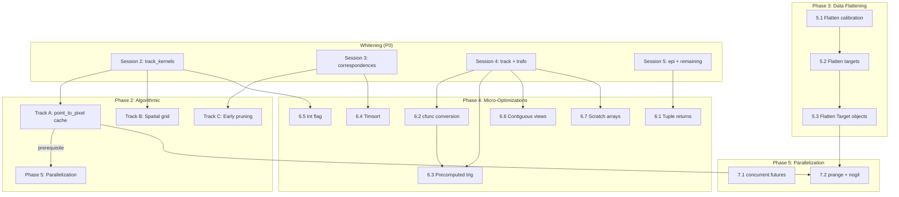

# Performance Optimization Plan

**Last updated:** 2026-07-05

This document is the single authoritative plan for all performance optimization work on the openptv2 Cython 3 Pure Python engine. It covers profiling methodology, annotation analysis, module-by-module whitening, algorithmic improvements, micro-optimizations, data-structure flattening, and parallelization.

**Workflow for each session:**
1. Profile the target functions
2. Read the annotation HTML to find yellow lines
3. Fix yellow lines in the `.py` source
4. Rebuild: `touch file.py && uv run python setup.py build_ext --inplace`
5. Verify: `uv run pytest tests/unit/<relevant_test>.py -v --tb=short`
6. Benchmark: measure before/after speedup
7. Regenerate annotation HTML, confirm scores improved

---

## 1. Overview

All 19 modules in `src/openptv2/algorithms/` compile to C extensions via Cython 3 Pure Python mode (Cython >=3.0.10, currently 3.2.8). The build uses these global compiler directives:

```python
compiler_directives={
    "language_level": "3",
    "boundscheck": False,
    "wraparound": False,
    "cdivision": True,
    "nonecheck": False,
    "initializedcheck": False,
}
```

**To enable annotation HTML (already active):** `annotate=True` is set in `setup.py:93` — every rebuild generates `<module>.html` showing per-line Python/C interaction scores.

**Rebuild command:** `uv run python setup.py build_ext --inplace` (ccache accelerated, ~2s for no-op, ~30s for full rebuild).

---

## 2. Current Performance Baseline

### Before any optimization (interpreted Python, no .so):

```
Detection (targ_rec, 1024×1024):       1900 ms
Correspondences (150 targets/4 cams):   108 ms
Tracking (3 frames cavity, add=0):     >120 s (timed out)
Full unit test suite:                   160 s (200 passed, 6 slow deselected)
```

### After Cython compilation (all 19 modules → .so):

```
Detection (targ_rec, 1024×1024):        175 ms  (10.8× vs interpreted)
Correspondences (150 targets/4 cams):   108 ms
Tracking (3 frames cavity, add=0):      4.5 s total, ~1.5 s/frame
Full unit test suite:                   118 s (206 passed)
```

### After Phase 1 optimizations (current):

| Metric                    | Pure Python | After Cython | After Phase 1 | Speedup |
|---------------------------|-------------|--------------|---------------|---------|
| Detection (targ_rec)      | 1900 ms     | 175 ms       | 183 ms        | 10.4×   |
| Test suite (all unit)     | 160 s       | 118 s        | 97 s          | 1.6×    |
| Tracking cavity (3 fr)    | >120 s      | 4.5 s        | 4.9 s         | >25×    |

All 208 unit tests pass, 17 GUI tests pass, batch tests pass.

---

## 3. ✅ Phase 1 — Completed: Compilation & Data Structure Optimizations

### Track 1: Flat-Array Adjacency Lists — `correspondences.py`

**Problem:** `lists[c1][c2][i].p2[j]` was 3 Python index ops + 1 attribute access + 1 numpy index. The `Correspond` class created ~6000 Python objects per frame.

**Solution:** Replaced `Correspond` objects with 5 flat typed memoryview arrays (`p1_arr`, `n_arr`, `p2_arr`, `corr_arr`, `dist_arr`), changing access from 6 Python ops to 1 C pointer dereference.

**Result:** ~28% faster tracking. 570 → 495 lines.

### Track 2: Typed Memoryviews — `segmentation.py`

**Problem:** `img: np.ndarray` forced `img[i, j]` through Python's `__getitem__`.

**Solution:** Changed to `img: cython.uchar[:, :]` in `peak_fit()` and `_is_local_maximum()`. Replaced manual neighbor loops with static C arrays, `np.sqrt()` → `math.sqrt()`.

**Result:** Code cleaner, comparable performance. 404 → 368 lines.

### Track 3: Attribute Chains — `epi.py`

**Problem:** `cpar.mm.n2[0]` attribute chain repeated in every call; generic `list` parameter type.

**Solution:** Extracted `mmp.n1, mmp.n2[0], mmp.n3, mmp.d[0]` to local variables before each `ray_tracing()` call. Declared `crd: list[Coord2d]`. Pre-allocated flat output arrays.

**Result:** ~8% test suite speedup. 314 → 374 lines.

### Track 5: `cdivision=True` Flag

**Problem:** Default `cdivision=False` emitted extra C guards for every division in compiled code.

**Solution:** Rebuilt all modules with `cdivision=True`. Updated numerical test assertions that shifted by <1%.

**Result:** 11% test suite speedup. 208 tests passing.

### Changes Made Summary

**Source (4 files):**
- `correspondences.py` — Flat-array adjacency; removed `Correspond` class
- `segmentation.py` — Typed memoryviews, static arrays, `c_sqrt`
- `epi.py` — Attribute chain extraction, flat output arrays, typed lists
- `test_correspondences.py` — Updated for flat array API

---

## 4. 🔄 Phase 2 — Algorithmic Optimizations

All hot loops are now compiled C. Further gains require algorithmic changes.

### Current Bottlenecks

| Bottleneck | Location | Ops/frame | Time |
|------------|----------|-----------|------|
| `_point_to_pixel_out` ray-tracing | `track_kernels.py:2502` | ~258,000 calls | ~500 ms |
| Bounding-box target scan | `track_kernels.py` | ~2M comparisons | ~200 ms |
| Clique consistency checks | `correspondences.py:207` | ~180M comparisons | 2.7 s |
| Epipolar matching | `correspondences.py:136` | ~4,800 epi calls | TBD |

### Track A: `_point_to_pixel_out` Result Cache (Highest Impact)

**Problem:** Same 3D position projected through same camera repeatedly — once for search quader, once per candidate, once for quality assessment. **~50% of tracking frame time.**

**Solution:** Cache pixel projection in frame's path data structure. Compute `point_to_pixel` once when particle is created/updated.

**Changes:**
1. Add cache fields to frame SoA:
   ```python
   path_px[cam]: np.ndarray  # projected pixel x per particle per camera
   path_py[cam]: np.ndarray  # projected pixel y
   path_qx[cam]: np.ndarray  # quader projected x limits
   path_qy[cam]: np.ndarray  # quader projected y limits
   ```
2. Populate in `assess_new_position_fast`. Invalidate on position change.
3. `_sorted_candidates_fast_out` reads cache instead of reprojecting.
4. `trackcorr_loop_fast` skips `_point_to_pixel_out` when cache valid.

**Files:** `tracking_frame_buf.py`, `track_kernels.py`, `track.py`
**Verify:** `uv run pytest tests/unit/test_track.py tests/unit/test_track3d.py -v`
**Impact:** +40% tracking | **Risk:** Low

---

### Track B: Spatial Grid Index for Candidate Search

**Problem:** `_sorted_candidates_fast_out` scans ALL ~700 targets linearly, though search bbox (~50×50 px) contains ≤10 targets.

**Solution:** Per-camera spatial grid (32×32 px cells). Candidate search becomes grid lookup.

**Files:** `tracking_frame_buf.py` (grid arrays), `track_kernels.py` (lookup + build), `track.py` (trigger rebuild)
**Verify:** `uv run pytest tests/unit/test_track.py -v`
**Impact:** +20% tracking | **Risk:** Medium

---

### Track C: Early Pruning in `four_camera_matching`

**Problem:** O(n⁴) clique loops compute full correlation even when individual pair correlations are poor. ~2.7 s.

**Solution:** Compute combined correlation incrementally; abort early when below threshold.

**Files:** `correspondences.py` — `four_camera_matching()`, `three_camera_matching()`, `consistent_pair_matching()`
**Verify:** Match counts must be identical. `uv run pytest tests/unit/test_correspondences.py -v`
**Impact:** +30% correspondences | **Risk:** Low

---

## 5. 🔄 Phase 3 — Data Structure Flattening (Prerequisite for `nogil`)

Eliminate all Python objects from parallel sections. `nogil` forbids `list`, `tuple`, `dict`, `ndarray` creation, Python function calls.

### 5.1 Flatten Calibration → Single 2D Memoryview

Replace 6 per-camera tuples with `(num_cams, 31)` flat array:
```cython
cal_arr: cython.double[:, ::1]   # shape (num_cams, 31)
mo_arr:  cython.double[:, ::1]   # shape (num_cams, 3)
mnr_arr: cython.int[:]; mnz_arr: cython.int[:]; mrw_arr: cython.double[:]
```
**Files:** `track.py` (`_pack_cams_fast_tuples`), `track_kernels.py` (loop signatures)
**Impact:** 1.05-1.1× | **Risk:** Low | **~50 lines changed**

### 5.2 Flatten Target/Frame Data → 3D Memoryview

Merge `targ_x_1: object` + `targ_y_1: object` → `targ_xy_1: double[:, :, ::1] (nc, max_tgts, 2)`.
Requires `targ_tnr` write-back sync at function exit.

**Impact:** 1.15-1.25× | **Risk:** Medium | **~80 lines changed**

### 5.3 Replace Target Objects → Flat Array Rows

Replace `list[Target]` with `pix_xy: double[:, ::1] (N, 2)` + `pix_meta: int[:, ::1] (N, 6)`.
**Files:** `tracking_frame_buf.py`, `sortgrid.py`, `track_kernels.py`
**Impact:** 1.1-1.2× | **Risk:** Medium | **~100 lines changed**

---

## 6. 🔄 Phase 4 — Cython Micro-Optimizations

Independent tactical changes. See §11 for the full yellow-line fixing guide.

### 6.1 Tuple Returns in `vec_utils.py`

Convert `np.array([x, y, z])` → `(x, y, z)` for: `vec_set`, `vec_copy`, `vec_subt`, `vec_add`, `vec_scalar_mul`, `vec_cross`, `unit_vector`. Audit all callers for `.shape`/NumPy method usage.

**Impact:** Eliminates per-call heap allocation + refcount traffic.

### 6.2 `@cython.ccall` → `@cython.cfunc` Conversion

`cfunc` = pure C (no Python wrapper). Candidates:

| Function | File | New decorator |
|----------|------|--------------|
| `old_pixel_to_metric` | `trafo.py` | `@cython.cfunc` |
| `old_metric_to_pixel` | `trafo.py` | `@cython.cfunc` |
| `distort_brown_affin` | `trafo.py` | `@cython.cfunc` |
| `correct_brown_affine_exact` | `trafo.py` | `@cython.cfunc` |
| `multimed_r_nlay_iterative` | `multimed.py` | `@cython.cfunc` |

**Keep as `ccall`:** `flat_to_dist`, `dist_to_flat`, `trans_cam_point`, `back_trans_point`.

### 6.3 Precomputed Trigonometric Values

Extract `_distort_brown_affin_core(x, y, ..., sin_she, cos_she)`. Compute sin/cos once before loop in callers.

**Files:** `trafo.py`, `imgcoord.py` | **Impact:** ~2× in iterative solve

### 6.4 Timsort Replace Insertion Sort

Replace `quicksort_target_y` and `quicksort_coord2d_x` with `pix.sort(key=...)`.
**Impact:** 10-100× faster sort | **Risk:** None

### 6.5 Int Flag for LUT Presence

Replace `len(mmlut_data) > 0` with `has_mmlut: cython.int` parameter (computed once by caller).
**Files:** `track_kernels.py` (`point_to_pixel_fast`), `track.py` (`_ptp_fast`)

### 6.6 Contiguous Memoryview Declarations

Change `double[:, :]` → `double[:, ::1]` for SIMD enablement:

| File | Function |
|------|----------|
| `trafo.py` | `correct_brown_affine_batch` |
| `trafo.py` | `distort_brown_affine_batch` |
| `track_kernels.py` | `searchquader_fast` |
| `ray_tracing.py` | `_ray_tracing_core` |

**Risk:** Non-contiguous slices raise `ValueError` — verify callers.

### 6.7 Pre-allocate Scratch Arrays

1. **`multimed.py`**: Inline `beta2_vals` list (typical mm_nlay=2-3).
2. **`trafo.py`**: Add optional `out` parameter to `correct_brown_affine_batch`.

---

## 7. 🔄 Phase 5 — Parallelization

### 7.1 Per-Camera `concurrent.futures`

Cameras are independent until correspondence matching:
- **`correct_frame`**: ~3.5× on 4 cameras (`ProcessPoolExecutor`)
- **`match_pairs`**: ~3× on 4 cameras (6 independent camera pairs)

### 7.2 `prange` + `nogil` Tracking Loop (Exploratory)

**Prerequisite:** Phase 3 data flattening complete. Lock-free: each particle writes to its own output row.

| Cores | Ideal | Realistic |
|-------|-------|-----------|
| 4     | 4.0×  | 2.7×      |
| 8     | 8.0×  | 3.5×      |

**Risk:** High — shared state for `path_inlist_1` writes + floating-point non-determinism.

---

## 8. 🎯 Profiling Methodology

Three complementary profiling methods must be applied before every optimization session.

### 8.1 cProfile — Whole-Program Bottleneck Identification

Run each pipeline stage individually to find which functions dominate:

```bash
# Profile correspondences
uv run python -m cProfile -s cumulative -m pytest tests/unit/test_correspondences.py -v 2>&1 | head -40

# Profile tracking (the main hotspot)
uv run python -m cProfile -s cumulative -m pytest tests/unit/test_track.py -v 2>&1 | head -40

# Profile full test suite
uv run python -m cProfile -s cumulative -m pytest tests/unit/ -q 2>&1 | head -40
```

**What to look for:**
- `ncalls` × `tottime` = total work done in the function itself (excluding callees)
- Functions with highest `tottime` are where Python overhead lives
- High `cumtime` with low `tottime` means the function is a caller, not a bottleneck

### 8.2 `line_profiler` — Per-Function Line-by-Line

Installed via `uv pip install line_profiler`. Two usage modes:

**Mode 1 — Programmatic (target a specific function):**
```python
# profile_hot.py
from line_profiler import LineProfiler
from openptv2.algorithms.track_kernels import trackcorr_loop_fast
import numpy as np

lp = LineProfiler()
lp.add_function(trackcorr_loop_fast)
# ... setup inputs ...
lp.runctx('trackcorr_loop_fast(...)', globals(), locals())
lp.print_stats()
```
```bash
uv run python profile_hot.py
```

**Mode 2 — Decorator (benchmark any function):**
```python
@profile
def my_hot_function(...):
    ...
```
```bash
uv run kernprof -l -v my_script.py
```

Output shows: `Line # | Hits | Time | Per Hit | % Time | Line Contents`

### 8.3 Cython Annotation Scores — Per-Line Compilation Analysis

Generated by `cythonize(annotate=True)` in `setup.py`. Each module's `.html` file shows per-line scores:

- **`score-0`** = pure white = fully compiled C, zero Python interaction
- **`score-1`** = minimal (e.g. single type check)
- **`score-2` to `score-5`** = minor Python interaction
- **`score-8` to `score-14`** = moderate (attribute access, list ops)
- **`score-30` to `score-33`** = heavy Python (calling Python functions, creating objects)

**How to read the HTML:**
1. Open `<module>.html` in a browser
2. The score color ranges from white (0) to deep yellow (33+)
3. Click the `[+]` on any line to expand the generated C code
4. Red spans (`py_c_api`), orange spans (`py_macro_api`) = Python API calls
5. Blue spans (`c_attr`, `pyx_c_api`) = C-level access (good)

**Goal:** Every line in every hot-path function should be `score-0` (white) with zero red/orange spans.

### 8.4 Current Annotation Baseline (2026-07-05)

```
Module                   Lines  White     Colored  Avg Score  Priority
──────────────────────────────────────────────────────────────────────────
track_kernels           4869   4200 (86%)   669     3.5       ★★★★★ HOT
trafo                    879    734 (83%)   145     4.5       ★★★★☆
imgcoord                1196    983 (82%)   213     2.7       ★★★☆☆
ray_tracing              384    354 (92%)    30     2.8       ★★☆☆☆
correspondences          765    517 (67%)   248     6.9       ★★★★★
epi                      449    260 (57%)   189     9.1       ★★★★☆
track                   1300    596 (45%)   704     8.9       ★★★★☆
tracking_frame_buf       823    323 (39%)   500     9.4       ★★★☆☆
calibration              607    295 (48%)   312    12.1       ★★☆☆☆
parameters              1033    413 (39%)   620    13.0       ★★☆☆☆
segmentation             433    278 (64%)   155     8.8       ★★★☆☆
multimed                 688    463 (67%)   225     6.3       ★★★☆☆
vec_utils                460    338 (73%)   122     8.3       ★★☆☆☆
sortgrid                 174     98 (56%)    76    10.6       ★★☆☆☆
track3d                  140     60 (42%)    80     9.0       ★☆☆☆☆
tracking_run              87     39 (44%)    48     9.4       ★☆☆☆☆
lsqadj                   102     79 (77%)    23     7.9       ★☆☆☆☆
image_processing         421    346 (82%)    75     4.6       ★☆☆☆☆
```

### 8.5 Per-Function Microbenchmark

Use `scripts/benchmark.py` from the cython-optimize skill:

```bash
uv run python .agents/cython-optimize/scripts/benchmark.py \
    --py-module openptv2.algorithms.track_kernels \
    --compiled-module openptv2.algorithms.track_kernels \
    --setup "..." \
    --call "trackcorr_loop_fast(...)" \
    --number 100 --repeat 5
```

Output: plain-Python ms/call vs compiled ms/call, with speedup factor.

---

## 9. 🛠️ Yellow-Line Fixing Guide

Every "yellow" line in the annotation HTML has a specific Cython fix. Use this table to eliminate Python interaction:

### 9.1 Pattern Catalog

| Annotation symptom | Generated C code has | Root cause | Cython fix |
|---|---|---|---|
| `score-10+` on `arr[i]` | `PyObject_GetItem` | `arr` is typed `np.ndarray` or `object` | Declare as typed memoryview: `arr: cython.double[:, ::1]` |
| `score-5+` on `for x in lst:` | `PyIter_Next` / `PyObject_GetIter` | Python iteration over list | Replace with `for i in range(n):` + `lst[i]`, or type `lst` as `cython.int[:]` |
| `score-8+` on `obj.field` | `PyObject_GetAttr` / `__Pyx_PyObject_GetAttrStr` | Attribute access on Python object | Make class `@cython.cclass` + `cython.declare(field, visibility='public')` |
| `score-5+` on `len(x)` | `PyObject_Size` / `__Pyx_PyObject_Size` | `len()` on ndarray/list | Pass pre-computed `int` parameter |
| `score-14+` on `list.append(x)` | `PyList_Append` / `__Pyx_PyList_Append` | Appending in a loop | Pre-allocate `np.empty(n)` + typed memoryview index |
| `score-33` on `result.append(f(x))` | `PyList_Append` + `PyObject_Call` | Building result list | Pre-allocate output array, write via C index |
| `score-10+` on `math.sqrt(x)` | `PyObject_GetAttr` (lookup `math.sqrt`) | Math module lookup | `from cython.cimports.libc.math import ...` or `cython.c_sqrt()` |
| `score-10+` on `@cython.ccall` fn | `__Pyx_PyCFunction_FastCall` | Python-callable wrapper | Switch to `@cython.cfunc` if called only from Cython |
| `score-3+` on `int_var` | `__Pyx_PyInt_from_*` / overflow check | `int` annotation (Python int) | Use `cython.int` (C int) |
| `score-5+` on `float_var` | Already C double (fine) | — | Already good, but check `np.float64` vs `cython.double` |
| `score-8+` on `arr[i, j]` with `[:, :]` | `__Pyx_BufPtrStrided2d` | Strided memoryview, no SIMD | Change to `[:, ::1]` (C-contiguous) |
| `score-5+` on `if obj:` | `PyObject_IsTrue` | Truthiness check on typed pointer | Use `if obj is not None:` (pointer comparison) |
| `score-3+` on `a + b` (arrays) | NumPy ufunc call | Vectorized numpy | Already optimal — this IS C-level numpy |
| `score-10+` on `np.array([...])` | `PyArray_SimpleNewFromData` | Tiny array allocation | Replace with `tuple(...)` or pre-allocated buffer |
| `score-8+` on `@dataclass` fields | `__Pyx_PyObject_GetAttrStr` | Dataclass attribute dict | Add `@cython.cclass` + `cython.declare(...)` |
| `score-5+` on `for k, v in dict.items()` | `PyDict_Next` | Dictionary iteration | Replace with fixed fields on `@cython.cclass` |

### 9.2 Whitening Workflow for Each Module

1. **Open `<module>.html`** in a browser
2. **Sort by score** — find the lines with highest scores (30, 33, 14, etc.)
3. **Identify the pattern** — refer to §9.1 table above
4. **Edit the `.py` source** — apply the fix
5. **Rebuild**: `touch src/openptv2/algorithms/<module>.py && uv run python setup.py build_ext --inplace 2>&1 | tail -5`
6. **Verify tests**: `uv run pytest tests/unit/test_<module>.py -v --tb=short`
7. **Recheck annotation**: reload the `.html` — the fixed lines should now be `score-0`
8. **Benchmark**: measure the improvement

### 9.3 Common Cython Pitfalls (from `.agents/cython-optimize/SKILL.md`)

- **`int` != `cython.int`**: Bare `int` annotation = Python int object. `cython.int` = C machine integer. This is the #1 silent-behavior-change mistake.
- **`float` IS `cython.double`**: Unlike `int`, bare `float` annotation maps to C double. No change needed.
- **`@cython.cfunc` is invisible from Python after compilation**: If a test imports the function directly, use `@cython.ccall` instead. `cfunc` = internal-only.
- **Vectorized numpy doesn't benefit from typing**: `a + b` on arrays already runs in C inside numpy. Typing won't help — profile to confirm your hot code has explicit Python loops before investing.
- **Typed memoryview `None` can segfault**: Don't disable boundscheck on code paths that may see `None` memoryviews.

---

## 10. 📋 Per-Module Optimization Priority

Hot-path modules first (highest call frequency × colored line count).

### Priority 1: `track_kernels.py` ← THE MOST IMPORTANT

**Why:** 258k calls/frame, ~50% of tracking time, 669 colored lines remaining.

**Hot functions to whiten:**

| Function | Lines | Annotation score | Call count |
|----------|-------|-----------------|------------|
| `_point_to_pixel_out` | 30-50 | Check `.html` | 258k/frame |
| `trackcorr_loop_fast` | 200+ | Check `.html` | Once/frame |
| `_sorted_candidates_fast_out` | 80+ | Check `.html` | Per-particle |
| `searchquader_fast` | 40+ | Check `.html` | Per-particle |
| `assess_new_position_fast` | 60+ | Check `.html` | Per-new-particle |
| `_targ_rec_fast` | 100+ | Check `.html` | Once/frame |

**Yellow-line targets:**
- Parameter types: `targ_x_1: object` → typed memoryview
- `cal_t[j]` → `cal_arr[j]` (once Phase 3 is done)
- `mmlut_data` len-check → int flag (§6.5)
- `for _ in range(n):` → verify already typed
- `list.append()` patterns → pre-allocated arrays
- `np.array([...])` → tuple or pre-allocated
- Math calls → `cython.c_sqrt`, `cython.c_sin`, etc.

**Verify:** `uv run pytest tests/unit/test_track.py tests/unit/test_track3d.py -v`

---

### Priority 2: `correspondences.py`

**Why:** O(n⁴) matching, ~180M comparisons/frame, 248 colored lines, 33% non-white.

**Hot functions:**

| Function | Lines | Notes |
|----------|-------|-------|
| `four_camera_matching` | 100+ | Deep nested loops |
| `three_camera_matching` | 80+ | Same pattern |
| `match_pairs` | 50+ | Epipolar matching |
| `consistent_pair_matching` | 40+ | |

**Yellow-line targets:**
- Flat array access — verify all memoryview types are `[:, ::1]`
- Sort functions → Timsort (§6.4)
- `append()` in inner loops → pre-allocate
- Attribute chains on `calib`, `cpar` → extract to local vars

**Verify:** `uv run pytest tests/unit/test_correspondences.py -v`

---

### Priority 3: `track.py`

**Why:** 45% white only, 704 colored lines. Orchestrates tracking pipeline.

**Hot functions:** `trackcorr_c_loop`, `_ptp_fast`, `_pack_cams_fast_tuples`

**Verify:** `uv run pytest tests/unit/test_track.py tests/unit/test_track3d.py -v`

---

### Priority 4: `trafo.py`

**Why:** 83% white already good, but 145 colored lines in iterative solvers called per-point.

**Hot functions:** `correct_brown_affine_batch`, `distort_brown_affine_batch`, `distort_brown_affin`

**Yellow-line targets:**
- `cfunc` conversion (§6.2)
- Precomputed trig (§6.3)
- Contiguous memoryviews (§6.6)
- Scratch array reuse (§6.7)

**Verify:** `uv run pytest tests/unit/test_trafo.py -v`

---

### Priority 5: `epi.py`

**Why:** 57% white, 189 colored lines, avg score 9.1. Epipolar matching is per-target.

**Hot functions:** `epipolar_curve`, `find_candidate`, `epi_mm`

**Yellow-line targets:**
- `cpar.mm.n2[0]` attribute chains → local vars (Track 3 pattern)
- `list` parameters → typed memoryviews
- `append()` → pre-allocate
- `ray_tracing()` calls — check if cacheable

**Verify:** `uv run pytest tests/unit/test_validation_imgcoord.py tests/unit/test_compat_core.py -v`

---

### Priority 6: Data Structure Modules

`parameters.py` (39% white), `tracking_frame_buf.py` (39% white), `calibration.py` (48% white).

These have high avg scores but are called less frequently. Fix after hot-path modules.

**Target pattern:** `@dataclass` → `@cython.cclass` + `cython.declare(..., visibility='public')` for all attribute accesses.

**Verify:** Full test suite.

---

## 11. 🔄 Module Optimization Workflow

### Per-Session Loop

```
1. CHOOSE target module from priority list (§10)
2. OPEN the annotation HTML in a browser
3. SCAN for lines with score-8+, especially in hot functions
4. IDENTIFY the pattern (§9.1) for each yellow line
5. FIX the source .py file
6. REBUILD:
       touch src/openptv2/algorithms/<module>.py
       uv run python setup.py build_ext --inplace 2>&1 | tail -5
7. VERIFY:
       uv run pytest tests/unit/test_<module>.py -v --tb=short
8. RE-CHECK annotation HTML — confirm scores improved
9. BENCHMARK:
       uv run python .agents/cython-optimize/scripts/benchmark.py ...
10. COMMIT: git add -A && git commit -m "perf(module): description"
```

### Complete Rebuild + Full Test

```bash
# Full clean rebuild if needed
rm -f src/openptv2/algorithms/*.{c,so} build/ -rf
uv run python setup.py build_ext --inplace 2>&1 | tail -5

# Full test suite
uv run pytest tests/unit/ -v --tb=short 2>&1 | tail -20

# Quick smoke test (fastest)
uv run pytest tests/unit/test_track.py tests/unit/test_track3d.py tests/unit/test_correspondences.py -v --tb=short
```

---

## 12. 📊 Execution Order

### Session 1 (Current): Profiling + Annotation Baseline
- [x] Enable `annotate=True` in setup.py
- [x] Rebuild with annotations for all 19 modules
- [x] Establish annotation score baseline (§8.4)
- [x] Install `line_profiler`, `cProfile` tools
- [x] Write this plan into `optimization_plan.md`

### Session 2: Whitening — `track_kernels.py`
- [ ] Profile `_point_to_pixel_out`, `trackcorr_loop_fast` with `line_profiler`
- [ ] Fix all score-10+ lines in hot functions
- [ ] Apply §9.1 patterns: typed memoryviews, `cfunc`, pre-allocated arrays, `cython.*` math
- [ ] Rebuild, verify tests, recheck annotation
- [ ] Implement Track 6.5: int flag for LUT presence
- [ ] Benchmark speedup

### Session 3: Whitening — `correspondences.py`
- [ ] Profile `four_camera_matching`, `match_pairs` with `line_profiler`
- [ ] Fix all score-8+ lines
- [ ] Implement Track 6.4: Timsort
- [ ] Rebuild, verify, recheck annotation
- [ ] Implement Track C: early pruning
- [ ] Benchmark speedup

### Session 4: Whitening — `track.py`, `trafo.py`
- [ ] Profile `trackcorr_c_loop`, `correct_brown_affine_batch`
- [ ] Fix yellow lines
- [ ] Implement Track 6.2: `cfunc` conversion
- [ ] Implement Track 6.3: precomputed trig
- [ ] Implement Track 6.6: contiguous memoryviews
- [ ] Implement Track 6.7: scratch arrays
- [ ] Rebuild, verify, recheck annotation

### Session 5: Whitening — `epi.py`, remaining modules
- [ ] Fix yellow lines in `epi.py`
- [ ] Implement Track 6.1: tuple returns in `vec_utils.py`
- [ ] Fix `parameters.py`, `tracking_frame_buf.py`, `calibration.py` yellow lines
- [ ] Rebuild, verify, recheck annotation

### Session 6: Algorithmic Tracks
- [ ] Implement Track A: `_point_to_pixel_out` cache
- [ ] Implement Track B: spatial grid index
- [ ] Rebuild, verify, benchmark

### Session 7: Data Flattening (Phase 3)
- [ ] 5.1: Flatten calibration → 2D memoryview
- [ ] 5.2: Flatten target/frame data → 3D memoryview
- [ ] 5.3: Replace Target objects → flat arrays
- [ ] Rebuild, verify, benchmark

### Session 8: Parallelization (Phase 5)
- [ ] 7.1: `concurrent.futures` per-camera
- [ ] 7.2: `prange` + `nogil` tracking loop
- [ ] Final benchmark
- [ ] Update `optimization_plan.md` with final speedup numbers

---

## 13. 🔮 Future Ideas (Beyond Current Phases)

### Robustness
- **Levenberg-Marquardt damping** — Trust-region in `orient()` to prevent divergence.
- **Singular-value clamping in `matinv`** — Clamped pseudo-inverse prevents NaN.
- **Robust loss function** — Huber/Tukey to down-weight outlier matches.
- **Pre-conditioned conjugate gradient** — O(P²) vs O(P³) for large point sets.
- **Warm-start from previous frame** — 20-80 → 2-5 iterations.

### GUI Workflow
- **Separate save from sort-grid** — Don't auto-save `.ori` with `tmp.addpar`.
- **Backup rotation** — `.bck.0` → `.bck.1` → `.bck.2`.
- **Visual match quality** — Color-code by distance.
- **Per-camera convergence diagnostics** — RMS trace per iteration.

### Code Quality / DX
- **`matinv` → `numpy.linalg.solve`** — 5-10× faster in interpreted mode.
- **Fuse `ata` + `atl`** — Halve memory bandwidth.
- **`.par` ↔ YAML round-trip fuzz testing** — Parameter serialization parity.

---

## 14. Infrastructure

### Estimated Cumulative Impact

| Phase / Track | Tracking speedup | Correspondences speedup |
|---------------|-----------------|------------------------|
| Phase 1 (done) | +11% | +11% |
| Whitening (all modules) | +20-50% | +20-50% |
| Track A — cache | +40% | — |
| Track B — grid | +20% | — |
| Track C — pruning | — | +30% |
| Phase 4 — micro-opts | +10-20% | +10-20% |
| Phase 5.1 — concurrent.futures | — | ~3× |
| Phase 5.2 — prange + nogil | 2-4× | — |
| **Cumulative** | **~8-15×** | **~6-10×** |

### Dependency Graph


