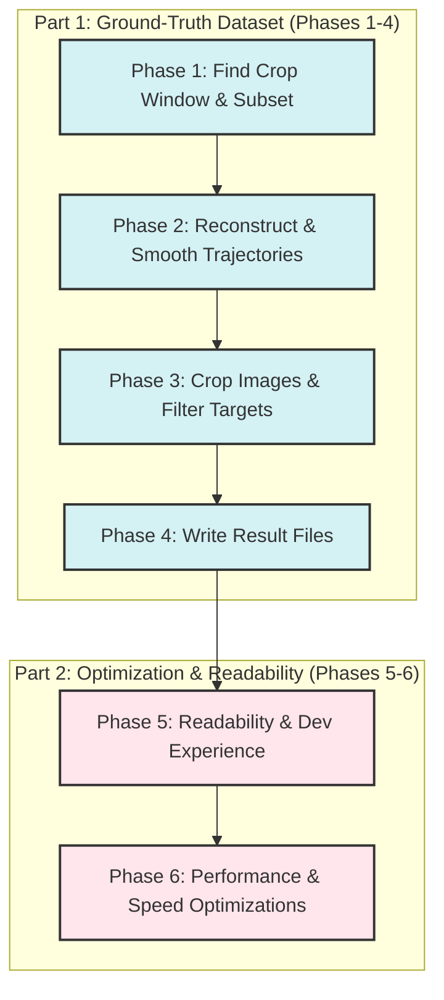
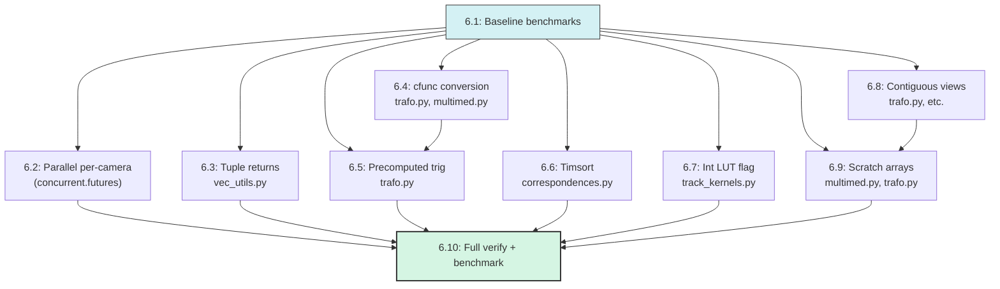

# OpenPTV2 Consolidated Project Plan

This document integrates and outlines the remaining active development plans for the `openptv2` project. It merges the synthetic cavity dataset creation plan with the Cython/Python optimization roadmap, organized into a single, cohesive six-phase project plan.



---

## Part 1: Small Synthetic Cavity Test Case (Phases 1–4)

### Goal
Produce a self-contained, ground-truth-annotated subset of the `test_cavity` experiment with 4 cameras, 256×256 pixel cropped images, and 5 frames of real particle positions and images. Everything must be traceable to a known answer at every pipeline step.

### Resolved Decisions
* **Source data**: Use `res/rt_is.10000`–`10004` and `res/ptv_is.10000`–`10004` for all 5 frames. Exclude `res_orig/` as it lacks frame 10000.
* **Coordinate system**: **Crop-relative** coordinate system. Raw pixel coords are `0..imx` referenced to the sensor center. Cropped targets will use `x_px_crop = x_px_full − ox`, and the `.ori` principal point will be updated per camera.
* **Partial trajectories**: Include all particles. Particles entering or leaving the volume mid-sequence are kept with `NaN` for missing frames.

### Target Dataset Directory Layout
```
test_data/test_cavity_small/
  cal/
    cam1.tif.ori          ← modified principal point (Phase 3)
    cam1.tif.addpar       ← copied unchanged
    ... (all 4 cameras)
  img/
    cam1.10000            ← 256×256 crop of real image
    cam1.10000_targets    ← filtered + offset _targets
    ... (4 cams × 5 frames)
  img_orig/               ← same crops, unmodified backup
  parameters/
    ptv.par               ← identical except imaX=256, imaY=256
    sequence.par          ← same frame range 10000–10004
    ... (all other .par files copied unchanged)
  res/
    ptv_is.10000          ← ground truth 3D positions with forward/backward links
    rt_is.10001           ← ground truth tracking result
    added.10001           ← particles entering mid-sequence
    ... (5 frames)
  ground_truth/
    particles.csv         ← full ground truth table
    trajectories.csv      ← per-trajectory summary
    projections.csv       ← ground truth 2D projections per camera
```

---

### Phase 1 — Find the 256×256 Window and Extract the Particle Subset

1. **Load camera models (all 4 cameras)**:
   Use `Calibration.from_file()` from `algorithms/calibration.py`:
   ```python
   from openptv2.algorithms.calibration import Calibration
   cals = [Calibration.from_file(f"cal/cam{i}.tif.ori", f"cal/cam{i}.tif.addpar")
           for i in range(1, 5)]
   ```
   Load `ControlParams` from `parameters/ptv.par` to obtain pixel pitch (0.012 mm/px), sensor size (1280×1024), and refractive indices.

2. **Load all 3D particle positions (all 5 frames from `res/`)**:
   Use `res/rt_is.{frame}` for 3D positions with labels, and `res/ptv_is.{frame}` for forward/backward trajectory links.

3. **Project particles into all 4 cameras**:
   Use `img_coord_batch` from `algorithms/imgcoord.py` to get `(x_mm, y_mm)` relative to the image center, and convert to pixel coords:
   ```python
   # x_px = x_mm / pixel_pitch + imx / 2
   # y_px = y_mm / pixel_pitch + imy / 2
   ```
   Or use `point_to_pixel` from `algorithms/track.py`:
   ```python
   from openptv2.algorithms.track import point_to_pixel
   x_px, y_px = point_to_pixel(point_xyz, cal, cpar)
   ```

4. **Select the 256×256 window in each camera**:
   Project volume centroid `(0, 2.5, 2.5)` mm to get `(cx_cam, cy_cam)` in full-image pixels. Establish a crop window of `[cy−128 : cy+128, cx−128 : cx+128]`.
   
   **Filter**: A particle is in the subset if its projection falls inside the 256×256 window in all 4 cameras in at least one frame. Record the top-left offset `crop_offset[cam] = (ox, oy)`.

---

### Phase 2 — Reconstruct Ground Truth Trajectories

1. **Chain trajectories across frames**:
   Combine the `label` field in `res/rt_is.{frame}` with `prev_frame_id` / `next_frame_id` links in `res/ptv_is.{frame}`. 
   * Collect `(X, Y, Z)` across frames 10000–10004.
   * Represent absent frames with `NaN` (entry/exit).

2. **Smooth trajectories to produce ground truth**:
   For each particle with $\ge 3$ valid frames, fit a degree-2 polynomial (degree-1 if 2 frames) through positions independently per axis. Evaluate the polynomial at each frame to produce smoothed ground truth positions.

3. **Classify trajectories**:
   * `full`: present in all 5 frames.
   * `entry`: first appears at frame > 10000.
   * `exit`: last present at frame < 10004.
   * `transient`: both enters and exits mid-sequence.

4. **Export CSV schemas**:
   * `ground_truth/particles.csv`: `particle_id, frame, X, Y, Z, dx, dy, dz, status`
   * `ground_truth/projections.csv`: `particle_id, frame, cam, x_px_full, y_px_full, x_px_crop, y_px_crop` where `x_px_crop = x_px_full - ox`, `y_px_crop = y_px_full - oy`.
   * `ground_truth/trajectories.csv`: `particle_id, first_frame, last_frame, n_frames, status`

---

### Phase 3 — Crop Real Images and Filter Targets

1. **Crop real images**:
   For each camera `c` and frame `f`, crop raw images using offsets:
   ```python
   import imageio
   img = imageio.imread(f"img/cam{c}.{f}")  # 1280×1024
   ox, oy = crop_offset[c]
   crop = img[oy:oy+256, ox:ox+256]
   imageio.imwrite(f"test_cavity_small/img/cam{c}.{f}", crop)
   ```

2. **Filter and offset `_targets` files**:
   Filter targets where `ox <= x_px < ox+256` and `oy <= y_px < oy+256`. Offset coordinates: `x_out = x_px - ox`, `y_out = y_px - oy`, and renumber target index starting from 0.

3. **Update `.ori` principal point per camera**:
   After cropping to 256×256, the sensor center relative to the crop shifts. Update the principal points `xh` and `yh` (in mm):
   $$xh_{new} = xh_{old} + (512 - ox) \times 0.012$$
   $$yh_{new} = yh_{old} - (384 - oy) \times 0.012$$

4. **Update `parameters/ptv.par`**:
   Modify dimensions to fit the crop:
   ```
   imaX  256
   imaY  256
   ```

---

### Phase 4 — Write Result Files

1. **`res/ptv_is.{frame}`**: Write subset particles with their smoothed coordinates and `prev_frame_id` / `next_frame_id` links.
2. **`res/rt_is.{frame}`**: Write target count details `n_targets_camX` matched to the particle in each camera.
3. **`res/added.{frame}`**: Write entries corresponding to first-time appearing particles (`entry` or `transient`).

#### Verification Checklist
- [ ] Unique particle count in `ptv_is.10000` matches unique ID count in `ground_truth/particles.csv` at frame 10000.
- [ ] Every coordinate in `ground_truth/projections.csv` falls inside `[0, 256)` boundaries.
- [ ] `ptv.par` has `imaX=256, imaY=256`.
- [ ] `.ori` principal points updated correctly per formula.

---

## Part 2: Optimizations & Developer Experience (Phases 5–6)

### Phase 5 — Readability & Developer Experience Improvements

1. **Standardize Type Annotations Across the Project**:
   * Ensure all `@cython.cclass` files use standardized Cython type-hints (e.g., `cython.double` and `cython.int`) rather than raw C definitions.
   * Add PEP 484 Python type-hints to all pure Python interfaces and wrappers to assist IDE auto-completion.

2. **Support Rapid Iterative Builds**:
   * Maintain the `DEV_BUILD` environment variable toggle inside `setup.py` to compile with `-O0` or `-O1` instead of `-O3`, keeping compile times under 35 seconds.

3. **Enhance Docstrings for Cython/Python Dual Execution**:
   * Document compiled vs. interpreted fallback behavior at the module level in each pure Python algorithm file.
   * Outline expected array-layout/dtypes for each function input so developers know exactly what shape Cython-typed memory views expect.

---

### Phase 6 — Performance Optimizations

*Constraint: No external parallel runtime (OpenMP, Numba). Use only CPython stdlib + Cython (already a dependency).*

---

#### Step 6.1 — Establish baseline benchmark suite

- [ ] Create `tests/benchmarks/` directory with:
  - `bench_baseline.py` — measures wall-clock for the hot-path functions listed below
  - `bench_tracking.py` — measures end-to-end tracking on the `test_cavity_small` dataset (from Phase 4)
- [ ] Use `time.perf_counter()` with 5 warmup iterations + 10 measured iterations (same pattern as `test_batch_fast.py::test_batch_speedup`)
- [ ] Log results as JSON so regressions are detectable

**Functions to baseline:**
| Function | File | Why |
|----------|------|-----|
| `correct_frame` / `match_pairs` | `correspondences.py` | Per-frame, loops over all cameras |
| `four_camera_matching` | `correspondences.py` | 6-deep nested loop, O(N⁶) worst case |
| `point_to_pixel_fast` | `track_kernels.py` | Called 9× per particle per camera per frame |
| `searchquader_fast` | `track_kernels.py` | Per-particle, 4 cameras × 9 projections |
| `correct_brown_affine_batch` | `trafo.py` | Per-point iterative solve |
| `multimed_r_nlay_iterative` | `multimed.py` | Per-point iterative radial shift |
| `targ_rec` | `segmentation.py` | Per-image particle detection |
| `epipolar_curve` | `epi.py` | Per-target epipolar line projection |

---

#### Step 6.2 — Parallelize per-camera operations with `concurrent.futures`

The simplest high-impact change. **Cameras are independent** — there is no cross-camera data sharing until correspondence matching.

**6.2.1: Parallelize `correct_frame` in `correspondences.py`**

Current (line 394–430): sequential loop over `cpar.num_cams`:
```python
corrected = []
for cam in range(cpar.num_cams):
    cam_coords = []
    for part in range(frm.num_targets[cam]):
        # pixel_to_metric + dist_to_flat per target
        ...
    quicksort_coord2d_x(cam_coords)
    corrected.append(cam_coords)
```

Change to:
```python
from concurrent.futures import ProcessPoolExecutor

def _correct_one_camera(cam, frm, calib, cpar, tol):
    """Process a single camera (pickle-safe arguments)."""
    cam_coords = []
    for part in range(frm.num_targets[cam]):
        t = frm.targets[cam][part]
        xm, ym = pixel_to_metric(t.x, t.y, cpar)
        ap = calib[cam].added_par
        ip = calib[cam].int_par
        fx, fy = dist_to_flat(xm, ym, ip.xh, ip.yh, ...)
        cam_coords.append(Coord2d(pnr=t.pnr, x=fx, y=fy))
    quicksort_coord2d_x(cam_coords)
    return cam_coords

with ProcessPoolExecutor(max_workers=cpar.num_cams) as pool:
    futures = [pool.submit(_correct_one_camera, cam, frm, calib, cpar, tol)
               for cam in range(cpar.num_cams)]
    corrected = [f.result() for f in futures]
```

**Expected speedup**: ~3.5× on 4 cameras (near-linear, independent work).

**6.2.2: Parallelize `match_pairs` in `correspondences.py`**

Current (line 103–154): nested loops over camera pairs `(i1, i2)`:
```python
for i1 in range(cpar.num_cams - 1):
    for i2 in range(i1 + 1, cpar.num_cams):
        # epi_mm + find_candidate per target
```

Change to parallelize the outer pair loop. Each `(i1, i2)` pair is fully independent — different adjacency lists, no shared state.

```python
from concurrent.futures import ProcessPoolExecutor, as_completed

def _match_one_pair(i1, i2, corrected, frm, vpar, cpar, calib):
    """Build adjacency list for one camera pair."""
    pair_list = [Correspond(p1=0, n=0) for _ in range(frm.num_targets[i1])]
    for i in range(frm.num_targets[i1]):
        # ... existing match_pairs inner logic ...
    return i1, i2, pair_list

pairs = [(i1, i2) for i1 in range(num_cams-1) for i2 in range(i1+1, num_cams)]
with ProcessPoolExecutor(max_workers=len(pairs)) as pool:
    futures = {pool.submit(_match_one_pair, i1, i2, ...): (i1, i2)
               for i1, i2 in pairs}
    for future in as_completed(futures):
        i1, i2, pair_list = future.result()
        lists[i1][i2] = pair_list
```

**Expected speedup**: ~3× on 4 cameras (6 pairs → 2-3 workers).

**6.2.3: Consider `ProcessPoolExecutor` vs `ThreadPoolExecutor`**

| Aspect | `ProcessPoolExecutor` | `ThreadPoolExecutor` |
|--------|----------------------|----------------------|
| GIL | Bypassed (separate processes) | Blocked in pure Python |
| Overhead | Higher (pickle serialization) | Lower (shared memory) |
| When to use | Functions with large standalone datasets | Short-lived, already-released-GIL work |

Since `correct_frame` and `match_pairs` are CPU-heavy and call Cython-compiled functions (which hold the GIL by default as `@cython.ccall`), **start with `ProcessPoolExecutor`** for correctness. If profiling shows pickle overhead dominates, switch to `ThreadPoolExecutor` with targeted `with nogil:` blocks inside the compiled Cython callees.

---

#### Step 6.3 — Reduce small array allocations in `vec_utils.py`

The single-vector functions allocate a new `np.array([...])` on every call. In tracking hot paths these are called millions of times.

**6.3.1: Convert return types from `np.ndarray` → `tuple`**

Functions to change (all in `vec_utils.py`):

| Function | Line | Current | Change to |
|----------|------|---------|-----------|
| `vec_set` | 47 | `np.array([x, y, z])` | `(x, y, z)` |
| `vec_copy` | 60 | `np.array([src[0],...])` | `(src[0], src[1], src[2])` |
| `vec_subt` | 73 | `np.array([from_vec[0]-sub[0],...])` | `(from_vec[0]-sub[0], from_vec[1]-sub[1], from_vec[2]-sub[2])` |
| `vec_add` | 91 | `np.array([vec1[0]+vec2[0],...])` | `(vec1[0]+vec2[0], vec1[1]+vec2[1], vec1[2]+vec2[2])` |
| `vec_scalar_mul` | 107 | `np.array([vec[0]*scalar,...])` | `(vec[0]*scalar, vec[1]*scalar, vec[2]*scalar)` |
| `vec_cross` | 173 | `np.array([v1[1]*v2[2]-...,...])` | `(...), (...), (...))` |
| `unit_vector` | 223 | `np.array([vec[0]/norm,...])` | `(vec[0]/norm, vec[1]/norm, vec[2]/norm)` |

**Impact**: Eliminates per-call heap allocation + refcount traffic. Returned tuples are stack-allocated in Cython-compiled mode.

**6.3.2: Audit all call sites**

Search for all imports of these functions across the codebase:
```bash
grep -rn "from.*vec_utils.*import\|import.*vec_utils" src/openptv2/ --include="*.py"
```
Update callers that expect `.shape`, `[index]` indexing, or NumPy methods on the return value. Most callers already treat them as sequences, so this is typically just removing `.copy()` or `.tolist()` calls.

**6.3.3: Update Cython type declarations**

Change return type annotations from `-> np.ndarray` to `-> tuple` in the `.py` files. The Cython compiler compiles tuple packing/unpacking to C stack operations.

---

#### Step 6.4 — Convert `@cython.ccall` → `@cython.cfunc` for internal-only kernels

`@cython.ccall` generates a Python-callable wrapper (incref/decref, C-API frame). `@cython.cfunc` generates a pure C function — no Python overhead. Functions that are never called from Python should be `cfunc`.

**6.4.1: `trafo.py`**

| Function | Line | Called from | Switch to |
|----------|------|-------------|-----------|
| `old_pixel_to_metric` | 27 | `pixel_to_metric` (same file) | `@cython.cfunc` |
| `old_metric_to_pixel` | 59 | `metric_to_pixel` (same file) | `@cython.cfunc` |
| `distort_brown_affin` | 229 | `correct_brown_affine_exact`, `correct_brown_affine_batch`, `flat_to_dist` (same file) | `@cython.cfunc` |
| `correct_brown_affine_exact` | 350 | `dist_to_flat` (same file) | `@cython.cfunc` |
| `flat_to_dist` | 429 | `imgcoord.py`, `epi.py` | Keep `@cython.ccall` (called from other modules) |
| `dist_to_flat` | 460 | `epi.py` | Keep `@cython.ccall` (called from other modules) |

**6.4.2: `imgcoord.py`**

| Function | Line | Called from | Switch to |
|----------|------|-------------|-----------|
| `_flat_to_dist_core` | 32 | Already `@cython.cfunc` ✅ | — |
| `_get_mmf_from_mmlut_core` | 73 | Already `@cython.cfunc` ✅ | — |

**6.4.3: `multimed.py`**

| Function | Line | Called from | Switch to |
|----------|------|-------------|-----------|
| `multimed_r_nlay_iterative` | 87 | `multimed_nlay` (same file) | `@cython.cfunc` |
| `trans_cam_point` | 184 | Called from imgcoord, track_kernels | Keep `@cython.ccall` |
| `back_trans_point` | 240 | Called from imgcoord | Keep `@cython.ccall` |

**Verification**: After each change, rebuild and run existing tests:
```bash
uv run pytest tests/unit/test_trafo.py tests/parity/ -v
```

---

#### Step 6.5 — Precompute trigonometric values in iterative solvers

**Problem**: `distort_brown_affin` (trafo.py:229) computes `c_sin(she)` and `c_cos(she)` on every call. When called inside the iterative loop of `correct_brown_affine_exact` (line 328), these are recomputed up to 50× per point — same `she` value each time.

**6.5.1: Add internal variants that accept precomputed sin/cos**

In `trafo.py`, add a `cfunc` helper:
```python
@cython.cfunc
@cython.inline
def _distort_brown_affin_core(
    x: cython.double, y: cython.double,
    k1: cython.double, k2: cython.double, k3: cython.double,
    p1: cython.double, p2: cython.double,
    scx: cython.double, sin_she: cython.double, cos_she: cython.double,
) -> tuple:
    """Brown distortion with precomputed trig values."""
    r = c_sqrt(x * x + y * y)
    if r < 1e-10:
        return 0.0, 0.0
    r2 = r * r; r4 = r2 * r2; r6 = r4 * r2
    radial_factor = 1.0 + k1 * r2 + k2 * r4 + k3 * r6
    x_dist = x * radial_factor + p1 * (r2 + 2.0 * x * x) + 2.0 * p2 * x * y
    y_dist = y * radial_factor + p2 * (r2 + 2.0 * y * y) + 2.0 * p1 * x * y
    return scx * (x_dist - sin_she * y_dist), scx * cos_she * y_dist
```

Then make `distort_brown_affin` call it:
```python
@cython.ccall
def distort_brown_affin(...):
    sin_she = c_sin(she)
    cos_she = c_cos(she)
    return _distort_brown_affin_core(x, y, k1, k2, k3, p1, p2, scx, sin_she, cos_she)
```

And update `correct_brown_affine_exact` and `correct_brown_affine_batch` to compute sin/cos once before the loop and call `_distort_brown_affin_core` inside.

**6.5.2: Same pattern for `imgcoord.py`**

`_flat_to_dist_core` (line 32) also computes sin_she/cos_she — it is called once per point so the impact is smaller, but for consistency apply the same split.

---

#### Step 6.6 — Replace manual insertion sort with Python's Timsort

**Problem**: `quicksort_target_y` (correspondences.py:58) and `quicksort_coord2d_x` (line 72) implement O(n²) insertion sort. Python's `list.sort()` uses Timsort (O(n log n), C-optimized).

**6.6.1: Replace `quicksort_target_y`**

```python
# Before:
def quicksort_target_y(pix):
    for i in range(1, len(pix)):
        item = pix[i]
        j = i
        while j > 0 and pix[j - 1].y > item.y:
            pix[j] = pix[j - 1]
            j -= 1
        pix[j] = item

# After:
def quicksort_target_y(pix):
    pix.sort(key=lambda p: p.y)
```

**6.6.2: Replace `quicksort_coord2d_x`**

```python
def quicksort_coord2d_x(crd):
    crd.sort(key=lambda c: c.x)
```

**Impact**: For typical target counts (100–10000), Timsort is 10-100× faster than insertion sort. No correctness change since both are stable sorts.

---

#### Step 6.7 — Replace `len()` check with a C int flag for LUT presence

**Problem**: In `point_to_pixel_fast` (track_kernels.py:250):
```python
has_mmlut = len(mmlut_data) > 0
```
When compiled, `len()` on a NumPy array calls `PyObject_Size`, which in a tight per-particle loop adds unnecessary C-API overhead for the common case (no LUT).

**Change**: Add an `int` parameter `has_mmlut` to `point_to_pixel_fast`:
```python
@cython.ccall
def point_to_pixel_fast(pos, cal,
                        mmlut_data, mmlut_origin,
                        mmlut_nr, mmlut_nz, mmlut_rw,
                        has_mmlut: cython.int,  # new: 0 or 1
                        imx_half, imy_half, inv_pix_x, inv_pix_y, chfield):
```

Then in `searchquader_fast` and any other caller, compute once before the per-particle loop:
```python
has_mmlut = 1 if len(mmlut_data) > 0 else 0
```

**Callers to update**: `track.py:_ptp_fast` (line 70), `track_kernels.py:searchquader_fast` (line 483).

---

#### Step 6.8 — Add `double[:, ::1]` contiguous memoryview declarations

**Problem**: Several multidimensional memoryviews use `double[:, :]` (strided) instead of `double[:, ::1]` (C-contiguous). The compiler cannot generate SIMD without the contiguous guarantee.

**6.8.1: Hot-path candidates**

| File | Function | Line | Current | Change to |
|------|----------|------|---------|-----------|
| `trafo.py` | `correct_brown_affine_batch` | 506 | `xy: cython.double[:, :]` | `xy: cython.double[:, ::1]` |
| `trafo.py` | `distort_brown_affine_batch` | 598 | `xy: cython.double[:, :]` | `xy: cython.double[:, ::1]` |
| `track_kernels.py` | `searchquader_fast` | 484 | `quader: cython.double[:, :]` | `quader: cython.double[:, ::1]` |
| `track_kernels.py` | `sort_candidates_by_freq_fast` | — | check signature | `cython.int[:, ::1]` |
| `orientation.py` | `_skew_midpoint_core` | 41 | `midpoint: cython.double[:]` | Already 1D ✅ |
| `ray_tracing.py` | `_ray_tracing_core` | 24 | `ext_dm: cython.double[:, :]` | `ext_dm: cython.double[:, ::1]` |

**Risks**: If a caller passes a non-contiguous slice (e.g., transposed array), the function will raise `ValueError` at runtime. Verify all callers pass C-contiguous arrays (`np.ascontiguousarray` where needed).

---

#### Step 6.9 — Pre-allocate scratch arrays for iterative functions

**Problem**: `correct_brown_affine_batch` (trafo.py:505) and `multimed_r_nlay_iterative` (multimed.py:87) are called per-point with internal allocations.

**6.9.1: `multimed_r_nlay_iterative` — eliminate `beta2_vals` list allocation**

Current (line 140): allocates a Python list every call:
```python
beta2_vals = [0.0] * mm_nlay
for i in range(mm_nlay):
    ...
    beta2_vals[i] = c_asin(arg)
```

Change to use a pre-allocated array or inline the computation:
```python
# Option A: Inline when mm_nlay is small (typical case)
rbeta = (ext_z0 - mm_d0) * c_tan(beta1) - zout * c_tan(beta3)
for i in range(mm_nlay):
    arg = sin_beta1 * mm_n1 / mm_n2[i]
    if arg > 1.0: arg = 1.0
    elif arg < -1.0: arg = -1.0
    rbeta += mm_d[i] * c_tan(c_asin(arg))
```
This eliminates the list entirely.

**6.9.2: `correct_brown_affine_batch` — result memoryview reuse**

The function already allocates `result` internally (good). If the caller has a pre-allocated buffer, add an optional `out` parameter:
```python
@cython.ccall
def correct_brown_affine_batch(xy, k1, k2, k3, p1, p2, scx, she, out=None):
    if out is None:
        result = np.empty((n, 2), dtype=np.float64)
    else:
        result = out
```
This allows callers in tracking loops to allocate once and reuse across frames.

---

#### Step 6.10 — Verify correctness + measure speedup

- [ ] Run full test suite after each substep:
  ```bash
  uv run pytest tests/unit/ tests/parity/ -v --tb=short
  ```
- [ ] Run benchmark suite and compare to Step 6.1 baseline
- [ ] Record results in `docs/performance.md` with table:

  | Optimization | File(s) | Speedup vs baseline | Notes |
  |--------------|---------|---------------------|-------|
  | 6.2 parallel correct_frame | correspondences.py | TBD | ~3.5× on 4 cameras |
  | 6.2 parallel match_pairs | correspondences.py | TBD | ~3× on 4 cameras |
  | 6.3 tuple returns | vec_utils.py | TBD | Lower GC pressure |
  | 6.4 cfunc conversion | trafo.py, multimed.py | TBD | 5-15% per call |
  | 6.5 precomputed trig | trafo.py | TBD | ~2× in iterative solve |
  | 6.6 Timsort | correspondences.py | TBD | 10-100× for sort |
  | 6.7 int flag | track_kernels.py | TBD | <5% per projection |
  | 6.8 contiguous views | trafo.py, track_kernels.py | TBD | SIMD enablement |
  | 6.9 scratch arrays | multimed.py, trafo.py | TBD | Reduced allocs |

  Run with:
  ```bash
  uv run pytest tests/unit/test_batch_fast.py -v -m "not slow" 2>&1 | tail -30
  uv run pytest tests/unit/test_batch_fast.py::test_batch_speedup -v -s 2>&1 | tail -30
  ```

---

### Dependency graph



Steps 6.2–6.9 are independent and can be worked on in parallel. Step 6.10 is a serial merge gate.
