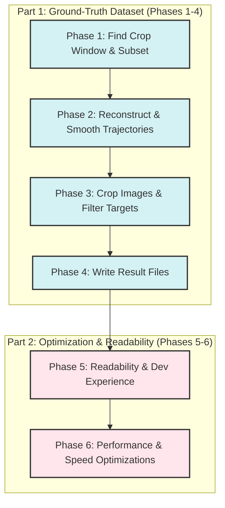

# OpenPTV2 Consolidated Project Plan

This document integrates and outlines the remaining active development plans for the `openptv2` project. It merges the synthetic cavity dataset creation plan with the Cython/Python optimization roadmap, organized into a single, cohesive six-phase project plan.



---

## Part 1: Small Synthetic Cavity Test Case (Phases 1–4)

### Goal
Produce a self-contained, ground-truth-annotated subset of the `test_cavity` experiment with 4 cameras, 256×256 pixel cropped images, and 5 frames of real particle positions and images. Everything must be traceable to a known answer at every pipeline step.

### Resolved Decisions
* **Source data**: Use `res/rt_is.10000`–`10004` and `res/ptv_is.10000`–`10004` for all 5 frames. Exclude `res_orig/` as it lacks frame 10000.
* **Coordinate system**: **Crop-relative** coordinate system. Raw pixel coords are `0..imx` referenced to the sensor center. Cropped targets will use `x_px_crop = x_px_full − ox`, and the `.ori` principal point will be updated per camera.
* **Partial trajectories**: Include all particles. Particles entering or leaving the volume mid-sequence are kept with `NaN` for missing frames.

### Target Dataset Directory Layout
```
test_data/test_cavity_small/
  cal/
    cam1.tif.ori          ← modified principal point (Phase 3)
    cam1.tif.addpar       ← copied unchanged
    ... (all 4 cameras)
  img/
    cam1.10000            ← 256×256 crop of real image
    cam1.10000_targets    ← filtered + offset _targets
    ... (4 cams × 5 frames)
  img_orig/               ← same crops, unmodified backup
  parameters/
    ptv.par               ← identical except imaX=256, imaY=256
    sequence.par          ← same frame range 10000–10004
    ... (all other .par files copied unchanged)
  res/
    ptv_is.10000          ← ground truth 3D positions with forward/backward links
    rt_is.10001           ← ground truth tracking result
    added.10001           ← particles entering mid-sequence
    ... (5 frames)
  ground_truth/
    particles.csv         ← full ground truth table
    trajectories.csv      ← per-trajectory summary
    projections.csv       ← ground truth 2D projections per camera
```

---

### Phase 1 — Find the 256×256 Window and Extract the Particle Subset

1. **Load camera models (all 4 cameras)**:
   Use `Calibration.from_file()` from `algorithms/calibration.py`:
   ```python
   from openptv2.algorithms.calibration import Calibration
   cals = [Calibration.from_file(f"cal/cam{i}.tif.ori", f"cal/cam{i}.tif.addpar")
           for i in range(1, 5)]
   ```
   Load `ControlParams` from `parameters/ptv.par` to obtain pixel pitch (0.012 mm/px), sensor size (1280×1024), and refractive indices.

2. **Load all 3D particle positions (all 5 frames from `res/`)**:
   Use `res/rt_is.{frame}` for 3D positions with labels, and `res/ptv_is.{frame}` for forward/backward trajectory links.

3. **Project particles into all 4 cameras**:
   Use `img_coord_batch` from `algorithms/imgcoord.py` to get `(x_mm, y_mm)` relative to the image center, and convert to pixel coords:
   ```python
   # x_px = x_mm / pixel_pitch + imx / 2
   # y_px = y_mm / pixel_pitch + imy / 2
   ```
   Or use `point_to_pixel` from `algorithms/track.py`:
   ```python
   from openptv2.algorithms.track import point_to_pixel
   x_px, y_px = point_to_pixel(point_xyz, cal, cpar)
   ```

4. **Select the 256×256 window in each camera**:
   Project volume centroid `(0, 2.5, 2.5)` mm to get `(cx_cam, cy_cam)` in full-image pixels. Establish a crop window of `[cy−128 : cy+128, cx−128 : cx+128]`.
   
   **Filter**: A particle is in the subset if its projection falls inside the 256×256 window in all 4 cameras in at least one frame. Record the top-left offset `crop_offset[cam] = (ox, oy)`.

---

### Phase 2 — Reconstruct Ground Truth Trajectories

1. **Chain trajectories across frames**:
   Combine the `label` field in `res/rt_is.{frame}` with `prev_frame_id` / `next_frame_id` links in `res/ptv_is.{frame}`. 
   * Collect `(X, Y, Z)` across frames 10000–10004.
   * Represent absent frames with `NaN` (entry/exit).

2. **Smooth trajectories to produce ground truth**:
   For each particle with $\ge 3$ valid frames, fit a degree-2 polynomial (degree-1 if 2 frames) through positions independently per axis. Evaluate the polynomial at each frame to produce smoothed ground truth positions.

3. **Classify trajectories**:
   * `full`: present in all 5 frames.
   * `entry`: first appears at frame > 10000.
   * `exit`: last present at frame < 10004.
   * `transient`: both enters and exits mid-sequence.

4. **Export CSV schemas**:
   * `ground_truth/particles.csv`: `particle_id, frame, X, Y, Z, dx, dy, dz, status`
   * `ground_truth/projections.csv`: `particle_id, frame, cam, x_px_full, y_px_full, x_px_crop, y_px_crop` where `x_px_crop = x_px_full - ox`, `y_px_crop = y_px_full - oy`.
   * `ground_truth/trajectories.csv`: `particle_id, first_frame, last_frame, n_frames, status`

---

### Phase 3 — Crop Real Images and Filter Targets

1. **Crop real images**:
   For each camera `c` and frame `f`, crop raw images using offsets:
   ```python
   import imageio
   img = imageio.imread(f"img/cam{c}.{f}")  # 1280×1024
   ox, oy = crop_offset[c]
   crop = img[oy:oy+256, ox:ox+256]
   imageio.imwrite(f"test_cavity_small/img/cam{c}.{f}", crop)
   ```

2. **Filter and offset `_targets` files**:
   Filter targets where `ox <= x_px < ox+256` and `oy <= y_px < oy+256`. Offset coordinates: `x_out = x_px - ox`, `y_out = y_px - oy`, and renumber target index starting from 0.

3. **Update `.ori` principal point per camera**:
   After cropping to 256×256, the sensor center relative to the crop shifts. Update the principal points `xh` and `yh` (in mm):
   $$xh_{new} = xh_{old} + (512 - ox) \times 0.012$$
   $$yh_{new} = yh_{old} - (384 - oy) \times 0.012$$

4. **Update `parameters/ptv.par`**:
   Modify dimensions to fit the crop:
   ```
   imaX  256
   imaY  256
   ```

---

### Phase 4 — Write Result Files

1. **`res/ptv_is.{frame}`**: Write subset particles with their smoothed coordinates and `prev_frame_id` / `next_frame_id` links.
2. **`res/rt_is.{frame}`**: Write target count details `n_targets_camX` matched to the particle in each camera.
3. **`res/added.{frame}`**: Write entries corresponding to first-time appearing particles (`entry` or `transient`).

#### Verification Checklist
- [ ] Unique particle count in `ptv_is.10000` matches unique ID count in `ground_truth/particles.csv` at frame 10000.
- [ ] Every coordinate in `ground_truth/projections.csv` falls inside `[0, 256)` boundaries.
- [ ] `ptv.par` has `imaX=256, imaY=256`.
- [ ] `.ori` principal points updated correctly per formula.

---

## Part 2: Optimizations & Developer Experience (Phases 5–6)

### Phase 5 — Readability & Developer Experience Improvements

1. **Standardize Type Annotations Across the Project**:
   * Ensure all `@cython.cclass` files use standardized Cython type-hints (e.g., `cython.double` and `cython.int`) rather than raw C definitions.
   * Add PEP 484 Python type-hints to all pure Python interfaces and wrappers to assist IDE auto-completion.

2. **Support Rapid Iterative Builds**:
   * Maintain the `DEV_BUILD` environment variable toggle inside `setup.py` to compile with `-O0` or `-O1` instead of `-O3`, keeping compile times under 35 seconds.

3. **Enhance Docstrings for Cython/Python Dual Execution**:
   * Document compiled vs. interpreted fallback behavior at the module level in each pure Python algorithm file.
   * Outline expected array-layout/dtypes for each function input so developers know exactly what shape Cython-typed memory views expect.

---

### Phase 6 — Performance & Speed Optimizations

1. **Optimize AoS to SoA Synchronization (`Frame` class)**:
   * Keep `@cython.cclass` types (`Target`, `Corres`, `Pathinfo`) as primary data structures to maintain object-oriented readability.
   * Avoid synchronization overhead inside `Frame` by ensuring all local loop variables and array bindings are fully Cython-typed (`p: Pathinfo`, `c: Corres`). This compiles down to direct C pointer attribute access (`p->prev`, `c->nr`), completely bypassing Python dictionary lookup overhead.

2. **Optimize Memory Views using Contiguous Slices**:
   * Explicitly declare all multidimensional typed memory views inside hot paths as contiguous in memory (e.g., `double[:, ::1]` instead of `double[:, :]`).
   * *Benefit*: Tells the compiler that the data is layout-contiguous, allowing GCC/Clang to generate optimized SIMD vector instructions.

3. **Pre-Allocate Temporary Arrays**:
   * In high-frequency recursive or iterative functions (e.g., `multimed_r_nlay_iterative` or `find_candidates_in_3d`), avoid allocating temporary small arrays/lists. Pass a pre-allocated scratch space array through the function arguments instead to eliminate GC overhead.
# OpenPTV2 Consolidated Project Plan

This document integrates and outlines the remaining active development plans for the `openptv2` project. It merges the synthetic cavity dataset creation plan with the Cython/Python optimization roadmap, organized into a single, cohesive six-phase project plan.


---

## Part 1: Small Synthetic Cavity Test Case (Phases 1–4)

### Goal
Produce a self-contained, ground-truth-annotated subset of the `test_cavity` experiment with 4 cameras, 256×256 pixel cropped images, and 5 frames of real particle positions and images. Everything must be traceable to a known answer at every pipeline step.

### Resolved Decisions
* **Source data**: Use `res/rt_is.10000`–`10004` and `res/ptv_is.10000`–`10004` for all 5 frames. Exclude `res_orig/` as it lacks frame 10000.
* **Coordinate system**: **Crop-relative** coordinate system. Raw pixel coords are `0..imx` referenced to the sensor center. Cropped targets will use `x_px_crop = x_px_full − ox`, and the `.ori` principal point will be updated per camera.
* **Partial trajectories**: Include all particles. Particles entering or leaving the volume mid-sequence are kept with `NaN` for missing frames.

### Target Dataset Directory Layout
```
test_data/test_cavity_small/
  cal/
    cam1.tif.ori          ← modified principal point (Phase 3)
    cam1.tif.addpar       ← copied unchanged
    ... (all 4 cameras)
  img/
    cam1.10000            ← 256×256 crop of real image
    cam1.10000_targets    ← filtered + offset _targets
    ... (4 cams × 5 frames)
  img_orig/               ← same crops, unmodified backup
  parameters/
    ptv.par               ← identical except imaX=256, imaY=256
    sequence.par          ← same frame range 10000–10004
    ... (all other .par files copied unchanged)
  res/
    ptv_is.10000          ← ground truth 3D positions with forward/backward links
    rt_is.10001           ← ground truth tracking result
    added.10001           ← particles entering mid-sequence
    ... (5 frames)
  ground_truth/
    particles.csv         ← full ground truth table
    trajectories.csv      ← per-trajectory summary
    projections.csv       ← ground truth 2D projections per camera
```

---

### Phase 1 — Find the 256×256 Window and Extract the Particle Subset

1. **Load camera models (all 4 cameras)**:
   Use `Calibration.from_file()` from `algorithms/calibration.py`:
   ```python
   from openptv2.algorithms.calibration import Calibration
   cals = [Calibration.from_file(f"cal/cam{i}.tif.ori", f"cal/cam{i}.tif.addpar")
           for i in range(1, 5)]
   ```
   Load `ControlParams` from `parameters/ptv.par` to obtain pixel pitch (0.012 mm/px), sensor size (1280×1024), and refractive indices.

2. **Load all 3D particle positions (all 5 frames from `res/`)**:
   Use `res/rt_is.{frame}` for 3D positions with labels, and `res/ptv_is.{frame}` for forward/backward trajectory links.

3. **Project particles into all 4 cameras**:
   Use `img_coord_batch` from `algorithms/imgcoord.py` to get `(x_mm, y_mm)` relative to the image center, and convert to pixel coords:
   ```python
   # x_px = x_mm / pixel_pitch + imx / 2
   # y_px = y_mm / pixel_pitch + imy / 2
   ```
   Or use `point_to_pixel` from `algorithms/track.py`:
   ```python
   from openptv2.algorithms.track import point_to_pixel
   x_px, y_px = point_to_pixel(point_xyz, cal, cpar)
   ```

4. **Select the 256×256 window in each camera**:
   Project volume centroid `(0, 2.5, 2.5)` mm to get `(cx_cam, cy_cam)` in full-image pixels. Establish a crop window of `[cy−128 : cy+128, cx−128 : cx+128]`.
   
   **Filter**: A particle is in the subset if its projection falls inside the 256×256 window in all 4 cameras in at least one frame. Record the top-left offset `crop_offset[cam] = (ox, oy)`.

---

### Phase 2 — Reconstruct Ground Truth Trajectories

1. **Chain trajectories across frames**:
   Combine the `label` field in `res/rt_is.{frame}` with `prev_frame_id` / `next_frame_id` links in `res/ptv_is.{frame}`. 
   * Collect `(X, Y, Z)` across frames 10000–10004.
   * Represent absent frames with `NaN` (entry/exit).

2. **Smooth trajectories to produce ground truth**:
   For each particle with $\ge 3$ valid frames, fit a degree-2 polynomial (degree-1 if 2 frames) through positions independently per axis. Evaluate the polynomial at each frame to produce smoothed ground truth positions.

3. **Classify trajectories**:
   * `full`: present in all 5 frames.
   * `entry`: first appears at frame > 10000.
   * `exit`: last present at frame < 10004.
   * `transient`: both enters and exits mid-sequence.

4. **Export CSV schemas**:
   * `ground_truth/particles.csv`: `particle_id, frame, X, Y, Z, dx, dy, dz, status`
   * `ground_truth/projections.csv`: `particle_id, frame, cam, x_px_full, y_px_full, x_px_crop, y_px_crop` where `x_px_crop = x_px_full - ox`, `y_px_crop = y_px_full - oy`.
   * `ground_truth/trajectories.csv`: `particle_id, first_frame, last_frame, n_frames, status`

---

### Phase 3 — Crop Real Images and Filter Targets

1. **Crop real images**:
   For each camera `c` and frame `f`, crop raw images using offsets:
   ```python
   import imageio
   img = imageio.imread(f"img/cam{c}.{f}")  # 1280×1024
   ox, oy = crop_offset[c]
   crop = img[oy:oy+256, ox:ox+256]
   imageio.imwrite(f"test_cavity_small/img/cam{c}.{f}", crop)
   ```

2. **Filter and offset `_targets` files**:
   Filter targets where `ox <= x_px < ox+256` and `oy <= y_px < oy+256`. Offset coordinates: `x_out = x_px - ox`, `y_out = y_px - oy`, and renumber target index starting from 0.

3. **Update `.ori` principal point per camera**:
   After cropping to 256×256, the sensor center relative to the crop shifts. Update the principal points `xh` and `yh` (in mm):
   $$xh_{new} = xh_{old} + (512 - ox) \times 0.012$$
   $$yh_{new} = yh_{old} - (384 - oy) \times 0.012$$

4. **Update `parameters/ptv.par`**:
   Modify dimensions to fit the crop:
   ```
   imaX  256
   imaY  256
   ```

---

### Phase 4 — Write Result Files

1. **`res/ptv_is.{frame}`**: Write subset particles with their smoothed coordinates and `prev_frame_id` / `next_frame_id` links.
2. **`res/rt_is.{frame}`**: Write target count details `n_targets_camX` matched to the particle in each camera.
3. **`res/added.{frame}`**: Write entries corresponding to first-time appearing particles (`entry` or `transient`).

#### Verification Checklist
- [ ] Unique particle count in `ptv_is.10000` matches unique ID count in `ground_truth/particles.csv` at frame 10000.
- [ ] Every coordinate in `ground_truth/projections.csv` falls inside `[0, 256)` boundaries.
- [ ] `ptv.par` has `imaX=256, imaY=256`.
- [ ] `.ori` principal points updated correctly per formula.

---

## Part 2: Optimizations & Developer Experience (Phases 5–6)

### Phase 5 — Readability & Developer Experience Improvements

1. **Standardize Type Annotations Across the Project**:
   * Ensure all `@cython.cclass` files use standardized Cython type-hints (e.g., `cython.double` and `cython.int`) rather than raw C definitions.
   * Add PEP 484 Python type-hints to all pure Python interfaces and wrappers to assist IDE auto-completion.

2. **Support Rapid Iterative Builds**:
   * Maintain the `DEV_BUILD` environment variable toggle inside `setup.py` to compile with `-O0` or `-O1` instead of `-O3`, keeping compile times under 35 seconds.

3. **Enhance Docstrings for Cython/Python Dual Execution**:
   * Document compiled vs. interpreted fallback behavior at the module level in each pure Python algorithm file.
   * Outline expected array-layout/dtypes for each function input so developers know exactly what shape Cython-typed memory views expect.

---

### Phase 6 — Performance & Speed Optimizations

1. **Optimize AoS to SoA Synchronization (`Frame` class)**:
   * Keep `@cython.cclass` types (`Target`, `Corres`, `Pathinfo`) as primary data structures to maintain object-oriented readability.
   * Avoid synchronization overhead inside `Frame` by ensuring all local loop variables and array bindings are fully Cython-typed (`p: Pathinfo`, `c: Corres`). This compiles down to direct C pointer attribute access (`p->prev`, `c->nr`), completely bypassing Python dictionary lookup overhead.

2. **Optimize Memory Views using Contiguous Slices**:
   * Explicitly declare all multidimensional typed memory views inside hot paths as contiguous in memory (e.g., `double[:, ::1]` instead of `double[:, :]`).
   * *Benefit*: Tells the compiler that the data is layout-contiguous, allowing GCC/Clang to generate optimized SIMD vector instructions.

3. **Pre-Allocate Temporary Arrays**:
   * In high-frequency recursive or iterative functions (e.g., `multimed_r_nlay_iterative` or `find_candidates_in_3d`), avoid allocating temporary small arrays/lists. Pass a pre-allocated scratch space array through the function arguments instead to eliminate GC overhead.

4. **Streamline Parallel Execution via Numba**:
   * Ensure fallback pathways using Numba JIT are decorated with `@njit(parallel=True)` where appropriate and utilize `prange` for thread-level loop parallelization.

---

### Phase 7 — Algorithmic Modernization & Deep Cython Optimization

This phase is executed with rigorous adherence to the `cython-optimize` skill workflow. The goal is to maximize execution speed by utilizing SciPy for high-level operations and strict, GIL-free Cython memoryviews for low-level loops, ensuring zero computational penalty from Python/C type-coercion.

#### Step 7.1: Global Infrastructure & Profiling Setup
- [ ] Establish a unified benchmark suite (`tests/benchmarks/run_baseline.py`) for all basic algorithms (`trafo`, `multimed`, `lsqadj`, `ray_tracing`, `imgcoord`, `epi`).
- [ ] Record baseline execution times and memory profiles using the standard Python interpreter.
- [ ] Add `cython` and HTML annotation (`cython -a`) targets to the build workflow for easy inspection of C-API interactions.

#### Step 7.2: Vectorization & SciPy Integration
- [ ] **`lsqadj.py` & `trafo.py`**: Replace custom matrix operations with `scipy.linalg` or `scipy.spatial.transform`.
- [ ] **`correspondences.py` & `epi.py`**: Utilize `scipy.spatial.KDTree` or `scipy.spatial.distance` to accelerate spatial neighbor searches and epipolar line measurements.
- [ ] **`image_processing.py` & `segmentation.py`**: Delegate to `scipy.ndimage` for filters, convolution, and connected components.
- [ ] **Bulk Array Operations**: Ensure all input transformations are applied in bulk (vectorized) before entering Cython loops.

#### Step 7.3: Strict Array/Cython Type Boundary Enforcement
- [ ] Audit all function signatures in `src/openptv2/algorithms/`.
- [ ] Replace all legacy NumPy definitions (`cnp.ndarray[cnp.float64_t, ndim=2]`) with continuous typed memoryviews (`double[:, ::1]`).
- [ ] Ensure boundary functions unpack standard `np.ndarray` objects into memoryviews *before* invoking tight `cdef` and `nogil` loops.
- [ ] **Prohibit mixing**: Do not mix `np.ndarray` and native Cython `@cython.cclass` structures (like `Target`, `Corres`) inside loops. Access C-struct attributes directly (`p->prev`, `c->nr`) to avoid GIL acquisition.

#### Step 7.4: Granular Module Optimization (Cython-Optimize Workflow)
Execute the 4-stage optimization pipeline (Profile -> Refactor -> Compile -> Verify) on the following module batches:

1. **Batch 1: Basic Geometry (`trafo`, `multimed`, `ray_tracing`, `imgcoord`)**
   - Refactor coordinate transformations and multimedia ray tracing.
   - Pre-allocate temporary scratch arrays instead of allocating inside loops.
   - Enforce purely numeric `cdef` functions with `nogil` blocks.
2. **Batch 2: Epipolar & Correspondences (`epi`, `correspondences`)**
   - Replace linear searches with SciPy spatial algorithms.
   - Optimize remaining inner search loops with Cython memoryviews.
3. **Batch 3: Least Squares & Tracking (`lsqadj`, `track_kernels`, `track3d`)**
   - Eliminate Python dictionary lookups and GC overhead within adjustment iterators.
   - Ensure Cython tracking kernels utilize `prange` for thread-level scaling and operate strictly on contiguous memory blocks.
   - Apply Numba fallbacks `@njit(parallel=True)` for pure-Python mode where applicable.

#### Step 7.5: Final Verification & Performance Reporting
- [ ] Run benchmark suite to compare against Step 7.1 baselines.
- [ ] Verify outputs exactly match baseline using `numpy.allclose` (floating-point stability).
- [ ] Validate final HTML optimization reports (`cython -a`), proving all inner mathematical loops are completely white (zero Python overhead).
- [ ] Document final speedup multipliers and metrics.
