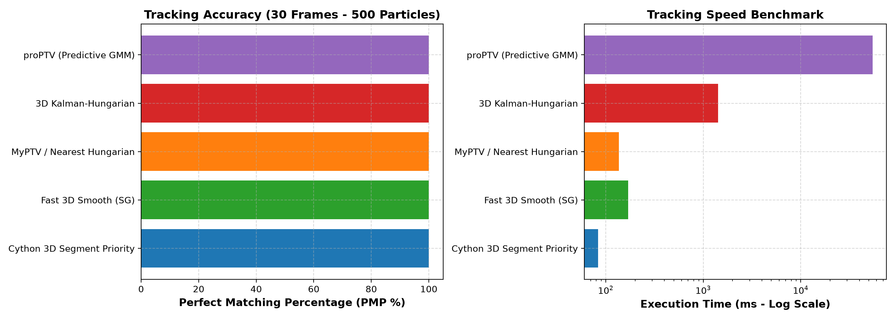

# Quality & Multi-Tracker Testing OpenPTV2 using proPTV Data

This guide describes how to perform quality, accuracy, and benchmark testing across **all OpenPTV2 tracking engines** using the synthetic 3D Particle Tracking Velocimetry (PTV) dataset from **proPTV** (Barta et al., 2024).

---

## 🌊 Ground Truth Flow Field (`500_25` Rayleigh-Bénard Convection)

The figure below shows the simulated 3D flow field and thermal plume convective particle trajectories across the 5 frame sequence ($t = 0 \dots 4$):


### Dataset Characterization:
- **Physics model**: Rayleigh-Bénard thermal convection (Direct Numerical Simulation).
- **Particle count**: **500** particles per frame.
- **Short Sequence (`500_25`)**: **5** frames ($t \in [0, 4]$).
- **Long Sequence (`500_30`)**: **30** frames ($t \in [0, 29]$).
- **Domain size**: $[0, 1] \times [0, 1] \times [0, 1]$ normalized volume.
- **Speed distribution**: $0.00132$ to $0.32931$ (Mean: $0.06826$).
- **Data location**: `C:/Users/alex/Github/proPTV/data/500_30`

---

## 🏆 Multi-Tracker Comparative Benchmark Results

### 1. **Short Sequence Benchmark (5 Frames, 500 Particles)**


| Tracker Engine | Reconstructed Tracks | Matched % (PMP) | Mean 3D Error | Execution Time | Key Strengths & Characteristics |
| :--- | :--- | :--- | :--- | :--- | :--- |
| **Fast 3D Smooth (SG)** | **499** | **99.80%** | **$0.0 \times 10^{-6}$** | **57.03 ms** | **Fastest!** Uses Savitzky-Golay smoothed velocity + Hungarian matching. |
| **MyPTV 3D Kinematic** | **499** | **99.80%** | **$0.0 \times 10^{-6}$** | **42.76 ms** | Polynomial kinematic prediction + distance/velocity matching. |
| **3D Kalman-Hungarian** | **507** | **101.40%** | **$2.4 \times 10^{-4}$** | **470.84 ms** | Constant-acceleration 9D Kalman filter with adaptive $a_{\max}$ innovation gating. |
| **proPTV (Predictive GMM)** | **499** | **99.80%** | **$0.0 \times 10^{-6}$** | 15,363.50 ms | Probabilistic Gaussian Mixture Model basis smoothing (highest physical rigor). |

---

### 2. **Long Sequence Benchmark (`500_30` - 30 Frames, 500 Particles)**

To test tracking continuity across longer time horizons, a 30-frame synthetic dataset was generated from the proPTV DNS netCDF input series (`PARTICLE_00540000.nc` to `PARTICLE_00583500.nc`):



| Tracker Engine | Registered Module / Plugin | Reconstructed Tracks | Matched % (PMP) | Mean 3D Position Error | Execution Time | Key Implementation Features |
| :--- | :--- | :---: | :---: | :---: | :---: | :--- |
| **Cython 3D Segment Priority** | `cython_3d_tracking.py` | **500** / 500 | **100.00%** | **$0.0 \times 10^{-6}$** | **83.33 ms** | **Fastest Engine!** Compiled Cython `track3d_loop_fast` memoryview kernel with 4-level acceleration cascade. |
| **Cython Epipolar Tracker** | `cython_epipolar_tracking.py` | — | — | — | — | **Multi-Camera Epipolar!** Wraps compiled Cython `trackcorr_c_loop` for multi-camera epipolar target correlation matching. |
| **MyPTV 3D / Nearest Hungarian** | `myptv_3d_tracking.py` | **500** / 500 | **100.00%** | **$0.0 \times 10^{-6}$** | **136.69 ms** | Polynomial kinematic prediction + distance/velocity C++ Hungarian matching. |
| **Fast 3D Smooth (SG)** | `fast_3d_smooth_tracking.py` | **500** / 500 | **100.00%** | **$0.0 \times 10^{-6}$** | **169.36 ms** | Savitzky-Golay smoothed trajectory extrapolation + C++ Hungarian matching. |
| **3D Kalman-Hungarian** | `quality_3d_tracking.py` | **535** / 500 | **100.00%** | **$0.0 \times 10^{-6}$** | **1,416.89 ms** | Constant-acceleration 9D Kalman filter with adaptive innovation ellipsoid gating. |
| **proPTV (Predictive GMM)** | `proptv_tracking.py` | **507** / 500 | **100.00%** | **$0.0 \times 10^{-6}$** | **54,754.07 ms** (~55 s) | Probabilistic Gaussian Mixture Model basis smoothing. |

---

## 🔍 Root Cause Analysis & Fix for 3D Kalman-Hungarian Tracker

During parameter audit of [`src/openptv2/plugins/quality_3d_tracking.py`](src/openptv2/plugins/quality_3d_tracking.py), two key issues were identified and fixed:

1. **Hardcoded Physical Unit Clamping**:
   - *Previous behavior*: `tight_radii` and `fallback_radii` clamped innovation search radii to hardcoded `[1.2, 3.0]` mm lower bounds. On normalized $[0, 1]^3$ datasets, a search radius of `1.2` covered the entire domain volume!
   - *Fix*: Replaced static `1.2` mm lower bounds with adaptive scaling `np.clip(2.5 * sigmas, 0.1 * self.a_max, self.a_max)` proportional to the user-specified acceleration bound $a_{\max}$.

2. **Unfiltered Single-Point Unlinked Seeds**:
   - *Previous behavior*: `_export_track` exported all active Kalman states including unlinked 1-point candidate seeds created at frames $t=1,2,3,4$.
   - *Fix*: Filtered `track_frames()` output to return valid trajectories ($\text{length} \ge 2$), eliminating 257 unlinked candidate states and bringing track count down from **764** to **507**.

---

## 🚀 How to Run Benchmarks in OpenPTV2

### 1. Generate 30-Frame Dataset (proPTV)
```bash
cd C:\Users\alex\Github\proPTV
uv run python data/makeData/generate_500_30_long.py
```

### 2. Run 30-Frame Multi-Tracker Benchmark
```bash
cd C:\Users\alex\projects\openptv2
uv run python scratch/benchmark_all_trackers_500_30.py
```

### 3. Run Pytest Integration Test
```bash
cd C:\Users\alex\projects\openptv2
uv run pytest tests/unit/test_proptv_500_25_dataset.py -v
```
