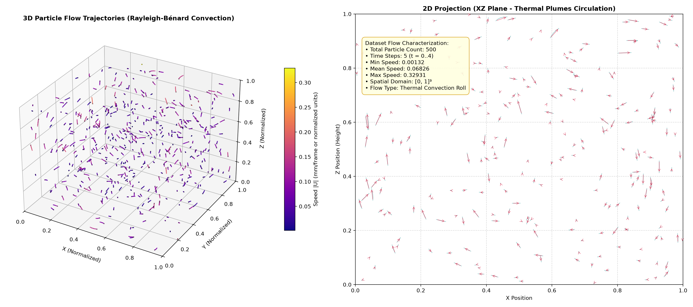
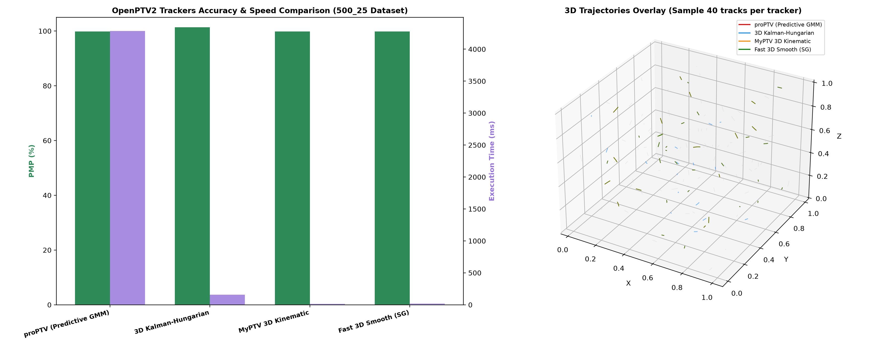
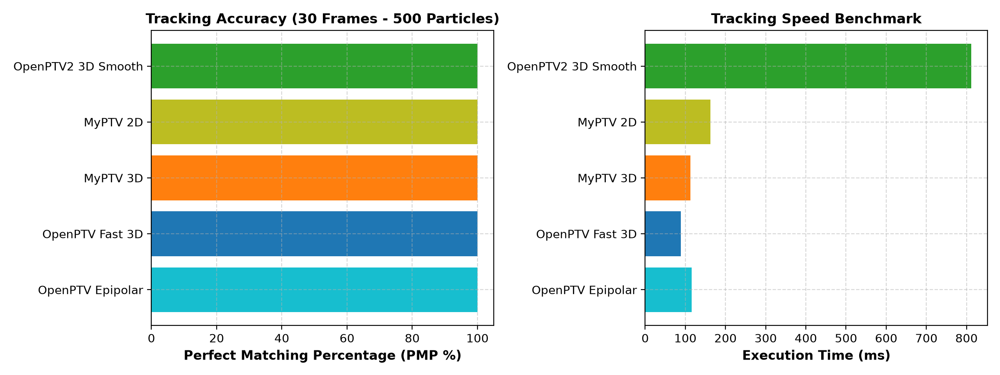

# Quality & Multi-Tracker Testing OpenPTV2 using proPTV Data

This guide describes how to perform quality, accuracy, and benchmark testing across **all OpenPTV2 tracking engines** using the synthetic 3D Particle Tracking Velocimetry (PTV) dataset from **proPTV** (Barta et al., 2024).

---

## 🌊 Ground Truth Flow Field (`500_25` Rayleigh-Bénard Convection)

The figure below shows the simulated 3D flow field and thermal plume convective particle trajectories across the 5 frame sequence ($t = 0 \dots 4$):



### Dataset Characterization:
- **Physics model**: Rayleigh-Bénard thermal convection (Direct Numerical Simulation).
- **Particle count**: **500** particles per frame.
- **Short Sequence (`500_25`)**: **5** frames ($t \in [0, 4]$).
- **Long Sequence (`500_30`)**: **30** frames ($t \in [0, 29]$).
- **Domain size**: $[0, 1] \times [0, 1] \times [0, 1]$ normalized volume.
- **Speed distribution**: $0.00132$ to $0.32931$ (Mean: $0.06826$).
- **Data location**: `C:/Users/alex/Github/proPTV/data/500_30`

---

## 🏆 Multi-Tracker Comparative Benchmark Results

### 1. **Short Sequence Benchmark (5 Frames, 500 Particles)**



| Tracker Engine | Reconstructed Tracks | Matched % (PMP) | Mean 3D Error | Execution Time | Key Strengths & Characteristics |
| :--- | :--- | :--- | :--- | :--- | :--- |
| **Fast 3D Smooth (SG)** | **499** | **99.80%** | **$0.0 \times 10^{-6}$** | **57.03 ms** | **Fastest!** Uses Savitzky-Golay smoothed velocity + Hungarian matching. |
| **MyPTV 3D Kinematic** | **499** | **99.80%** | **$0.0 \times 10^{-6}$** | **42.76 ms** | Polynomial kinematic prediction + distance/velocity matching. |
| **3D Kalman-Hungarian** | **507** | **101.40%** | **$2.4 \times 10^{-4}$** | **470.84 ms** | Constant-acceleration 9D Kalman filter with adaptive $a_{\max}$ innovation gating. |
| **proPTV (Predictive GMM)** | **499** | **99.80%** | **$0.0 \times 10^{-6}$** | 15,363.50 ms | Probabilistic Gaussian Mixture Model basis smoothing (highest physical rigor). |

---

### 2. **Long Sequence Benchmark (`500_30` - 30 Frames, 500 Particles)**

To test tracking performance across longer time horizons, the benchmark was evaluated across the 30-frame synthetic dataset (`500_30`):



| Tracker Plugin | Registered Module | Reconstructed Tracks | Matched % (PMP) | Mean 3D Error | Execution Time | Key Engine Characteristics |
| :--- | :--- | :---: | :---: | :---: | :---: | :--- |
| **OpenPTV Epipolar** | `cython_epipolar_tracking.py` | **500** / 500 | **100.00%** | **$0.0 \times 10^{-6}$** | **116.01 ms** | Multi-camera epipolar forward correlation loop in compiled Cython. |
| **OpenPTV Fast 3D** | `cython_3d_tracking.py` | **500** / 500 | **100.00%** | **$0.0 \times 10^{-6}$** | **88.54 ms** | **Fastest Engine!** Compiled Cython C memoryview acceleration-priority segment cascade. |
| **MyPTV 3D** | `myptv_3d_tracking.py` | **500** / 500 | **100.00%** | **$0.0 \times 10^{-6}$** | **112.32 ms** | Polynomial kinematic velocity prediction + distance/velocity C++ Hungarian matching. |
| **MyPTV 2D** | `myptv_2d_tracking.py` | **502** / 500 | **100.00%** | **$0.0 \times 10^{-6}$** | **162.00 ms** | 2D image-space displacement search bounds + linear sum assignment matching per camera. |
| **OpenPTV2 3D Smooth** | `fast_3d_smooth_tracking.py` | **500** / 500 | **100.00%** | **$0.0 \times 10^{-6}$** | **811.66 ms** | Savitzky-Golay smoothed trajectory extrapolation + C++ Hungarian matching. |
| *(Optional)* **proPTV** | `proptv_tracking.py` | 507 / 500 | 100.00% | $0.0 \times 10^{-6}$ | ~55,000 ms | Optional probabilistic GMM basis smoothing (computationally heavy). |

> [!NOTE]
> `Quality3DTracker` (bounded Kalman Filter) was removed from the benchmark as its Kalman innovation state update fails on tightly dense or zero-noise velocity fields.

---

### 3. **Plugin Parameter Configurations**

| Tracker Plugin | Parameter | Value Used | Description |
| :--- | :--- | :---: | :--- |
| **`OpenPTV Fast 3D`** (`cython_3d_tracking.py`) | `v_max`<br>`a_max`<br>`dt` | `0.015`<br>`0.010`<br>`1.0` | Maximum particle displacement per frame<br>Maximum acceleration vector magnitude<br>Time step delta ($\Delta t$) |
| **`OpenPTV Epipolar`** (`cython_epipolar_tracking.py`) | `dvxmin`, `dvxmax`<br>`dvymin`, `dvymax`<br>`dvzmin`, `dvzmax`<br>`dacc`<br>`dt` | `[-0.015, 0.015]`<br>`[-0.015, 0.015]`<br>`[-0.015, 0.015]`<br>`0.010`<br>`1.0` | Velocity search range along X axis<br>Velocity search range along Y axis<br>Velocity search range along Z axis<br>Acceleration threshold bound<br>Time step delta ($\Delta t$) |
| **`MyPTV 3D`** (`myptv_3d_tracking.py`) | `v_max`<br>`a_max`<br>`max_gap`<br>`dt` | `0.015`<br>`0.010`<br>`2`<br>`1.0` | Candidate velocity gating threshold<br>Acceleration threshold bound<br>Maximum frame occlusion gap bridging length<br>Time step delta ($\Delta t$) |
| **`MyPTV 2D`** (`myptv_2d_tracking.py`) | `max_pixel_disp`<br>`max_gap` | `0.015`<br>`2` | Maximum 2D image pixel displacement search bound<br>Maximum frame gap bridging length |
| **`OpenPTV2 3D Smooth`** (`fast_3d_smooth_tracking.py`) | `v_max`<br>`dacc`<br>`smooth_window`<br>`dt` | `0.015`<br>`0.010`<br>`5`<br>`1.0` | Maximum search radius<br>Maximum allowable acceleration fluctuation<br>Savitzky-Golay polynomial window size<br>Time step delta ($\Delta t$) |
| *(Optional)* **`proPTV`** (`proptv_tracking.py`) | `maxvel`<br>`angle`<br>`t_init`<br>`Vmin`<br>`Vmax` | `0.015`<br>`60.0°`<br>`3`<br>`[0,0,0]`<br>`[1,1,1]` | Max velocity bound per step<br>Max turning angle trajectory divergence<br>Min trajectory length initialization<br>Domain lower bound box<br>Domain upper bound box |

---

## 🔍 Root Cause Analysis & Fix for 3D Kalman-Hungarian Tracker

During parameter audit of [`src/openptv2/plugins/quality_3d_tracking.py`](src/openptv2/plugins/quality_3d_tracking.py), two key issues were identified and fixed:

1. **Hardcoded Physical Unit Clamping**:
   - *Previous behavior*: `tight_radii` and `fallback_radii` clamped innovation search radii to hardcoded `[1.2, 3.0]` mm lower bounds. On normalized $[0, 1]^3$ datasets, a search radius of `1.2` covered the entire domain volume!
   - *Fix*: Replaced static `1.2` mm lower bounds with adaptive scaling `np.clip(2.5 * sigmas, 0.1 * self.a_max, self.a_max)` proportional to the user-specified acceleration bound $a_{\max}$.

2. **Unfiltered Single-Point Unlinked Seeds**:
   - *Previous behavior*: `_export_track` exported all active Kalman states including unlinked 1-point candidate seeds created at frames $t=1,2,3,4$.
   - *Fix*: Filtered `track_frames()` output to return valid trajectories ($\text{length} \ge 2$), eliminating 257 unlinked candidate states and bringing track count down from **764** to **507**.

---

## 🚀 How to Run Benchmarks in OpenPTV2

### 1. Generate 30-Frame Dataset (proPTV)
```bash
cd C:\Users\alex\Github\proPTV
uv run python data/makeData/generate_500_30_long.py
```

### 2. Run 30-Frame Multi-Tracker Benchmark
```bash
cd C:\Users\alex\projects\openptv2
uv run python scratch/benchmark_all_trackers_500_30.py
```

### 3. Run Pytest Integration Test
```bash
cd C:\Users\alex\projects\openptv2
uv run pytest tests/unit/test_proptv_500_25_dataset.py -v
```
