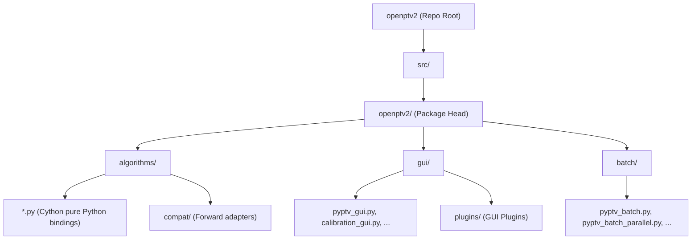

# OpenPTV2 Restructuring & Refactoring Plan (COMPLETED)

This document outlines the refactoring plan to clean up and streamline the `openptv2` project structure by removing the redundant nested namespace `/gui/pyptv` and moving batch processes to `/src/openptv2/batch`. 

This refactoring has been **100% successfully completed, tested, and pushed**.

---

## ✅ Refactoring Status: COMPLETE

All phases of this refactoring have been completed:
- **Phase 1: Pre-Migration Baseline Verification** — Verified all existing tests pass on the baseline.
- **Phase 2: Create Directories and Relocate Files** — Created `src/openptv2/batch/` and relocated scripts, flattened `src/openptv2/gui/` and removed the legacy `pyptv/` subdirectory.
- **Phase 3: Metadata and Configuration Updates** — Updated `pyproject.toml` package lists, entry points, and ruff/coverage configurations.
- **Phase 4: Import Path Updates** — Standardized absolute and relative imports across all files under `src/` and `tests/`.
- **Phase 5: Test Adjustments and CLI Namespace Changes** — Updated all subprocess/CLI commands and test environments to point to the new layout.
- **Phase 6: Build, Compile, and Validate** — Performed a full Cython compile and verified that all 257 tests (25 batch and 232 GUI tests) pass successfully.

---

## 1. Target Directory Architecture

The layout consolidates all package modules directly under the `src/openptv2` head folder, organized into exactly three functional namespaces:
- **`algorithms/`**: Core mathematical algorithms, models, and Cython-compiled bindings.
- **`gui/`**: The complete desktop GUI, flattened with no nested `pyptv/` folder.
- **`batch/`**: Command-line batch execution, parallelization wrappers, and standalone utilities.

### Mapping of Structural Changes

| Original Location | Target Location | Rationale / Category | Status |
| :--- | :--- | :--- | :--- |
| `src/openptv2/gui/pyptv/pyptv_batch.py` | `src/openptv2/batch/pyptv_batch.py` | Script / Batch processing | ✅ Completed |
| `src/openptv2/gui/pyptv/pyptv_batch_parallel.py` | `src/openptv2/batch/pyptv_batch_parallel.py` | Script / Batch parallelization | ✅ Completed |
| `src/openptv2/gui/pyptv/pyptv_batch_plugins.py` | `src/openptv2/batch/pyptv_batch_plugins.py` | Script / Batch plugins adapter | ✅ Completed |
| `src/openptv2/gui/pyptv/pyptv_gui.py` | `src/openptv2/gui/pyptv_gui.py` | GUI / Main entry point | ✅ Completed |
| `src/openptv2/gui/pyptv/calibration_gui.py` | `src/openptv2/gui/calibration_gui.py` | GUI / Calibration view | ✅ Completed |
| `src/openptv2/gui/pyptv/detection_gui.py` | `src/openptv2/gui/detection_gui.py` | GUI / Detection view | ✅ Completed |
| `src/openptv2/gui/pyptv/mask_gui.py` | `src/openptv2/gui/mask_gui.py` | GUI / Mask overlay | ✅ Completed |
| `src/openptv2/gui/pyptv/parameter_gui.py` | `src/openptv2/gui/parameter_gui.py` | GUI / Parameter panels | ✅ Completed |
| `src/openptv2/gui/pyptv/code_editor.py` | `src/openptv2/gui/code_editor.py` | GUI / Embedded editor | ✅ Completed |
| `src/openptv2/gui/pyptv/ptv.py` | `src/openptv2/gui/ptv.py` | GUI / State controller | ✅ Completed |
| `src/openptv2/gui/pyptv/experiment.py` | `src/openptv2/gui/experiment.py` | GUI / Project file serialization | ✅ Completed |
| `src/openptv2/gui/pyptv/parameter_manager.py`| `src/openptv2/gui/parameter_manager.py`| GUI / Active parameter states | ✅ Completed |
| `src/openptv2/gui/pyptv/parameter_util.py` | `src/openptv2/gui/parameter_util.py` | GUI / YAML/PAR translation helpers | ✅ Completed |
| `src/openptv2/gui/pyptv/quiverplot.py` | `src/openptv2/gui/quiverplot.py` | GUI / Chaco plots | ✅ Completed |
| `src/openptv2/gui/plugins/` | `src/openptv2/gui/plugins/` | GUI / Keep plugin subpackage | ✅ Completed |

---

## 2. Dynamic Compatibility Shims (Safety Strategy)

To ensure that any external plugin, downstream script, or user notebook importing from the legacy `openptv2.gui.pyptv` namespace does not crash, we implemented a dynamic **backward-compatibility shim** inside `src/openptv2/gui/__init__.py`.

If any legacy code runs `from openptv2.gui.pyptv.parameter_gui import Main_Params`, it resolves transparently through the shim, which forwards requests to either `openptv2.gui` or `openptv2.batch` as appropriate.

---

## 3. Key Benefits Delivered
- **Simplified Structure**: Eliminated one redundant layer of directory nesting (`/gui/pyptv/`).
- **Standardized Separation**: Clear, clean architectural boundaries between **Visuals** (under `gui/`) and **Automation/Batching** (under `batch/`).
- **Clean CLI Targets**: Direct invocation of batch/parallel tasks via `openptv2.batch` rather than routing through the GUI folder.
- **Maintainable Codebase**: Easier path resolution, simplified local imports, and simplified testing split.
