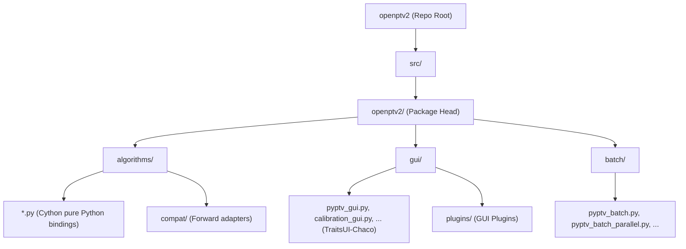

# OpenPTV2 Restructuring & Refactoring Plan

This document outlines a future refactoring plan to clean up and streamline the `openptv2` project structure. The goal is to move towards a flat, logical structure under the main `openptv2` package directory (referred to as the `head` folder) that cleanly separates core algorithms, legacy TraitsUI-Chaco GUI components, and command-line batch/standalone scripts.

By removing the redundant nested namespace `/gui/pyptv`, we make the codebase simpler to navigate, easier to maintain, and avoid deep, confusing imports like `openptv2.gui.pyptv.pyptv_gui`.

---

## 1. Target Directory Architecture

The proposed layout consolidates all package modules directly under the `src/openptv2` head folder, organized into exactly three functional namespaces:
- **`algorithms/`**: Core mathematical algorithms, models, and Cython-compiled bindings.
- **`gui/`**: The complete Enthought TraitsUI and Chaco-based desktop GUI, flattened with no nested `pyptv/` folder.
- **`batch/`**: Command-line batch execution, parallelization wrappers, and standalone utilities.



### Detailed Mapping of Structural Changes

| Original Location | Target Location | Rationale / Category |
| :--- | :--- | :--- |
| `src/openptv2/gui/pyptv/pyptv_batch.py` | `src/openptv2/batch/pyptv_batch.py` | Script / Batch processing |
| `src/openptv2/gui/pyptv/pyptv_batch_parallel.py` | `src/openptv2/batch/pyptv_batch_parallel.py` | Script / Batch parallelization |
| `src/openptv2/gui/pyptv/pyptv_batch_plugins.py` | `src/openptv2/batch/pyptv_batch_plugins.py` | Script / Batch plugins adapter |
| `src/openptv2/gui/pyptv/pyptv_gui.py` | `src/openptv2/gui/pyptv_gui.py` | GUI / Main entry point |
| `src/openptv2/gui/pyptv/calibration_gui.py` | `src/openptv2/gui/calibration_gui.py` | GUI / Calibration view |
| `src/openptv2/gui/pyptv/detection_gui.py` | `src/openptv2/gui/detection_gui.py` | GUI / Detection view |
| `src/openptv2/gui/pyptv/mask_gui.py` | `src/openptv2/gui/mask_gui.py` | GUI / Mask overlay |
| `src/openptv2/gui/pyptv/parameter_gui.py` | `src/openptv2/gui/parameter_gui.py` | GUI / Parameter panels |
| `src/openptv2/gui/pyptv/code_editor.py` | `src/openptv2/gui/code_editor.py` | GUI / Embedded editor |
| `src/openptv2/gui/pyptv/ptv.py` | `src/openptv2/gui/ptv.py` | GUI / State controller (Legacy `ptv.py`) |
| `src/openptv2/gui/pyptv/experiment.py` | `src/openptv2/gui/experiment.py` | GUI / Project file serialization |
| `src/openptv2/gui/pyptv/parameter_manager.py`| `src/openptv2/gui/parameter_manager.py`| GUI / Active parameter states |
| `src/openptv2/gui/pyptv/parameter_util.py` | `src/openptv2/gui/parameter_util.py` | GUI / YAML/PAR translation helpers |
| `src/openptv2/gui/pyptv/quiverplot.py` | `src/openptv2/gui/quiverplot.py` | GUI / Chaco plots |
| *All other files inside `gui/pyptv/`* | `src/openptv2/gui/` | GUI / Supporting files |
| `src/openptv2/gui/plugins/` | `src/openptv2/gui/plugins/` | GUI / Keep plugin subpackage |

---

## 2. Step-by-Step Refactoring Workflow

To ensure zero breakage and retain a completely green test suite throughout the restructuring process, we propose a six-phase execution sequence.

### Phase 1: Pre-Migration Baseline Verification
1. Activate the virtual environment:
   ```bash
   source .venv/bin/activate
   ```
2. Verify all existing tests pass:
   ```bash
   uv run pytest
   ```
3. Commit or stash any outstanding edits so that the git history starts from a clean baseline.

### Phase 2: Create Directories and Relocate Files
1. Create the new `batch` package directory:
   ```bash
   mkdir -p src/openptv2/batch
   touch src/openptv2/batch/__init__.py
   ```
2. Move the batch scripts from `gui/pyptv/` to `batch/`:
   ```bash
   mv src/openptv2/gui/pyptv/pyptv_batch.py src/openptv2/batch/
   mv src/openptv2/gui/pyptv/pyptv_batch_parallel.py src/openptv2/batch/
   mv src/openptv2/gui/pyptv/pyptv_batch_plugins.py src/openptv2/batch/
   ```
3. Move all other files from `src/openptv2/gui/pyptv/` to `src/openptv2/gui/`:
   ```bash
   # Move all files
   find src/openptv2/gui/pyptv/ -maxdepth 1 -type f -exec mv {} src/openptv2/gui/ \;
   # Move subdirectories (e.g. __marimo__, calibration_output)
   find src/openptv2/gui/pyptv/ -maxdepth 1 -type d -not -path 'src/openptv2/gui/pyptv/' -exec mv {} src/openptv2/gui/ \;
   ```
4. Delete the empty legacy folder:
   ```bash
   rmdir src/openptv2/gui/pyptv/
   ```

### Phase 3: Metadata and Configuration Updates
Modify project configuration files to point to the new layout:

#### A. Update `pyproject.toml` Package Lists & Entry Points:
```toml
[project.scripts]
openptv = "openptv2.cli:main"
openptv2-gui = "openptv2.gui.pyptv_gui:main"
openptv2-batch = "openptv2.batch.pyptv_batch:main_cli"
openptv2-validate = "openptv2.validate:main"
pyptv = "openptv2.gui.pyptv_gui:main"
pyptv_gui = "openptv2.gui.pyptv_gui:main"
pyptv_batch = "openptv2.batch.pyptv_batch:main_cli"

[tool.setuptools]
packages = [
    "openptv2",
    "openptv2.algorithms",
    "openptv2.algorithms.compat",
    "openptv2.gui",
    "openptv2.gui.plugins",
    "openptv2.batch",
]

[tool.coverage.run]
branch = true
source = ["openptv2", "algorithms", "gui", "batch"]
```

### Phase 4: Import Path Updates (Codebase-wide)
We must run an automated regex replacement across all `.py` files in `src/` and `tests/`.

#### Replacement Mappings:
1. `openptv2.gui.pyptv.pyptv_batch` ➔ `openptv2.batch.pyptv_batch`
2. `openptv2.gui.pyptv.pyptv_batch_parallel` ➔ `openptv2.batch.pyptv_batch_parallel`
3. `openptv2.gui.pyptv.pyptv_batch_plugins` ➔ `openptv2.batch.pyptv_batch_plugins`
4. `openptv2.gui.pyptv` ➔ `openptv2.gui`
5. `from .pyptv_batch import` ➔ `from openptv2.batch.pyptv_batch import` (inside `src/openptv2/batch/`)

#### Relocating Relative Imports within `src/openptv2/gui/`:
Since files are now flattened inside `src/openptv2/gui/`, relative imports between GUI modules will become simpler. For example, `from .experiment import Experiment` will continue to work perfectly, but absolute subpackage lookups (like `from openptv2.gui.pyptv.experiment import ...`) will need to be changed to `from openptv2.gui.experiment import ...`.

### Phase 5: Test Adjustments and CLI Namespace Changes
Many integration/functional tests in the test suite run the CLI utilities in separate subprocesses using commands like `sys.executable -m openptv2.gui.pyptv.pyptv_batch`.
We must grep for all `subprocess.run` / `subprocess.Popen` or `sys.executable` invocations in `tests/` and update their CLI namespace paths.

Files to update:
- `tests/gui/test_pyptv_batch.py`
- `tests/gui/test_pyptv_batch_parallel.py`
- `tests/gui/test_pyptv_batch_plugins.py`
- `tests/gui/test_standalone_dumbbell_calibration_cycle.py`

### Phase 6: Build, Compile, and Validate
Once all movements and code/test imports are updated:
1. Perform a clean editable installation and compile the Cython extensions:
   ```bash
   DEV_BUILD=1 uv pip install -e .
   ```
2. Run the full test suite to guarantee complete parity:
   ```bash
   uv run pytest
   ```

---

## 3. Dynamic Compatibility Shims (Safety Strategy)

To ensure that any external plugin, downstream script, or user notebook importing from the legacy `openptv2.gui.pyptv` namespace does not crash, we should implement a dynamic **backward-compatibility shim**.

We can keep a virtual `pyptv` module active within the `openptv2.gui` package dynamically at runtime using Python's `sys.modules` overriding system.

### Implementing the Compatibility Shim inside `src/openptv2/gui/__init__.py`:

```python
import sys
import types
from pathlib import Path

# Import the actual flattened gui components
from .pyptv_gui import main as gui_main

# Create a virtual module 'openptv2.gui.pyptv' so old imports do not crash
class VirtualPyPTVModule(types.ModuleType):
    """Dynamic shim forwarding lookups from openptv2.gui.pyptv to openptv2.gui or batch."""
    def __getattr__(self, name):
        # If the requested name is a batch processing script, forward to batch
        if name in ("pyptv_batch", "pyptv_batch_parallel", "pyptv_batch_plugins"):
            import importlib
            return importlib.import_module(f"openptv2.batch.{name}")
        
        # Otherwise, look it up in the flattened openptv2.gui namespace
        try:
            import importlib
            return importlib.import_module(f"openptv2.gui.{name}")
        except ImportError:
            pass
        
        # Fall back to attributes defined directly in openptv2.gui
        if hasattr(sys.modules["openptv2.gui"], name):
            return getattr(sys.modules["openptv2.gui"], name)
            
        raise AttributeError(f"module 'openptv2.gui.pyptv' has no attribute '{name}'")

# Register the shim in sys.modules
shim = VirtualPyPTVModule("openptv2.gui.pyptv")
sys.modules["openptv2.gui.pyptv"] = shim
```

### Why this dynamic shim is crucial:
1. **Zero-Breakage Guarantee**: If any third-party code, old test, or notebook runs `from openptv2.gui.pyptv.parameter_gui import Main_Params`, it resolves transparently through the shim.
2. **Subprocess/CLI Safety**: It prevents scripts running `python -m openptv2.gui.pyptv.pyptv_batch` from failing immediately, although they should be migrated to `python -m openptv2.batch.pyptv_batch` as a best practice.

---

## 4. Key Benefits of This Refactoring
- **Simplified Structure**: Eliminates one redundant layer of directory nesting (`/gui/pyptv/`).
- **Standardized Separation**: Separation between **Visuals** (under `gui/`) and **Automation/Batching** (under `batch/`).
- **Clean CLI Targets**: Directly invoke batch/parallel tasks via `openptv2.batch` rather than routing through the GUI folder.
- **Maintainable Codebase**: Easier path resolution, simplified local imports, and clear architectural boundaries.
- **Backward Compatible**: Existing user scripts and external tools can continue to interact with `openptv2.gui.pyptv` via the dynamic compatibility shim without experiencing import failures.
